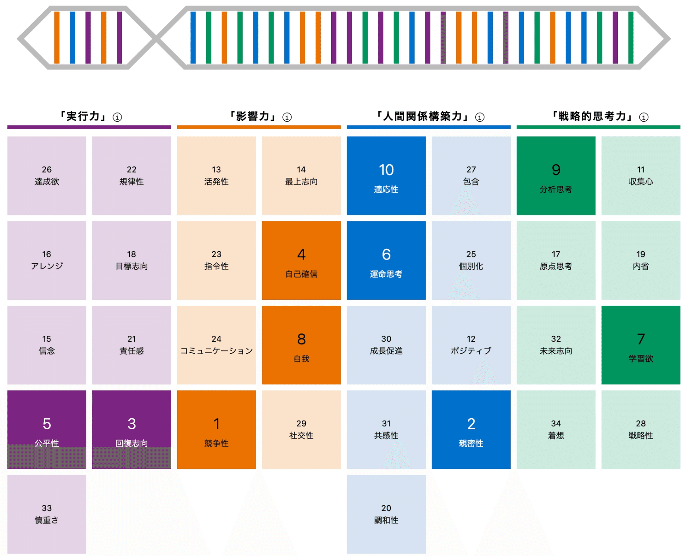

はじめまして。MOSH株式会社でエンジニア / EM をしている山本 一将（[@kyamamoto9120](https://x.com/kyamamoto9120)）です。 SNSなどのプロフィールでは「焚き火を愛するエンジニア」と名乗っています。

2025年6月にMOSHへジョインし新しいスタートを切ったこのタイミングで、改めて「私は何者で、何を考えているのか」を自己紹介として残しておこうと思います。

### 鉄道からWeb、そして「個」の時代へ

エンジニアとしてのキャリアは、少し変わったグラデーションを描いています。

新卒では鉄道の運行管理システムという、ミスの許されない「堅牢性」が全ての環境でキャリアをスタートさせました。その後、「もっと変化の激しい場所で技術を磨きたい」という思いからWeb業界（ユニークビジョン株式会社）へ転身し、SNSマーケティングツールの開発や組織づくりに7年間従事しました。

この転身については幾度かアウトプットしているので、興味のある方はご覧いただけると嬉しいです。

https://findy-code.io/engineer-lab/careershift_kyamamoto

https://www.docswell.com/s/kyamamoto9120/5JQYMJ-2025-10-08-190000

専門領域はバックエンドですが、インフラから機械学習まで「なんとかする」のが得意です。かつては趣味で作った将棋プログラムで世界大会9位に入賞するなど、ロジックを突き詰めることには自信があります。

### ストレングスファインダーから見る、意外と（？）人間臭い中身

普段仕事をしていると「論理と効率の人」というイメージを持たれがちなのですが、ストレングスファインダー（強み診断）の結果を見ると、実はもうちょっと人間味のある中身だったりします。

私の上位資質はこんな感じです。

*クリフトンストレングスレポート*

専門家のレポートによると**「原則を重んじる戦士」**なんてカッコいい名前がついているんですが 、噛み砕くと**「負けず嫌いの修理屋さん」**で、**「義理堅いチームプレイヤー」**といったところでしょうか。

私の中では、こんなふうにスイッチが働いています。

- **「勝ちたい」よりも「直したい」** トラブルが起きているプロジェクトや、誰も解決できていない課題を見ると、「これを直して（回復）、最高の結果を出せたら気持ちいいだろうな（競争）」とワクワクしてしまいます。

- **「正しく」ありたいし、「深く」繋がりたい** でも、勝てれば何でもいいわけじゃありません。不公平なルールは嫌いですし 、仕事をするなら表面的な付き合いよりも「背中を預けられる信頼できる仲間」とじっくり走りたいタイプです 。

**「システムには論理的に、人には誠実に」** エンジニアとしてバグを直すのが好きな自分と、EMとしてメンバーと膝を突き合わせて話すのが好きな自分。このバランスが、私らしいスタイルなのかなと思っています。

### なぜ、焚き火なのか

そんなふうに、仕事では「直したい」「より良くしたい」と常に思考を回転させている私が、唯一スイッチを切れるのが「焚き火」の時間です。

不便なキャンプ場に行き、ただ火を眺める。 効率とは無縁の時間ですが、私にとっては、熱くなりすぎた思考のCPUを冷却し、自分のコンディションを整えるために不可欠な儀式になっています。

平日はデジタルな世界で論理を戦わせ、休日はアナログな炎の前で整える。この往復があるからこそ、エンジニアとして走り続けられているのだと思います。

### このnoteでやりたいこと：「指名経済」の実践

私が現在所属しているMOSHは、**「情熱がめぐる経済をつくる」**をミッションに掲げ、個人が才能や情熱を価値に変えるサポートをしています。

MOSHが提唱している概念に**「指名経済」**という言葉があります。 **「何を」買うかよりも、「誰から」買うか**が重要になる経済圏のことです 。

私はエンジニアとしてこのプラットフォームを作りながら、同時に私自身も一人のクリエイターとして、この「指名経済」を体現してみたいと考えるようになりました。

技術情報だけであれば、AIがきれいな回答を出してくれる時代です。 だからこそ、このnoteでは**「私が実際に体験し、悩み、考えたこと」**という一次情報にこだわって発信していこうと思います。

**今後書いていきたいテーマ**

- エンジニアリング組織における「信頼」と「勝利」の両立
- LLM時代における技術選定の思考プロセス
- 焚き火やキャンプから得られる、仕事への気づき

「最新技術の解説」のような教科書的な内容は少ないかもしれませんが、その分、読んでくださる方の思考のヒントになるような、温度感のある記事を書いていきたいと思っています。

もしよろしければ、フォローでお付き合いいただけると嬉しいです。
