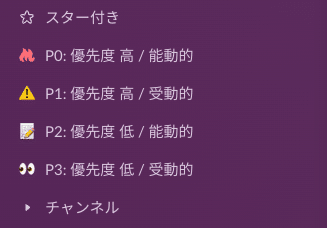
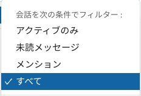
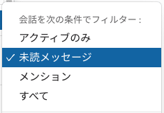
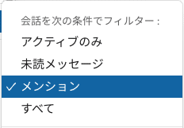

本記事は [MOSH Advent Calendar 2025](https://adventar.org/calendars/11936)  の1日目の記事です。

MOSHにジョインして、気づけば半年が経ちました。   
本記事では、フル出社の前職からフルリモートの MOSH に転職して模索した**「Slack通知との向き合い方」**についてご紹介します。

## 「あれ、仕事が進まないぞ…？」

私が前職まで働いていた環境は「フル出社」が基本でした。 「ちょっといいですか？」と口頭で話すのが当たり前だったので、Slackの通知も十分さばききれる量でした。

しかし、フルリモートの会社となると勝手が大きく異なります。 当然ながら、すべての会話がテキストベースで流れてきます。

広範囲へのメンション、botからのアラート、気になるチャンネルの未読バッジ…。 最初の頃は「早くキャッチアップしなければ」と意気込んで、通知が来るたびにすべて反応していたのですが、ふと気づきました。

「あれ、今日あんまり作業が進んでいないぞ…？」

通知が来るたびに思考が中断され、対応して、また集中し直して…。エンジニアの方なら共感していただけると思うのですが、このコンテキストスイッチは脳のメモリをかなり消費します。

「これは運用を見直さないと、パフォーマンスが出せない」 と感じ、Slackとの付き合い方を本気で再設計することにしました。

## 「プロジェクトごと」に分けるのをやめた

どう整理すべきか悩んでいた時、X（Twitter）で興味深い投稿を見かけました。チャンネルは「内容」ではなく「閲覧頻度」で分けると良い、という内容です。

https://x.com/iwashi86/status/1973174358777667817

この視点は、私にとって目からウロコでした。 それまでの私は「開発チーム」「通知」「全社連絡」のように「情報の意味」でセクションを分けていました。しかし、実際の業務フローにおいて重要なのは「どこのチームの情報か」よりも「今すぐ見るべきか、後でいいか」という時間軸です。

なるほどと思い、この考え方をベースに自分なりにアレンジを加えたのが今の運用方法です。

## 「自分から見に行く」のか「呼ばれたら行く」のか

私が実践して一番しっくり来たのは**「優先度」**と**「スタンス（能動・受動）」**の2軸で分類する方法です。

実際のSlackサイドバーは、以下のような4つのグループで構成されています。

### ① P0: 優先度 高 / 能動的

業務中に最も集中してアクセスしたいチャンネルを集めたセクションです。基本的には自分がメインで動いているプロジェクトやチームのチャンネルだけが含まれます。

- **フィルター条件：**すべて
- **開閉状態：**常に開いている状態

このセクションに含まれるチャンネルの未読はなるべく早く読みたいですし、自分から書き込みにも行くのでチャンネルを開くコストはなるべく抑えたいです。 そのため、セクションを開閉したりするコストを省き、ワンクリックでアクセスできるように設定しています。

### ② P1: 優先度 高 / 受動的

自分からチャンネルを開くことは多くないけれど、何か未読のメッセージが届いたらいち早くアクションをしたいチャンネルをこのセクションに入れています。代表的なチャンネルはシステムのエラー通知が届くチャンネルです。

- **フィルター条件：**未読メッセージ
- **開閉状態：**常に開いている状態

エラー通知は**「何もないなら見なくていいけれど、異常があれば即座に知りたい」**情報です。 ここは「未読メッセージ」だけ表示するという設定にしており、平和な時はセクションの中身が空っぽで視界に入らないため、無駄なノイズが生まれません。

### ③ P2: 優先度 低 / 能動的

エンジニア組織全体や全社チャンネルなど、能動的に利用するが範囲の広いチャンネルなどはリアルタイム性がちょっと低くても問題がないことが多いです。そういったチャンネルはこのセクションにまとめます。

- **フィルター条件：**すべて
- **開閉状態：**通常は閉じておき、必要な時に開く

このセクションはアクセスする頻度は低いのですが、必要があればなるべく少ない手数でアクセスできるのが望ましいです。そのため、フィルターはかけずに全てのチャンネルが表示される状態にはするのですが、ノイズにならないよう普段は畳んでおきます。

### ④ P3: 優先度 低 / 受動的

優先度も低く、自分から開くことはないチャンネルを集めたセクションです。雑談チャンネルや分報（times）などがここに当たります。

- **フィルター条件：**メンション
- **開閉状態：**常に開いている状態

これらのチャンネルはメンションが飛んできた時だけリアルタイムに反応し、それ以外の内容は時間ができた時にまとめて未読メッセージを読んでいます。 少し極端かもしれませんが、集中したい時に「お菓子食べたい」といった雑談通知で思考が止まるのは避けたいのです。1日1回、仕事終わりにまとめて眺めて「盛り上がってるな」と楽しむくらいが私にはちょうど良い距離感でした。

## 情報を「浴びる」のではなく「取りに行く」

フルリモート環境では「情報を取り逃がして孤立するのが怖い」という不安と、「すべて追っていたらパンクする」という現実の板挟みになりがちです。

しかし、こうして「自分から取りに行く情報」と「来たら反応する情報」を明確に分けたことで、心理的にも随分と楽になりました。

大切なのはツールに使われるのではなく、自分のペースで情報の流入をコントロールすること。 「サイドバーをどう設定するか」という地味な話ですが、リモートワークで機嫌よく成果を出し続けるためには意外と重要な工夫なのかもしれません。

## おわりに

この運用に変えてから、情報のキャッチアップ漏れを防ぎつつ、しっかりと「コードを書く時間」や「深く考える時間」を確保できるようになりました。

もし「通知が多すぎてしんどい…」と感じている方がいれば、一度「プロジェクトごと」の整理をやめて、「見る頻度」で並べ替えてみてはいかがでしょうか。頭の中がスッキリして、本来の業務により集中できるかもしれません。
