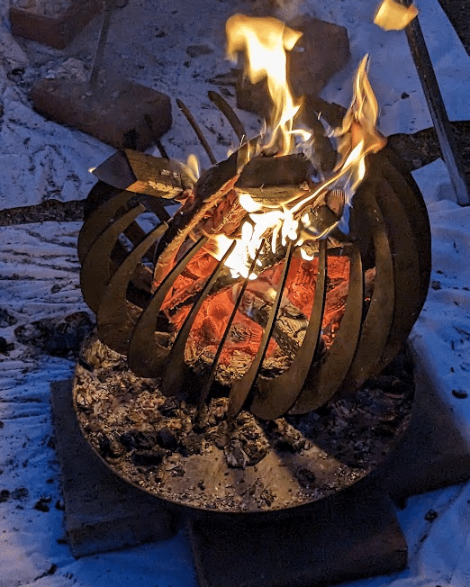
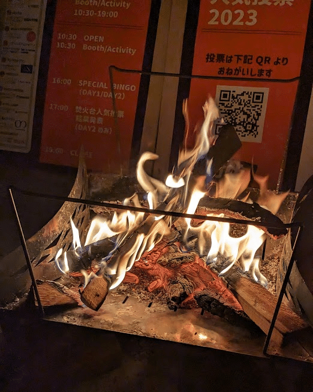

本記事は [キャンプ x エンジニア Advent Calendar 2025](https://adventar.org/calendars/11403) の5日目の記事です。

寒くなってきましたね。冬は空気が澄んでいて、焚き火が一番きれいな季節です。  
今日は、私が毎年楽しみにしている「焚き火クラブ」というイベントについてゆるりと紹介させてください。

## 焚き火クラブとは

一言で言えば焚き火をメインコンテンツにした屋外イベントです。  
毎年、江東区立若洲公園キャンプ場にて開催されていたのですが、今年は東京臨海高速鉄道臨海線「有明駅」から徒歩すぐの国営東京臨海広域防災公園に会場を変えて開催されるそうです。

詳しくは、今年のイベントの情報が公開されているので以下のURLをご参照ください！

:::embed{service="external-article" url="https://www.herofield.com/event/takibi/"}
**イベント:焚火クラブ | イベント情報**
イベント:焚火クラブ通信(ブログ)「イベント:焚火クラブ」の記事一覧です。
www.herofield.com
:::

## とにかく気楽。お散歩感覚で行ける

焚き火クラブの一番の良いところは、とにかく 「ハードルが低い」 ことです。

キャンプに行こうとすると、道具を用意して、設営して、終わったら灰を片付けて…と、結構な気合が必要です。  
でも、焚き火クラブであれば手ぶらで行って、満足するまで火を眺めて、飽きたらそのまま帰るだけです！

一人でふらっと参加もできますし、ちょっとピクニック行くくらいの気持ちで焚き火を楽しめます。

## 実際に火がついた状態の焚き火台が見られる

そしてこのイベントのメインコンテンツが**「試焚火」**です。  
公式でも紹介されていますが、お店ではなかなか見られない**「実際に火がついた状態の焚き火台」**が 70 台以上も展示されています 。

大定番の人気モデルから、実物はめったに見られないレアな焚き火台まで。  
実用性だけではない、とにかく美しさを求めた面白い焚き火台も見ることができます！

*この焚き火台を見ると、焚き火クラブに来たな〜って思います！*

同じ薪でも、焚き火台の形によって燃え方が全然違うんですよね。炎が縦にシュッと伸びるものもあれば、全体がボッと赤く輝くものもある。  
購入する前に燃え方を見ることができると安心感もあります！

*焚き火クラブで見て、後に実際に購入した焚き火台*

「へぇ、この焚き火台はこんなふうに燃えるんだ」  
そんな発見があるのが、この試焚火の醍醐味です。見ているだけで時間が溶けていきます。

## 作り手の「熱量」に触れる

もう一つの魅力は、出店されているメーカーやブランドの方と距離が近いこと。ブースによっては、焚き火台の開発者ご本人や社長さんから直接お話を聞けることもあります。

作り手の想いを聞いてから改めて火を眺めると、また違った味わいがあります。焚き火に詳しくなくても、単純に「へぇ〜！」と楽しめると思います！

### おわりに

次回の開催は年明け、 **2026年1月18日(日)** だそうです。

私もふらっと遊びに行く予定です。  
もしご都合が合えば、ぜひこのようなイベントから焚き火と触れ合ってみてください！
