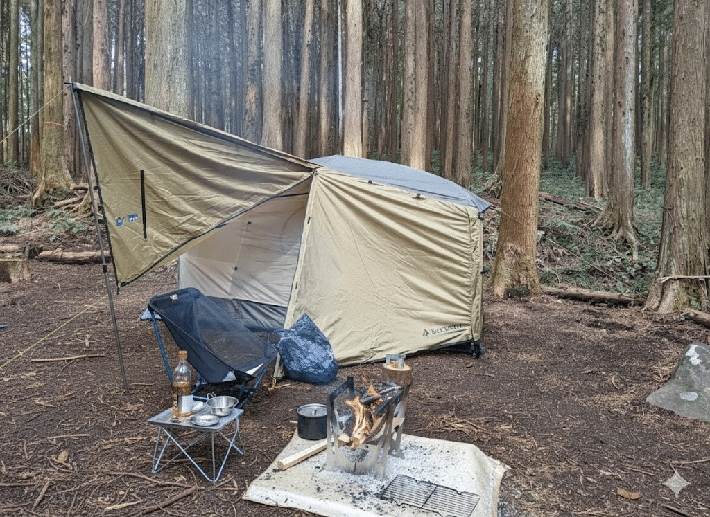
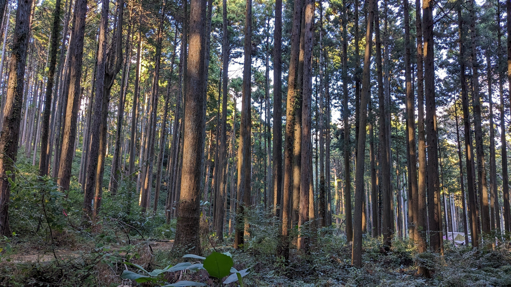

本記事は [キャンプ x エンジニア Advent Calendar 2025](https://adventar.org/calendars/11403) の9日目の記事です。

私はキャンプは好きですが、車は持っていません。

「キャンプ」というと、大きな車にテントやギアを詰め込んでサイトの横まで乗りつけるオートキャンプを想像する人が多いかもしれません。  
ですが、私の場合は電車やバスでキャンプ場を目指す、いわゆる「徒歩キャンパー」というスタイルで楽しんでいます。

そうなると、キャンプ場を選ぶ基準が世間一般のオススメとはずいぶん変わってくるのです。

まず大前提として、公共交通機関だけでたどり着けること。 バスを降りてから、心が折れない距離で歩けること。 そして何より大事なのが、道中で食料やお酒が調達できることです。  
重い荷物を持って歩く時間を減らすためにも、なるべくゴールの近くで買い出しができるのが理想です。

この条件だけなら意外と選択肢はあるのですが、私はここにもうひとつ、譲れない条件があります。

**「静けさがほしい」**

アクセスのいい場所はどうしても、人も多くなりがちです。  
私はキャンプではなるべく人と会わず、静かに過ごしたいです。隣の区画との距離が近かったり周囲が騒がしかったりすると、ちょっと残念に思ってしまいます。

「アクセスはいいけれど、孤独感も味わいたい」  
そんな矛盾するような条件を求めて行き着いたのが、今回紹介するキャンプ場です。

## 「近さ」と「静かさ」が同居する場所

私のお気に入りは、小田原にある「いこいの森 RECAMP おだわら」の「密林サイト」という区画です。

:::embed{service="external-article" url="https://www.nap-camp.com/kanagawa/13655"}
**小田原市 いこいの森 RECAMP おだわら**
小田原市 いこいの森 RECAMP おだわらの詳細。口コミやブログ・写真などリアルな情報をチェック。アクセスや料金、営業情
www.nap-camp.com
:::

ここは、小田原駅からバスで10分ちょっと、バス停からは5分ほど歩けば到着します。 駅前で買い物をしてサッとバスに乗れるので、重い荷物を長時間持ち運ぶ必要がありません。  
バスの本数や道中の坂道は懸念材料ですが、非常にアクセスの良い立地です。

そして、このキャンプ場自体はお湯の出る炊事場やきれいなシャワーもある、いわゆる「高規格」なキャンプ場です。車の乗り入れができる区画サイトは広々としていて、ファミリーやグループで賑わっています。

ですが、私が選ぶ「密林サイト」は少し趣が異なります。車の乗り入れは当然できず、キャリーカートを引いて入ることも難しい林の中に区画サイトがあります。林の中には通路とテントを張るスペースだけが拓かれていて、区画と区画の間には十分な木々が残されているのです。おかげで視界が遮られ、プライベートな空間が確保されています。

*密林サイトの様子。私の姿は Nano Banana に消してもらった！*

林の中に自分たち以外誰もいないような感覚。これがたまらなく心地よいのです。

## 不便さが生む、ちょっとしたサバイバル

密林サイトの区画はどの区画も絶妙に不便です。斜面が多かったり、区画内に木や切り株があってテントを張るレイアウトに困ったり。

また、炊事場やトイレからは少し離れています。急にトイレに行きたくなったらちょっと焦るくらいの距離はあります。便利なオートキャンプサイトに比べれば、その辺も少し不便さを感じるかもしれません。

*右下、遠くにオートキャンプサイトが見えます。川を挟んでいます。*

夜、トイレに行くのは大変です。ヘッドライトは必須装備。明かりがあってもどこが道なのか分からないほど、暗くて目じるしがないのです。  
過去には別の区画の方が道に迷って、灯りを頼りに我々の区画にたどり着いてしまうこともありました。

キャンプ場の中ではあるのですが、準備や工夫がないと困ってしまう難易度になっているのも程よい緊張感があって素敵です。

## 徒歩キャンパーが求める「解」として

最後に、私が徒歩キャンプをする上で重視している条件を整理しておきます。

- **交通アクセス:** 公共交通機関の最終地から徒歩で無理なく行けること
- **調達の利便性:** 現地のスーパーやコンビニが道中にあり、直前で買い出しができること
- **プライベート感:** 隣接サイトと距離があり静寂が確保されていること

車がなくても、このような条件を満たすキャンプ場は意外とあるものです。 もし私と同じような条件で場所を探している方がいたら、ぜひ一度訪れてみてください！

そして、私にオススメのキャンプ場があれば X などで教えていただけると嬉しいです！
