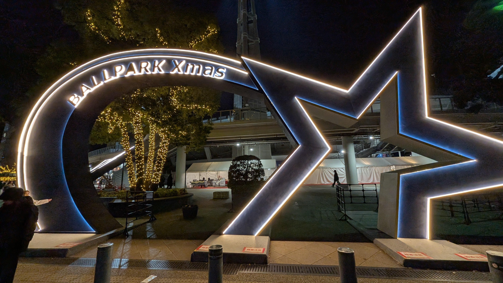

本記事は [横浜北部ソフトウェアエンジニアの集い Advent Calendar 2025](https://adventar.org/calendars/11417) の9日目の記事です。

私は普段、MOSHでエンジニアをしながら、技術広報やコミュニティ運営もしています。

今日は、今年参加して心に残ったイベントたちを振り返りつつ、そこから見えてきた「コミュニティってなんだろう」という、振り返りをします。

## LINE Developers Communityでの挑戦

LINE API Expert として企画・運営に携わるコミュニティですが、今年は少しチャレンジな機会がありました。

一つは、亀田さんのイベントにハンズオン講師として参加した企画。

https://linedevelopercommunity.connpass.com/event/351970/

270名もの申し込みをいただいたイベントで、参加者全員が完走できることを目標にハンズオンの準備をしました。考えることも多かった分、学びが多いイベントになりました。

もう一つ、心に残っているのはLINEミニアプリの開発イベント。

https://linedevelopercommunity.connpass.com/event/371941/

個人開発されていて実際に運用されているアプリを題材に、これから個人開発でサービスを作りたい方へ、コンセプト作りから実装までを伝える場をイメージして企画しました。

私はExpertとして「LINE APIを自己実現の手段として使ってもらいたい」という想いがあります。単発のLT会では届けられないメッセージが、このイベントでは少し形になった気がします。

## 本音で話せるオアシス

ただただ楽しかったのは焚き火LT会です。

https://kaitou.connpass.com/event/363314/

初めてのグルキャンでしたが、キャンプの新しい楽しみ方を学びました。LT会も良かった。「バック・トゥ・ザ・フューチャー」を初めて通しで見れたのも良い思い出です。

私が運営に関わる EM Oasis でも、新しい試みをしました。

https://emoasis.connpass.com/event/372027/

普段はOSTでお悩みを解決するスタイルですが、今回はトピックオーナーに最初にLTをしてもらう形式に。 次世代のEMがふらっと入りやすい場にしたかったんですが、参加者のバランスもよく、小規模ながらとても温かい時間になりました。

## 初めて参加した「地域コミュニティ」

そして、今日のアドカレの主催でもある「横浜北部ソフトウェアエンジニアの集い」。

https://yokohama-north.connpass.com/event/370555/

「技術スタックが同じだから」とか「同じ職種だから」という理由で集まるわけじゃない。 ただ「住んでいる場所が近い」というだけで繋がる面白さ。

Discordにはローカルトークが流れてくる。これが、本来のコミュニティの姿なのかもしれません。

ちなみに、会場・飲食スポンサーをしてくださった DeNA さんがスポンサーLTで紹介されたハマスタのクリスマスイベント、いきましたよ！  
素敵なイベントでした〜🙌

## 技術広報とコミュニティ

私は今年も一年、「技術広報」としての活動と「コミュニティ運営」としての活動、その両方を行き来していました。

どちらも「イベントをやって、人を集める」という点では似ているかもしれません。 でも、その根っこにある想いは全然違うものだと感じています。

会社の魅力を伝え、仲間を増やすための技術広報。 純粋に「その場」が楽しくて、誰かの居場所を作るためのコミュニティ。

今年は素敵なコミュニティに多く触れたことで、一層「コミュニティのあり方」についてたくさん考えた年でした。仕事としての広報ももちろん頑張りますが、やっぱり私は損得勘定抜きで人が繋がれる、あの温かい空気が好きなんだと思います。

来年はもっと、コミュニティそのものの熱量を上げていけるような、そんな貢献ができたらいいな、と考えています。

## 最後に、すこしだけ宣伝を

これは技術広報の人格で書く文章です。今月から、MOSHでもTech Meetupを定期開催することになりました！

https://mosh.connpass.com/event/377406/

「情熱がめぐる経済をつくる」をミッションに掲げるMOSHはコミュニティとの親和性が高い会社だと思っています。横浜北部の集まりで感じたような、肩の力を抜いて話せる「地域コミュニティに近い温度感」を持った場にしたいと（個人的には）思っています。

ぜひ、気軽に遊びに来てください。美味しいものを食べながら、技術のことやコミュニティのこと、一緒にお話ししましょう！
