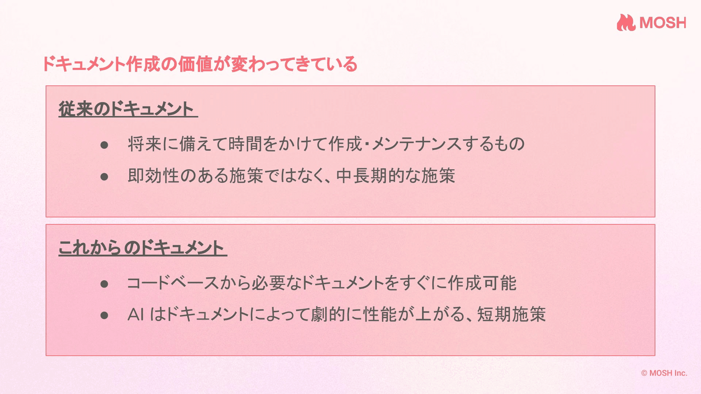

「LLMが生成したコードがレビューできなくて困っている」  
という課題はアーキテクトが直面する課題に似ている。

t_wadaさんのこの言葉に、私は思わず膝を打ちました。

BuriKaigi 2026の基調講演「2026年のソフトウェアエンジニアリング」。t_wadaさん曰く「生煮え版」で、今年の講演の土台になるお話とのこと。私にとっては、自分のキャリアを肯定してもらえたような講演でした。

この記事では講演の全体像を整理した上で、私が特に刺さった話を3つ取り上げます。

---

## 講演の全体像

講演資料は公開されないかもしれないとのことだったので、聞けなかった方や振り返りたい方のために、まず全体像を整理しておきます。

### 2025年の振り返り

コーディングエージェントが「使うかどうか」ではなく「どう使うか」の段階に到達した年。バイブコーディングによって、エンジニアでない人が自分のためのソフトウェアを作れるようになった。

ディスカバリー（新しいものを作る、検証する）はやりやすくなった。一方でデリバリー（届ける、維持する）はまだこれから。2026年はデリバリーにフォーカスする年。

### 非決定性という前例のない変化

抽象化のレベルを上げるだけでなく、横方向に「非決定性」が入った。これはソフトウェアエンジニアリングの歴史において前例がない。ハルシネーションは「バグ」ではなく、確率的に動作する言語モデルの仕組み上、当然起きるもの。

### 適応度関数で品質を担保する

人間がコードを読まなくても品質を担保する仕組みが必要。大規模開発のアーキテクトが直面してきた課題と同じ構図。メトリクスの測定と判断をセットにした「適応度関数」を設計し、AIの暴走を防ぐ。

### 理解容易性への投資が報われる時代

変更の主体が人間からAIになった。変更量への許容度が人間とAIでは次元が違う。一方、理解容易性は人間とAIで見解が一致している。理解容易性と変更容易性のトレードオフが緩和され、理解容易性への投資が報われるようになる。

### コスト構造の変化で「避けてきたプラクティス」が射程に

記述・変更コストの大幅な低減により、コードカバレッジ100%、形式手法、モデル検査といった、これまでコスパの観点で避けられてきたプラクティスが現実的な選択肢になる。ドキュメントを書いた本人が短時間で報われる時代が来た。

---

以下では、私が特に刺さった話を3つ取り上げます。

## 私が刺さった話①：非決定性への感度

私はLLMの非決定性にそれほど困った経験がありません。

X ではよく「ハルシネーションで困ってる」「思った通りに動かない」という声をよく見かけます。でも、私はそこまで困っていない。なんでだろう、とずっと思っていました。

t_wadaさんの話を聞いて、理由がわかった気がします。

ひとつは、いにしえの言語モデルの時代からこの領域に触れてきたこと。そもそもの仕組みを理解しているから、「確率的に動作するもの」という前提が自然と身についている。

もうひとつは、コンピュータ将棋開発の経験です。将棋AIも確率的に動作します。同じ局面でも毎回違う手を指すことがある。そういう挙動に対する馴染みがあるんです。

たぶん、「そういうものだ」と思って取り扱うことが、本能的にできているんだと思います。

## 私が刺さった話②：適応度関数という考え方

冒頭で触れた「LLMが書いたコードをレビューできない」という課題。

t_wadaさんは、これは大規模開発のアーキテクトが直面してきた課題に似ていると話されました。人間がコードを読まなくても品質を担保する仕組みが必要。その答えのひとつが「適応度関数」。メトリクスの測定と判断をセットにした仕組みを設計するという考え方です。

これも、納得感が強かった。言語化できていない感覚を整理してもらったと感じます。

大規模開発って、1社で完結しません。開発体制も統制できない。それでも品質は担保しなければいけない。

そういう現場では、コードの品質を直接見るより、もっと上のレイヤーを見ることが多かった。担保すべきことと、気にしても仕方ないことを切り分ける。そういう意識が自然と身についていました。

t_wadaさんの話を聞いて思ったのは、あのとき考えていたことが今はより小さいスコープで発生するようになったんだな、ということです。

「1社で完結しない開発」が「1人で完結しない開発」になった。主体が人間からAIに変わっただけで、課題の構造は同じ。

大規模開発を経験していてラッキーだったな、と素直に思います。

## 私が刺さった話③：コスト構造の変化

t_wadaさんは、コスト構造の変化についても話されていました。

記述・変更コストが大幅に下がったことで、これまで「コスパが悪い」と避けられてきたプラクティスが射程に入る、と。コードカバレッジ100%、形式手法、モデル検査。

私は1社目でモデル駆動開発をやっていた時期があります。まさかあの経験が2026年に活きてくるとは。

そして、特に刺さったのがこの言葉でした。

「ドキュメントを書いた本人が短時間で報われるようになった。これはソフトウェアエンジニアリングの歴史で初めてのことです」

これは、私も昨年の登壇で話していました。

*2025年7月には短期施策になった実感をしていました*

コスト構造の変化で考え方を変える場面はこれからもあるでしょう。常に意識していたいものです。

## おわりに

t_wadaさんの講演を聞いて、これまでの人生経験がLLM時代の開発に活きるんだな、という手応えを得ました。

確率的な挙動を「そういうものだ」と受け止められること。コードを全部読まなくても品質を担保する考え方を知っていること。どちらも、過去の経験があったからこそ身についたものです。

「若い世代より有利だ」なんて言うつもりはありませんが、過去の経験が無駄にならないというのは、素直に嬉しい。

t_wadaさんの講演は「生煮え版」とのことでした。今後ブラッシュアップされていくそうなので、どこかでまた聞けることを楽しみにしています。
