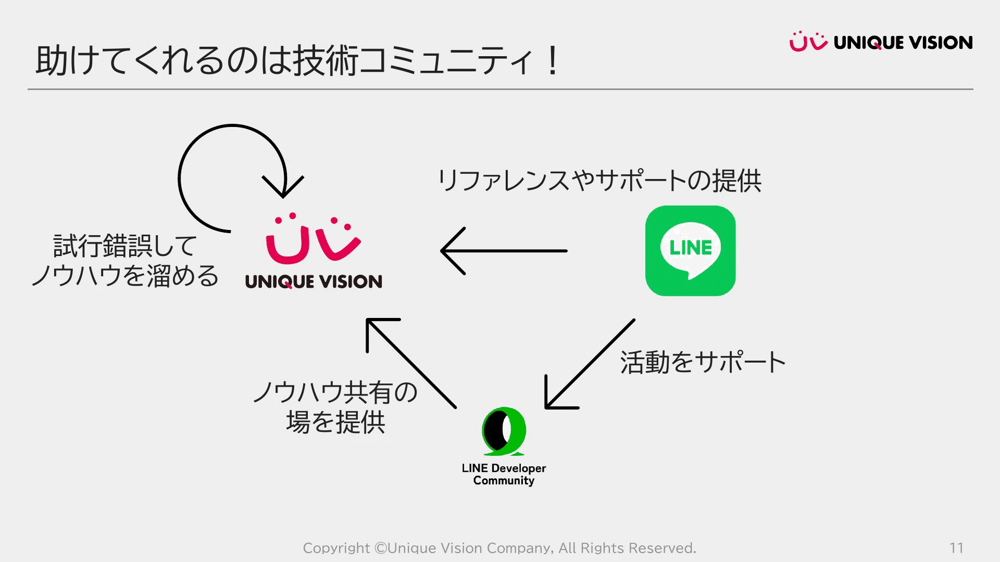

「こういうことってできないのかな」

そう思っている人が、世の中にはたくさんいます。

自分の子どものため。趣味のコミュニティのため。周りの人がちょっと便利になるため。そういう「小さなスコープ」から生まれるアイデアを持っている人たち。

「子ども好き」とか「趣味をもっと楽しみたい」とか。言葉にするとチープに聞こえるかもしれませんが、そこにはもっと尖った情熱がある。

私には技術力があります。知識も経験もある。いろんな開発をしてきて、技術で課題を乗り越えて、自力で解決してきた自負があります。

でも、そういう**「小さくて尖った情熱」から生まれるアイデアは、私には絶対に思いつけないものばかり**です。

そして同時に、アイデアはあるのに実現する方法がわからなくて止まってしまう人も多いことを感じてきました。

そんな方々に対して、私は何ができるだろうか。ずっと考えてきたテーマです。

## LINE API Platform Evangelistになりました

2026年1月、LINE API Platform Evangelist（LAPE）に認定されました。

https://note.com/linedc/n/ne1ec9eb84e2d

LINE Developer Communityというコミュニティがあります。LINEの開発者向けプロダクトに興味のあるLINEヤフー社外の有志のエンジニア・クリエイターを中心に運営されているコミュニティです。

LAPEは、このコミュニティの運営と成長をリードするための新しいロールとして作られました。従来のLINE API Expertの中から、よりコミュニティ運営の中心的な役割を担うパートナーとして認定を受けた形になります。

## 9,700万人が使うツールの上で

LINE APIプラットフォームは、アイデアを持っている人にとって良い選択肢だと思っています。

MAUは2024年12月時点で9,700万人。日本のほとんどの人がすでに使っているツールなんですよね。

このプラットフォームの上で、チャットボットもミニアプリも作ることができる。通知も送れる。生活の中にシームレスに溶け込んでいくようなアプリを提供できる。

一から開発しようと思ったら大変なことも、LINE APIプラットフォームに乗るだけで実現できる機能がたくさんあります。初心者にも優しく、それでいてチープではないフルスペックなアプリを提供できる。そこが魅力だと感じています。

## 公式情報だけでは、届かない

ただ、アイデアは持っているけれど技術力がない人に「LINE APIプラットフォームを使えばいいですよ」と伝えたとして、それだけで実現されるかというと、そうではないと思います。

公式のドキュメントやサポートだけでは、届かない人がいる。

「為せば成る 為さねば成らぬ 何事も」で有名な江戸時代中期の米沢藩の名君、上杉鷹山。私はこの人の「三助の思想」という考え方が好きで、よくコミュニティの話をするときに引用しています。

自助、共助、公助。

まず自分で頑張る。それでも足りなければ隣同士で助け合う。それでも補えない部分を公が支える。この三つが噛み合って初めて、全体がうまく回る。

技術コミュニティもまさにこれだと思っています。  
公式ドキュメント（公助）だけでは届かない部分を、コミュニティ（共助）が補う。

*2年前の登壇資料でも「三助の思想」を紹介していました！*

隣同士で教え合ったり、つまずいたところを共有したり。そういう仕組みがないと、面白いアイデアは「こういうことってできないのかな」のまま、実現されずに消えてしまうかもしれない。

## コミュニティは居場所です

だから、私がやりたいのはこういうことです。

LINE Developer Communityを、自助・共助・公助がちゃんと噛み合う形で維持し続けること。

コミュニティは居場所です。

最初の一歩を踏み出す場所でもあり、その先に進む場所でもある。

「まずは自分のために作ってみた」から始まって、「もっと多くの人に使ってもらいたい」と思うようになる。ノーコードで始めたところから自分でコードを書くようになったり、サーバーを立てたりする必要が出てくるかもしれない。

そして、作ったものを発表する場所でもある。

誰かが「こんなの作りました」と見せてくれると、「自分もやってみよう」と思う人が出てくる。その人が作ったものを見て、また別の誰かが刺激を受ける。教える側と教わる側が固定されていなくて、お互いに影響を与え合っている。

そういう循環が続いていく場所が、LINE Developer Communityだと思っています。

## 「できた」に変わる瞬間を

私がLAPEとしてやりたいことは、結局のところ一つだけです。

面白いアイデアを持つ人が、それを実現できる土壌を整えること。

「こういうことってできないのかな」が、「できた！」に変わる瞬間を、一つでも多く見たい。 そのために、地道にコミュニティを耕していこうと思います。

LINE Developer Communityはconnpassで定期的にイベントを開催しています。気になった方はぜひ覗いてみてください！

https://linedevelopercommunity.connpass.com/

これからも、どうぞよろしくお願いします。
