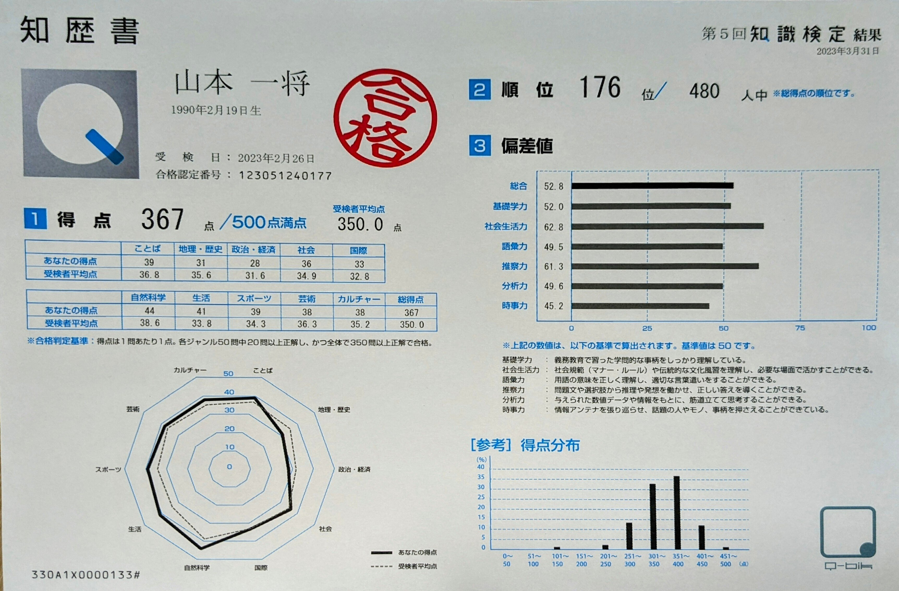
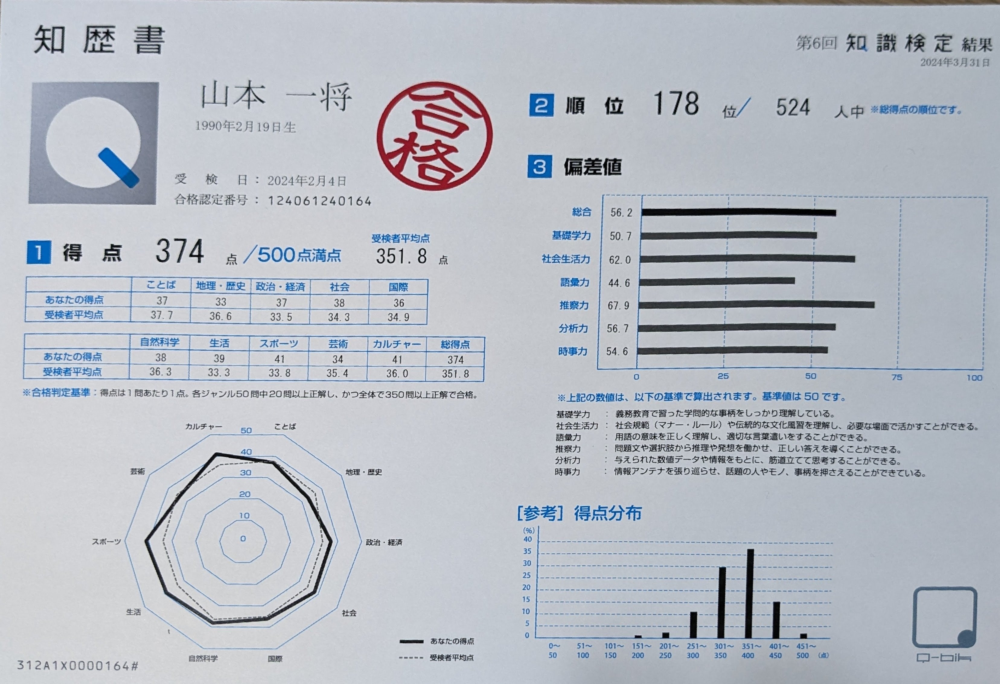
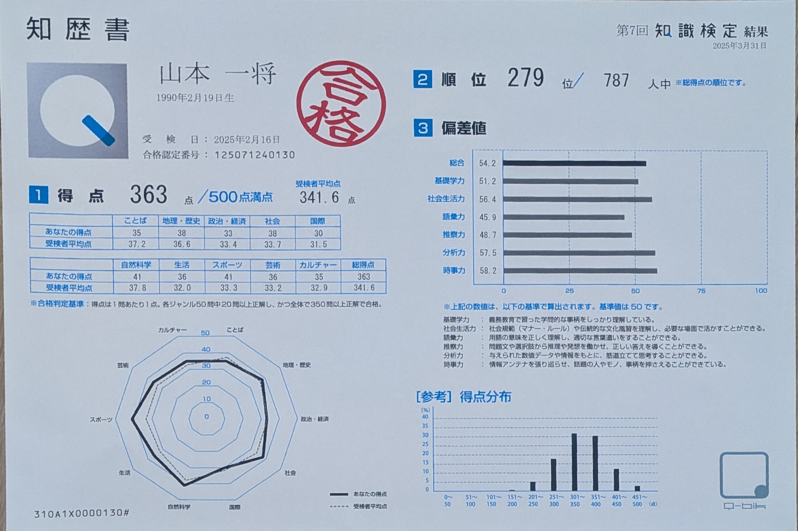

本日、2026年2月8日は第8回知識検定の試験日です。  
私にとっては4回目のチャレンジ。過去3回はすべて合格しています。

「3回受かっているなら、もう受けなくてもいいのでは？」と思われるかもしれません。 でも、私にとってこの検定は「合格すること」が目的ではないのです。

## 出題範囲は「出題範囲は、この世のすべて」

知識検定の公式サイトを開くと、「知を問う」という言葉が大きく掲げられています。

> 問いだらけの、この世界。  
> 多様な答えが求められる今、  
> ひとりひとりの知が、問われている。  
>   
> 内なる知識が、思考を確かにする。  
> 知識の連鎖が、思考を飛躍させる。  
> その先に、あなたの答えがある。  
>   
> 出題範囲は、この世のすべて。  
> 全500問が、あなたの知を問う。
*<https://www.kentei-uketsuke.com/knowledge/>*

「出題範囲は、この世のすべて」。  
なかなか思いきったことを言っています。

実際、出題ジャンルは「ことば」「地理・歴史」「政治・経済」「社会」「国際」「自然科学」「生活」「スポーツ」「芸術」「カルチャー」の10分野。  
各ジャンル50問、合計500問を110分で解きます。

1問あたり約13秒です。

「そもそも全部解けるの？」という心配が先に来るかもしれません。  
正直、私も毎回ギリギリです。じっくり考える余裕はほとんどなく、知っているか知らないかを瞬時に判断していく。体力勝負に近い感覚があります。

もう一つユニークなのが、1級や2級といった階級が存在しないこと。  
合格基準は「各ジャンル50問中20問以上正解」かつ「全体で350問以上正解」。つまり、まんべんなく知っていないと受からない仕組みです。どこか一つのジャンルに極端に弱いと、総合点が足りていても不合格になります。

## 「知識の健康診断」という考え方

なぜ合格しても毎年受けるのか。

私はこの検定を、ある種の「知識の健康診断」だと考えています。

1年間、意識的に動いていないと、学生時代に学んだ基礎教養のような部分はどんどん抜け落ちていきます。歴史の年号、化学式、政治の仕組み。かつては知っていたはずのことが、じわじわと記憶から消えていく。

一方で、新しくインプットして知っていくこともあります。仕事を通じて得た知識、趣味で触れたカルチャー、ニュースから吸収した時事ネタ。

知識検定には、こうした最新のカルチャーや時事問題も出題されます。自分の知識がいまの時代にちゃんと追いついているか。去年と比べて何が伸びて、何が衰えたか。それを年に1回、数字で確認できる。

健康診断と同じです。「今年も健康でした」で終わるのがベストだけど、「ここがちょっと引っかかりましたね」という結果も含めて、自分の現在地を知ることに意味がある。

## 「知歴書」という名の成績表

知識検定には「知歴書」という成績表があります。

知歴書には、10ジャンルごとの得点と受検者平均点、偏差値（基礎学力・社会生活力・語彙力・推察力・分析力・時事力の6軸）、レーダーチャート、得点分布グラフがまとめられています。自分の知識の「形」が可視化される。

私は過去3回分の知歴書を手元に持っているので、ここからは少し自分の話をさせてください。

## 3年分の知歴書を振り返る

*2023年の成績*

*2024年の成績*

*2025年の成績*

### 得点の推移

第5回（2023年） 第6回（2024年） 第7回（2025年） 得点 367/500 374/500 363/500 順位 176位/480人 178位/524人 279位/787人 総合偏差値 52.8 56.2 54.2

合格ラインは350点なので、毎回なんとか超えている、という感じです。400点の壁はまだ遠い。

ちなみに受検者数が480人→524人→787人と増えていて、この検定自体の認知が広がっていることも読み取れます。

### ジャンル別の傾向

3年間の推移を見ると、自分の知識の「得意・不得意」がはっきり浮かび上がってきます。

**安定して強いジャンル**は自然科学（44→38→41）とスポーツ（39→41→41）。自然科学はエンジニアだからまあ納得なのですが、スポーツが安定して強いのは自分でも少し意外でした。

**じわじわ改善しているジャンル**は地理・歴史（31→33→38）。2023年は31点で平均を下回っていたのが、年々上がってきています。

逆に**じわじわ下がっているジャンル**もあります。ことば（39→37→35）と生活（41→39→36）。日常の中で意識しないと衰えていく領域、という感じがして、少し耳が痛いです。

### 偏差値から見える「知識の体質」

知歴書には6軸の偏差値もついています。これが面白い。

時事力が45.2→54.6→58.2と、3年間で13ポイント上昇しています。社会人として情報のアンテナが広がっていることが数字に出ていて、素直にうれしいです。

分析力も49.6→56.7→57.5と着実に伸びている。仕事でデータを見る機会が増えたことと無関係ではないかもしれません。

一方で、語彙力が49.5→44.6→45.9と一貫して低めです。文章を書く仕事もしているのに語彙力が弱い。これは正直、少しへこみます。

そして推察力。61.3→67.9→48.7と、振れ幅が約20ポイント。毎年同じ検定を受けているのに、ここまで安定しないのかと驚きます。推察力は「問題文や選択肢から推理や発想を働かせ、正しい答えを導くことができる」力とされていて、つまりはその日のコンディションや問題との相性に左右されやすいのかもしれません。

### AIに知歴書を読み込ませてみた

せっかく3年分のデータがあるので、AIに知歴書を読み込ませて「私はどんな知識を持った人間か」を診断してもらいました。健康診断の所見のようなものです。

> **安定領域:** 自然科学とスポーツは3年を通じて高水準を維持しており、あなたの知的基盤と言えます。社会も安定しています。  
> **改善傾向:** 時事力の偏差値が45.2→54.6→58.2と年々上昇しています。情報のアンテナが広がっていることを示す良い兆候です。分析力も着実に伸びています。  
> **経過観察:** 語彙力の偏差値が低めで推移しています。ことばジャンルの得点も緩やかに下降しており、意識的なインプットが望ましいです。  
> **所見まとめ:** 全体として「理系的な思考力」と「社会への関心」を土台に持ち、年々カバー範囲を広げている傾向が見られます。一方で言語・語彙領域にやや偏りがあり、総合的な知識のバランスとしては「健康だが、少し偏食気味」という状態です。
*Claude による診断結果*

「健康だが、少し偏食気味」。なかなか的確な表現だと思いました。

## 4回目の受験を終えて

本日の受験を終えて、自己採点では少し合格ラインには届いていないという所感です。

この一年でスポーツに対する関心が薄くなっていることは感じていましたが、昨年までなら取れていた問題が分からなくなっていると実感する場面がありました。

一方で、最近アイドルの話を聞く機会が増えた影響で取れた問題もあります。

その時の知識は、身を置く環境にも大きく依存します。  
トゥントゥントゥンサフールというキャラクターは出題されて初めて知りましたが、子育て中の方は子供を通してこのキャラクターが流行していることを知っているようです。

合否はまだわかりませんが、今後も知識検定の受験を通して世間とのギャップを少しでも埋められるよう、注意深く生きていきたいものです。
