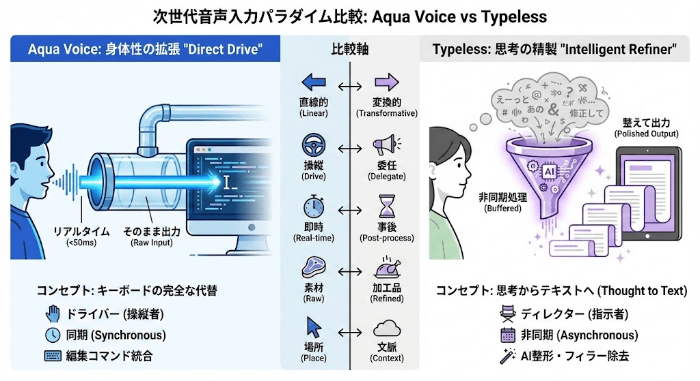

音声入力を始めて1ヶ月が経った。

いま一番変わったのは、「まずキーボードで打とう」と思わなくなったこと。何かを書くとき、最初に考えるのは「これ、声で入力できないかな」になった。キーボードに戻ると、MacのIMEの誤変換がいちいちストレスになる。1ヶ月前にはなかった感覚。

前回、AquaVoiceという音声入力ツールについて記事を書いた。

https://note.com/kyamamoto9120/n/n8fa537d1c18b

あれから毎日、音声入力を使っている。そんな中、Typelessというツールに出会った。

## 2026/2/12 11:00 追記

Typeless に対してのプライバシーリスクが報告されています。  
本記事は記録のために残しますが、利用に際しては十分にご注意いただくようお願いいたします。

私は、一旦 Typeless の利用をやめて AquaVoice に戻すことにしました。

https://x.com/medmuspg/status/2021198792524169650

## 「そのまま出す」と「整えて出す」

Xで名前を見かけるようになり、知人にも勧められて試してみた。AquaVoiceとは設計思想がまったく違う。

AquaVoiceは「そのまま出す」ツール。喋った言葉がそのまま文字になる。「えーと」も「あのー」もそのまま出る。

Typelessは「整えて出す」ツール。喋った内容を要約し、構造化して出力する。箇条書きにまとめてくれることもある。5分間、同じことを繰り返しながら考えを整理するように喋っても、要点だけが出てくる。そのままSlackに貼れるくらいの品質になる。

精度の違いもある。AquaVoiceは小声だと認識精度が落ちることがあった。Typelessはボソボソ喋っても、かなり正確に拾ってくれる。文章の整形過程で予測が入るからだと思う。これなら、オフィスやカフェでもスマホで使えるかもしれない。今後試していきたい。

*Gemini で作った比較画像*

## キーボードは例外になった

この1ヶ月でキーボードを叩く回数は体感で8割くらい減った。盛っているかもしれない。でも、それくらいの変化は感じている。

私は日常の開発でClaude Codeを使わない場面がほぼない。コードレビューの依頼も、設計の相談も、ドキュメントの下書きも、すべてClaude Codeに声で指示を出している。自宅にいる限り、手で入力することはまずない。

Typelessで喋った内容は構造化された状態で出てくるので、そのままClaude Codeへのプロンプトとして使える。AquaVoiceだと話し言葉がそのまま入力されるため、トークン数が膨らみやすかった。Typelessならコンテキストの圧迫が少ない。

いま自宅でキーボードを使うのは、ほぼ2つの場面だけ。コマンドの実行と、URLのコピペ。コマンドは補完が効くし、喋るより打った方が早い。なにより、コマンドを間違えると面倒なので正確性を優先したい。URLも同じで、コピペ操作はキーボードの方がスムーズ。

それ以外は、全部声で入力している。

## 「整えてくれる」が裏目に出た日

先日、noteの記事を1本ボツにした。

テーマは「MOSHへの愛」。オファーをもらってから約1年、ずっと燃え続けているこの気持ちを記事にしたかった。Typeless経由で音声入力し、それをもとに記事を起こした。

休日に1時間以上粘った。ああでもないこうでもないと構成を変え、言葉を足したり削ったりした。結局、ボツにした。読み返すと、何の記事なのか分からない。結論がブレていた。熱量が文字に乗っていなかった。

思い当たる原因はある。Typelessは喋った内容を要約・整理して出力する。それはコーディングやSlackでは助かる。でも、バーッと喋る中でポロッと出てくる「いいフレーズ」は、その過程で消えてしまう。脳の端にあった言葉が、整形される前に削られる。

Typelessのせいだと断定はできない。ただ、「もしかしたらAquaVoiceだったら書けたかもな」とは思った。

## AquaVoiceからTypelessへ

それでも、日常使いはTypelessに乗り換えることにした。

AquaVoiceが月10ドル、Typelessが30ドル。両方契約するつもりはない。コーディング、Slackのやりとり、ちょっとしたメモ。日常のほとんどの場面では「整えて出す」方が助かる。

Typelessが気になった人は、オンボーディングを試してみるのが一番早い。

MOSH愛の記事は、またいつか書く。
