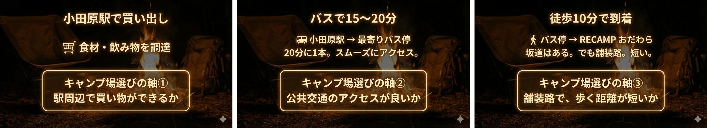
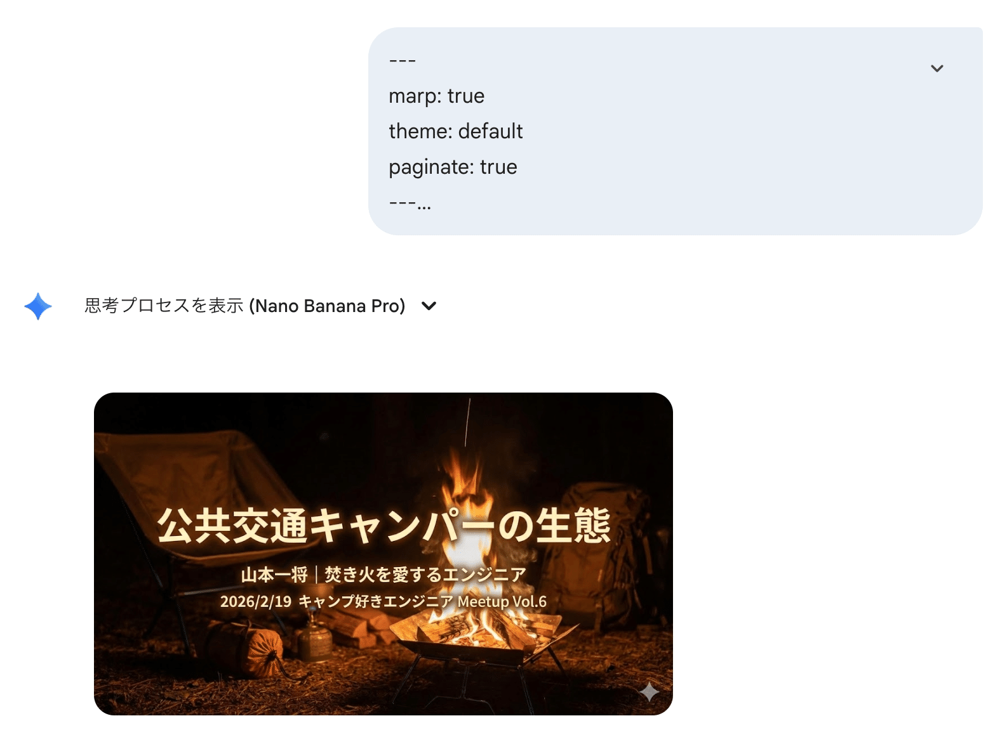
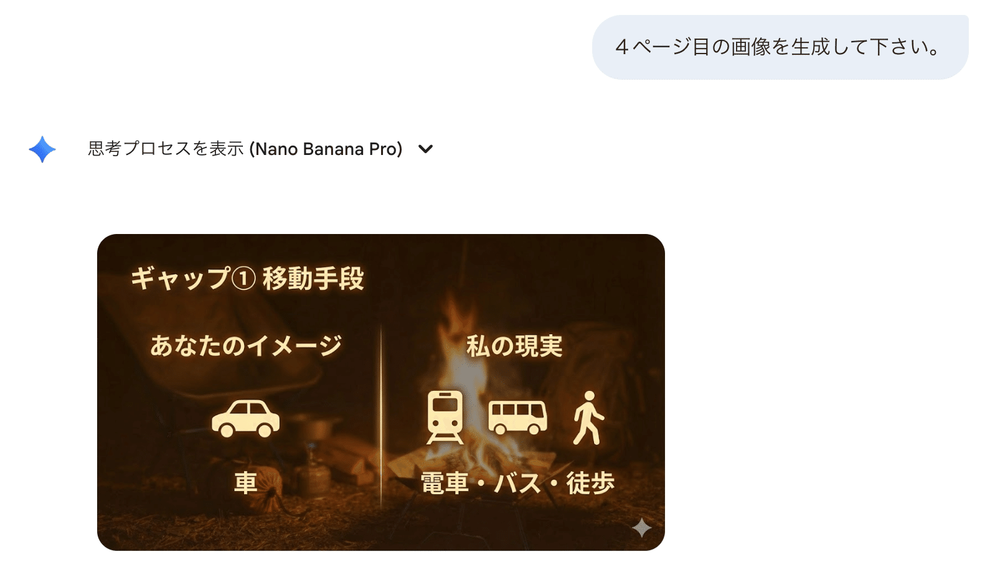
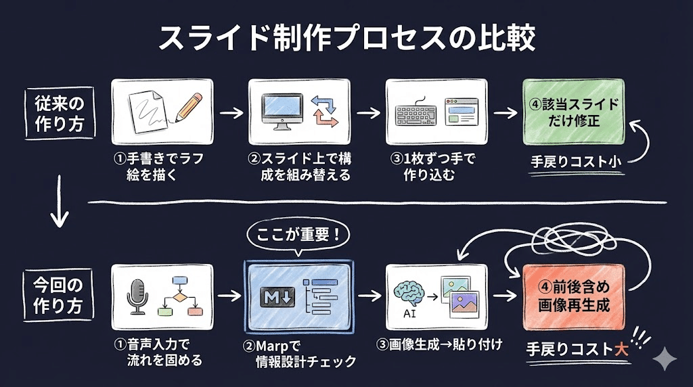

Geminiに「1ページ目のスライド画像を作って」と投げる。  
16:9の画像が返ってくる。それをGoogle Slidesに貼る。全画面に引き伸ばす。これを全ページ繰り返す。

今週の登壇資料は、こうやって作った。  
実際にできたスライドがこちら。

https://www.docswell.com/s/kyamamoto9120/5REL6G-2026-02-16-193000

https://www.docswell.com/s/kyamamoto9120/KPGVLQ-2026-02-19-193000

年間20回以上、勉強会やカンファレンスで登壇する。そのたびにスライドを作る。スライドだけは人間が手を動かすものだと思ってきた。

ただ、あらゆる作業を「まずAIに任せてみる」という流れの中で、自分だけスライドを手作りし続けているのが気になっていた。今週、2本の登壇資料で試してみた。

## 画像生成に落ち着くまで

結論から言うと、Geminiの画像生成AI（Nano Banana）で1ページずつスライド画像を生成する方法が、いまの自分には一番合っていた。

ほかに2つの手法も試している。

---

**NotebookLM  
**使っている人は多い印象がある。見た目はそれなりに作れる。  
ただ、出力されるコンテンツの制御が弱かった。中身を細かく調整しようとすると厳しい。

**Marp  
**コンテンツの制御はしやすい。マークダウンファイルなので当然ではある。  
ただ、私はスライドを「ビジュアルエイド」として重視している。箇条書き中心の Marp はそもそも相性が悪い。

---

私のスライド作りの考え方は『slide:ology\[スライドロジ―\]』という本がベースになっている。

https://www.amazon.co.jp/dp/4861009448

話を聞くことと文字を読むことは両立しづらい。スライドはあくまで理解を助けるもので、メインは話を聞いてほしい。  
この思想だと、Marpでは図やレイアウトの自由度に限界があった。

画像生成なら、コンテンツもレイアウトも制御できる。フォントが崩れることもなかった。


*並びで見せたい3枚のスライド。レイアウトにズレはない。*

複数ページで同じレイアウト・異なる内容という構成でも、タイトル位置やブロック位置がずれない。ページを送っても違和感なく読める。  
これは期待以上だった。

## 制作プロセスが変わった

具体的にどう作ったか。

まず、スライドがない状態で喋る。音声入力でプレゼンの流れを固める。喋りながら「ここでページを送る」というイメージが湧いてくるので、大体のスライド枚数と各ページのメッセージが決まる。

次に、マークダウンで全ページの設計書を書く。

実際に書いた設計書の一部がこちら。

```
---
marp: true
theme: default
paginate: true
---

<!--
■■■ 全スライド共通：世界観の定義 ■■■

このプレゼンテーションのビジュアルは、イベント「キャンプ好きエンジニアミートアップ Vol.6」の
アイキャッチ画像の世界観を踏襲する。

【アイキャッチの特徴】
- 手描き風のイラスト。ペンで輪郭線を描き、水彩のように淡く塗ったスタイル
- 色味：淡い水色の空、やわらかい緑の草原、オレンジのテント、水色のバックパック、白い雲と山
- 線：黒〜ダークブラウンの細いペン線。きっちりしすぎず、ゆるい手描き感
- 全体的にやさしく、あたたかく、カジュアルな雰囲気
- テキストは手書き風のフォント（丸みがあり、カジュアル）
- キャンプ×エンジニアのモチーフ（テント、焚き火、ノートPC、バックパック、山、木、川）

【全スライド共通の画像生成プロンプトに含めるスタイル指定（英語）】
以下を各スライドのプロンプト末尾に必ず付与すること：

"Hand-drawn illustration style with thin pen outlines and soft watercolor-like fills.
Color palette: soft sky blue, gentle green, warm orange, white, light brown.
Casual, warm, friendly atmosphere like a Japanese indie illustration.
Consistent with a 'camping x engineer' meetup event visual identity.
No photorealistic elements. 16:9 aspect ratio."

【画像・QRコード等の配置エリアについて】
実際の写真やQRコードを後から配置する箇所は、画像生成AIに対して
「その箇所にプレースホルダーの矩形（角丸の薄い枠線ボックス）を描くこと」と指示する。
QRコードそのものや写真そのものを生成させない。
-->

<!-- _class: lead -->
<!-- _paginate: false -->

# 公共交通キャンパーの生態

## キャリーケースと焚き火と、ときどき新幹線

**山本 一将** / MOSH Inc. エンジニア / EM

<!--
=====================================================================
■ スピーカーズノート（スライド1：タイトル）
=====================================================================

【話す内容】
こんにちは、MOSH株式会社の山本一将です。
今日は「公共交通キャンパーの生態」ということで、私のキャンプスタイルについてお話しします。
サブタイトルに「ときどき新幹線」って書いてあるんですけど、これは後ほど。

【時間配分目安】0分20秒

【ポイント】
- サブタイトルの「ときどき新幹線」で軽く笑いを狙う。深掘りはせず伏線にする
- テンポよく自己紹介スライドへ繋ぐ

=====================================================================
■ ビジュアル素材の指示
=====================================================================

【スライドタイプ】タイトルスライド
【役割】登壇の第一印象。タイトル・サブタイトル・名前を提示
【表示する要素】
- タイトル「公共交通キャンパーの生態」
- サブタイトル「キャリーケースと焚き火と、ときどき新幹線」
- 名前・所属「山本 一将 / MOSH Inc. エンジニア / EM」
【世界観の要素】
- アイキャッチと同様の風景（山、木、草原、空）を背景に描く
- テント、焚き火、キャリーケースなどのキャンプモチーフを散りばめる
- テキストは手書き風フォントのイメージ。カジュアルで丸みのある字体

生成AIへのプロンプト（英語）:
"Title slide for a camping presentation. Background: gentle landscape with mountains, trees, green hills, light blue sky and white clouds — all hand-drawn with thin pen outlines and soft watercolor fills. Small campfire, orange tent, and rolling suitcase illustrated in the scene. Title text area in center: 'Public Transit Camper's Ecology'. Subtitle below: 'A suitcase, a campfire, and sometimes the bullet train'. Speaker name area at bottom. Text should be in casual hand-drawn Japanese font style. Hand-drawn illustration style with thin pen outlines and soft watercolor-like fills. Color palette: soft sky blue, gentle green, warm orange, white, light brown. Casual, warm, friendly atmosphere like a Japanese indie illustration. Consistent with a 'camping x engineer' meetup event visual identity. No photorealistic elements. 16:9 aspect ratio."
-->

---

<!-- スライド2・3は同じフォーマットで記述。省略 -->

---

# ギャップ① 移動手段

|  | あなたのイメージ | 私の現実 |
|--|:--:|:--:|
| 移動手段 | 🚗 車 | 🚃 電車・🚌 バス・🚶 徒歩 |

<!--
=====================================================================
■ スピーカーズノート（スライド4：ギャップ① 移動手段）
=====================================================================

【話す内容】
まずひとつめのギャップが移動手段です。
キャンプって聞くと、多くの方は車にギアを積んで出発するイメージだと思うんですよ。
高速乗って、オートキャンプ場に着いて、テントの横に車があるっていう。
でも私がやっているのは、電車とバスと徒歩だけでキャンプ場に行くスタイルなんですね。
車は使いません。

【時間配分目安】0分30秒

【ポイント】
- ここでは移動手段の違いだけを見せる。運搬方法（キャリーケース）はまだ出さない
- 聴衆の多くが車キャンパーだと想定し、「え、車なしで？」というリアクションを狙う

=====================================================================
■ ビジュアル素材の指示
=====================================================================

【スライドタイプ】対比スライド
【役割】2つのものを並べてギャップを視覚化する
【表示する要素】
- 左側：「あなたのイメージ」= 車の手描きイラスト
- 右側：「私の現実」= 電車・バス・歩く人の手描きイラスト
- 中央に「vs」や手描きの仕切り線
- 各側にラベルテキスト
【世界観の要素】
- 左側：車とオートキャンプ場の簡単なイラスト（テントの横に車がある風景）
- 右側：電車、バス、歩く人のゆるいイラスト（アイキャッチの人物と同じタッチ）
- 仕切り線も手描き風（定規で引いたような直線ではなく）
- キャリーケースはまだ描かない

生成AIへのプロンプト（英語）:
"Comparison slide divided into left and right. Left side labeled 'Your image': hand-drawn illustration of a car parked next to a tent at a campsite, with trees and mountains. Right side labeled 'My reality': hand-drawn illustrations of a train, a bus, and a person walking — NO suitcase or carry-case. Center: a hand-drawn divider line or 'vs' mark. Both sides use the same illustration style. The person walking should match the character style from the event key visual (simple, cute, with a hat). Hand-drawn illustration style with thin pen outlines and soft watercolor-like fills. Color palette: soft sky blue, gentle green, warm orange, white, light brown. Casual, warm, friendly atmosphere like a Japanese indie illustration. Consistent with a 'camping x engineer' meetup event visual identity. No photorealistic elements. 16:9 aspect ratio."
-->

---
```

全ページ分、同じフォーマットで書いていく。

これをGeminiに渡すときは、こんな感じで指示を出す。

```
[設計書のマークダウンを貼り付け]

===

このプレゼンテーションのスライドの画像を１ページずつ、同じトンマナで作成していきたいです。
１ページ目の画像を生成して下さい。
```


*1ページ目の画像を生成してもらう*


*以降は「4ページ目の画像を生成して下さい」のように繰り返すだけ*

「2ページ目を生成してください」「3ページ目を生成してください」と繰り返していく。生成された画像をGoogle Slidesに貼り、全画面に引き伸ばす。

ひとつポイントがある。設計書をいきなり画像生成に渡す前に、Marpに通した。情報の並びと流れに違和感がないかを確認する中間チェック。  
従来の「手書きラフ」の代わり。

画像生成後の構成変更は再生成を意味する。手戻りコストが高いので、このチェックが効いてくる。

## 従来のプロセスとの違い


*従来は「見えるものから作る」。今回は「喋りから作って、見えるものは最後」。*

従来は「見えるものを先に作って、触りながら整える」やり方だった。手書きでラフ絵を描き、スライド上で構成を組み替え、1枚ずつ作り込んでいく。手戻りがあっても、該当のスライドだけ直せばいい。

今回は逆になった。喋りから入って、伝えたいことを先に固めて、見えるものは最後に一気に作る。制作物のイメージができるのが、かなり後ろのフェーズに移った。

手前の設計フェーズが重くなる分、そこさえ固まれば画像生成以降は速い。

---

やってみて、意外と実用レベルだった。納得のいく品質のスライドを作ることができた。

フォントの選定や世界観の作り込みを狙い通りにできるかというと、まだ課題は残る。しばらくはこの手法で続けてみる。
