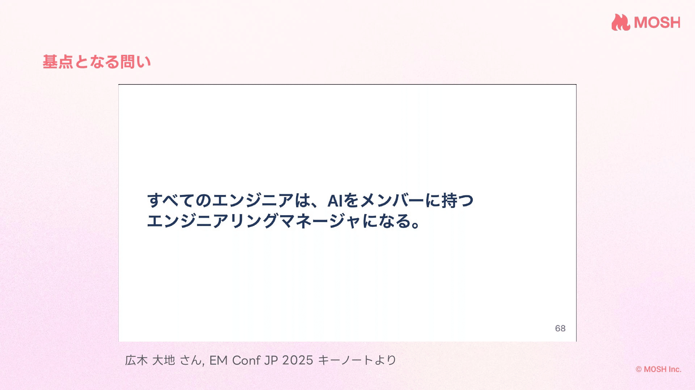
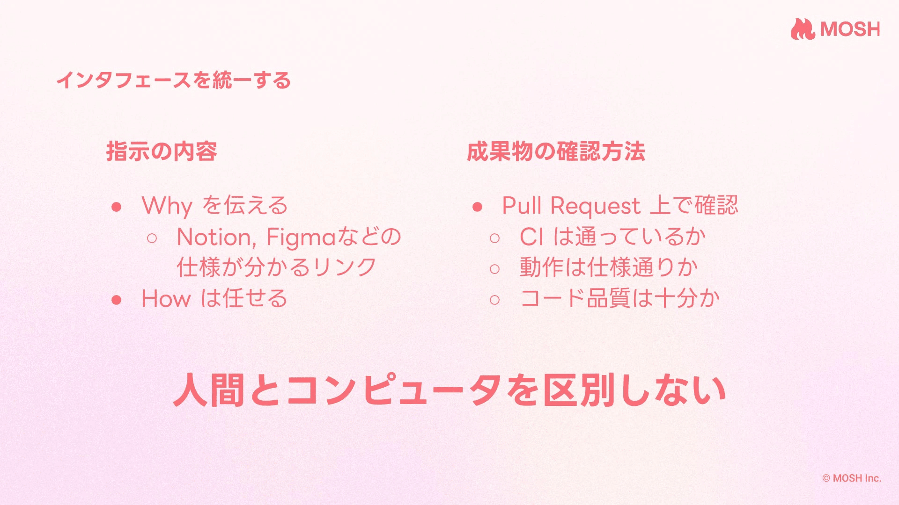
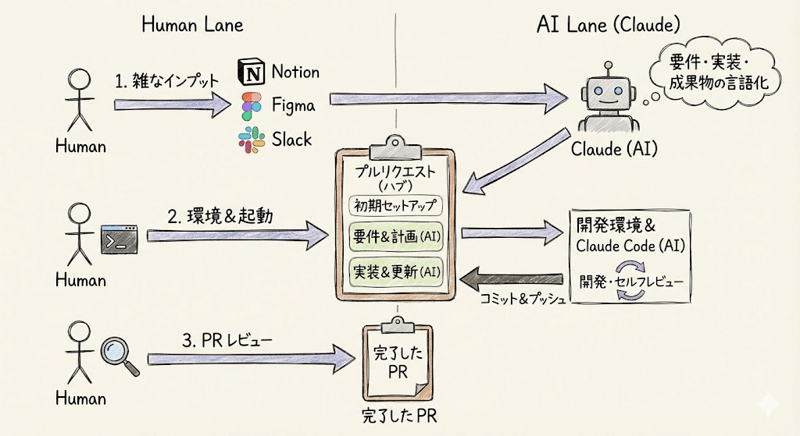
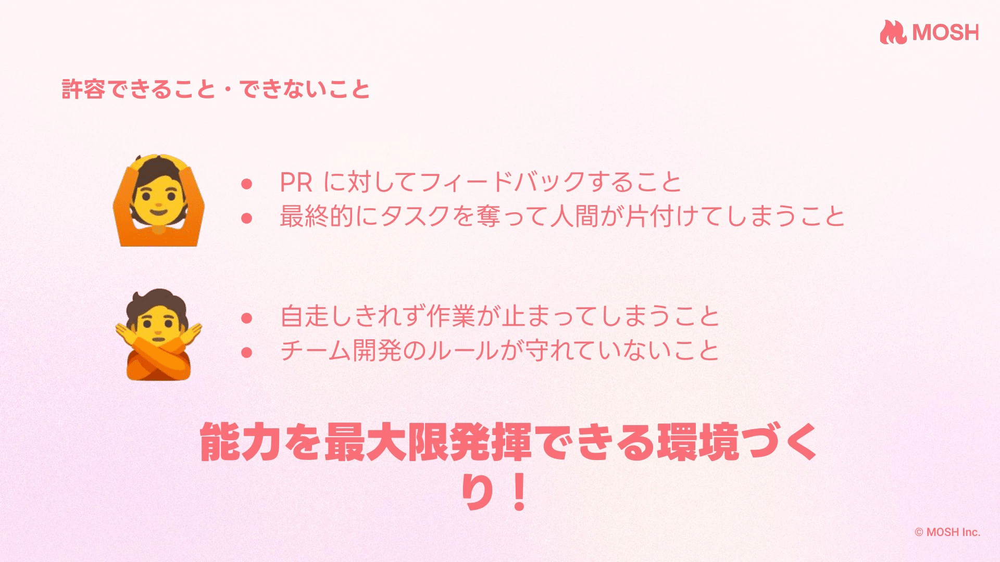
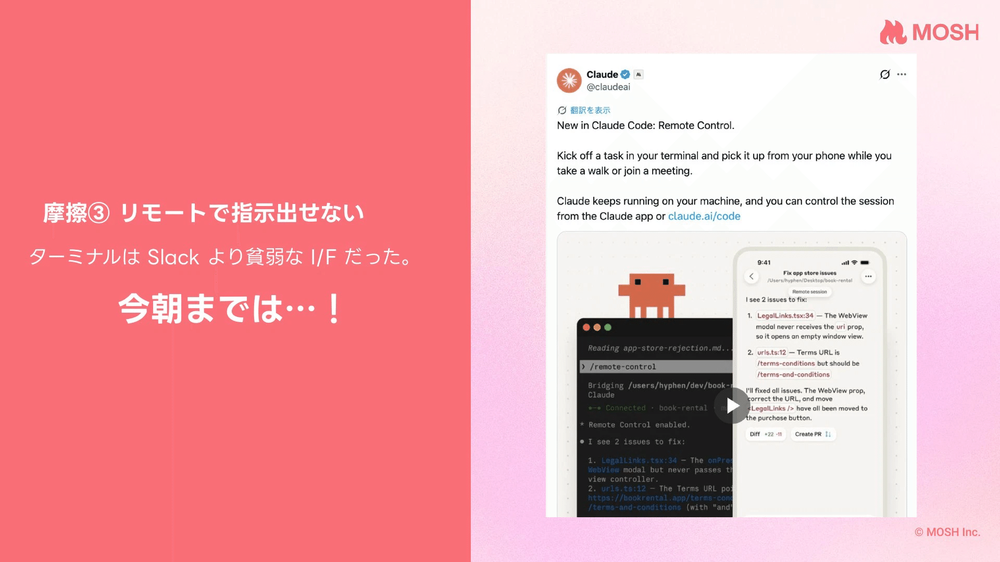

最後に自分でコードを書いてコミットしたのはいつだろう。

この1ヶ月、記憶にない。毎日PRはレビューしている。仕様も書く。  
でもコードを書いているのは私ではなくClaude Codeだ。

2026年3月現在、私の開発スタイルはそうなっている。  
先日Findyさん主催のClaude Code活用LT会で、この話をした。この記事では、登壇で伝えきれなかった部分も含めて書き残しておきたい。

## 人間とコンピュータを区別しない

基点となるのは EM Conf JP 2025 の広木大地さんのキーノート。

*p.5「すべてのエンジニアは、AIをメンバーに持つエンジニアリングマネージャになる。」*

1年前はまだ想像が難しかった。いまのClaude Codeなら、十分現実的だと思っている。

*p.7 インタフェースを統一する*

私が心がけているのは、人間のメンバーとClaude Codeに対するインタフェースを統一すること。

指示の出し方は「Whyを伝えて、Howは任せる」。NotionやFigma、SlackのURLを渡して、何を実現したいかを伝える。具体的な実装方法は指定しない。

成果物の確認はPR上で完結させる。CIが通っているか、動作は仕様通りか、コード品質は十分か。ここも人間のPRと同じ基準で見る。

開発の流れを図にするとこうなる。  
雑なインプット（Notion、Figma、SlackのURL）を渡すところと、実装計画の精査、最終成果物のPRレビュー。この3箇所だけが人間の仕事だ。

URLから要件を言語化し、実装計画を立て、コードを書き、セルフレビューしてコミット&プッシュする。ここはすべてClaude Codeが自律的にやる。

この「自律的に」が大事だと思っている。

## 能力不足は許容する。引き出せないのは改善する

*p.12 許容できること・できないこと*

Claude Codeに任せる範囲が広がると、EMがボトルネックになってくる。レビューが追いつかない。要件の言語化が間に合わない。これは予想通りだった。

ただ、ここで大事にしている考え方がある。

**能力不足は仕方ない。能力を引き出せていないのはまずい。**

これは人間のメンバーに対しても同じだ。ある人がスキル的にできないことがある。それは許容する。でも、環境やプロセスのせいでフルパワーが出せていないなら、それはEMの責任だと思っている。

Claude Codeにも同じ考え方を適用している。

PRに対してフィードバックすること。これは許容する。最終的にタスクを引き取って人間が片付けること。これも許容する。できないことはある。

でも、情報が足りなくて自走できず手が止まること。チーム開発のルールを知らなくて間違えること。これは許容しない。環境の問題だからだ。

フルパワーを出せる状態を作る。その上で出た結果が、いまのClaude Codeの実力。そう評価したい。

## 摩擦を減らす3つの打ち手

では具体的に何をしているか。私は「摩擦」という言葉で整理している。  
Claude Codeが自律的に動こうとしたとき、引っかかって止まるポイント。それが摩擦だ。

### 情報へのアクセス

一番多い摩擦は「情報が足りなくて判断できない」だった。

打ち手は3つ。MCPを整備して、Notion・Figma・Slackの情報に直接アクセスできるようにした。PR descriptionで曖昧さを事前に潰すようにした。そして「迷ったら決めで実装して、後で報告」というルールを入れた。

3つ目が地味に大きかった。人間のメンバーにも同じことを言う。「迷ったら一旦決めて進めて。間違ってたらレビューで直すから」。手戻りになる可能性もあるが、手が止まってしまうよりずっと良いと考えている。

### パーミッションの設計

Claude Codeには権限の壁がある。bashコマンドを実行するたびに承認を求めてくる。安全のためだが、毎回止まると自律性が損なわれる。

ここでの工夫は、Claude Codeがやりたいことを観察して、繰り返すパターンに名前をつけてスクリプト化すること。そのスクリプトに対して権限を付与する。

闇雲に全権限を開放するのではない。やりたいことを理解した上で、必要な権限だけを渡す。これもメンバーに対する権限設計と同じ発想だ。

### リモートでの指示

*p.16 Remote Control 機能がリリース*

登壇した日の朝、Claude CodeのRemote Control機能がリリースされた。ターミナルで起動したClaude Codeのセッションを、スマホやブラウザから操作できる機能だ。

これはまさに摩擦を減らすための機能だと思った。それまで、Claude Codeへの指示はターミナルからしか出せなかった。Slackなら移動中でもスマホから返信できるのに、Claude Codeには席に戻らないと指示が出せない。

リリースから数日、実際に使ってみている。散歩中にスマホからPRの修正指示を出したり、ミーティングの合間にタスクを投げたりできる。コミュニケーションのギャップがまた一つ小さくなった。

## 機能は「摩擦を減らす手段」として見る

Claude Codeには新しい機能がどんどん追加されている。MCP、カスタムスラッシュコマンド、Remote Control。

これらを「AIの能力を上げるもの」として捉えると、使い方を間違えると思っている。

Claude Codeの能力そのものは、モデルのアップデートで上がる。私がやるべきなのは、いまある能力をフルに引き出すための環境を整えること。新機能は、そのための手段だ。

それぞれの機能が、具体的な摩擦に対応している。能力を上げるのではなく、摩擦を減らす。この視点で機能を評価すると、何を優先的に導入すべきかが見えてくる。

---

この考え方が正解かは分からない。1ヶ月後にはまた変わっているかもしれない。2026年3月時点の記録として、ここに残しておく。
