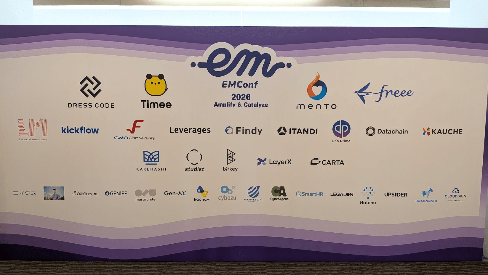
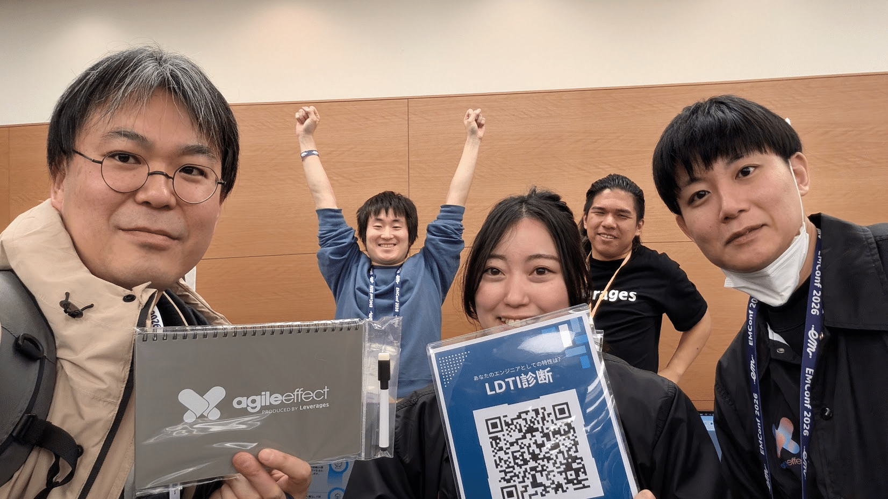
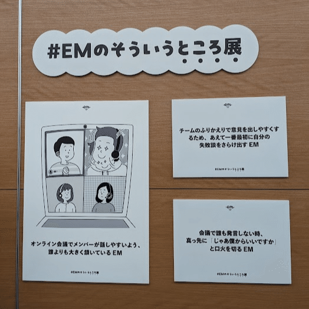
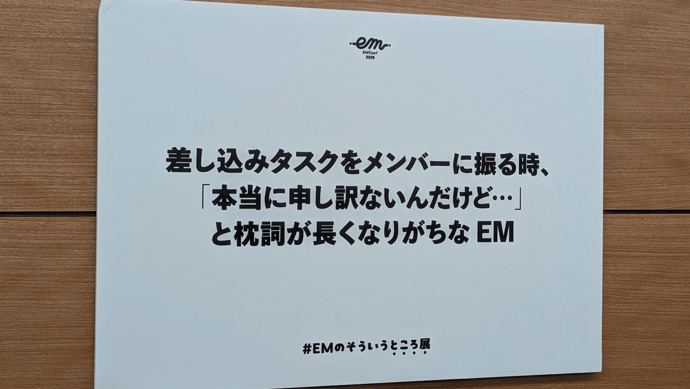

「責任を引き受けることが、私たちの仕事だ」

クロージングキーノートで、藤倉さんがそう言った。AIがコードを書き、設計を考え、レビューまでする時代。それでも最後に残るのは、「何を作るか」を決めて、その結果に向き合うことだと。

EM Conf JP 2026に参加してきました！

参加者は約700名。ホールA・B・Cの3会場が同時進行するカンファレンスで、去年より明らかに規模が大きくなっていた。EMという職種に特化したイベントでこの規模になるのが、正直すごいと思う。

私はスポンサーブースや当日スタッフとしてではなく、個人参加を選んでいる。ブース担当になると聴きたいセッションに行けないし、懇親会も自由に動けなくなる。EM Confはそういう「参加者として楽しむ」イベントだと決めているので、今年もそのスタンスで。

## 聴いたセッション

特に印象に残ったセッションを紹介。

### 「冒険する組織のつくりかた」安斎 勇樹さん（オープニングキーノート）

印象に残ったのは2つ。

ひとつは「ALIVEの法則」。SMARTは管理する側の論理で作られた目標設定の原則で、やる側のテンションは上がらない。  
それに対してALIVE（Adaptive / Learningful / Interesting / Visionary / Experimental）は、目標をメンバーがどう受け止めているかに着目した考え方だ。目標がALIVEかどうかより、みんながALIVEに受け止めているかどうかが重要、という話。自分のチームでの1on1や目標設定に引き寄せて考えた。

もうひとつは興味のマネジメント、「生成AI時代はスキル格差より興味格差」という話も刺さった。人の興味は「ヒト」と「コト」に大別され、さらに「創造・解明・介入・運用」の4軸と掛け合わせると8パターンに分類できる。こちらも、1on1で活用していきたい。

### 「AI Codingの先にある、Engineering Managerの本当の仕事」藤倉 成太さん（クロージングキーノート）

AIが「何を作るか」以外のほぼすべてを代替していく時代、エンジニアに残るのは「判断して責任を取ること」だという話だった。昔は専門知識を持つことに価値があった。インターネットが普及してそれが崩れ、今はその経験値さえAIに代替されつつある。そのうえで残るのは「作るかどうかを決める」「その結果に向き合う」という能力だと。

冒頭に書いた「責任を引き受けることが、私たちの仕事だ」はこの文脈で出てきた言葉。そのままEM Confの一番の持ち帰りになった。

### 「トップマネジメントとコンピテンシーから考えるエンジニアリングマネジメント」山口 徹さん

ドラッカーの「事業の定義は顧客と市場から始まる」という考え方をエンジニアリングマネジメントに当てはめた講演。Engineering Ladders のコンピテンシーフレームワークを用いて EM の役割を明確にし他職種との比較を行うお話しは非常に参考になった。

https://speakerdeck.com/zigorou/totupumanezimentotokonpitensikarakao-eruenziniaringumanezimento

## 会場の様子

セッション以外も楽しかった。

### スポンサーブース

カンファレンスの楽しみの一つでもあるスポンサーブースですが、スタンプラリーによる周遊の仕掛けも良く、楽しく巡ることができました！

AI × 各社が向き合う課題、みたいな話をさまざま聞くことができ、セッションの合間にも濃密な時間がありました。

*いつもお世話になっている Agile Effect さん、ノベルティ当たってしまった…！*

### EMのそういうところ展

休憩スペースの展示企画。

一番あるあると思ったのがコレ。スムーズな本題への入り方を誰か教えてほしい〜😭

### 懇親会と二次会

昨年は懇親会チケットが手に入らなかったので、懇親会は初参加。  
豪華なお料理とたくさんのEMたちとのお話し、楽しかった！

お話ししたい人が多すぎて忙しい。たくさんお悩み相談もさせていただき、最後まで学びのあるイベントでした。

二次会はゆるやかな雰囲気。翌日仕事でしたが目一杯飲みました。

https://x.com/DShuhari/status/2029192809568452763

---

次の開催がいつになるか分からないが、また来年も個人参加でいくつもり。
