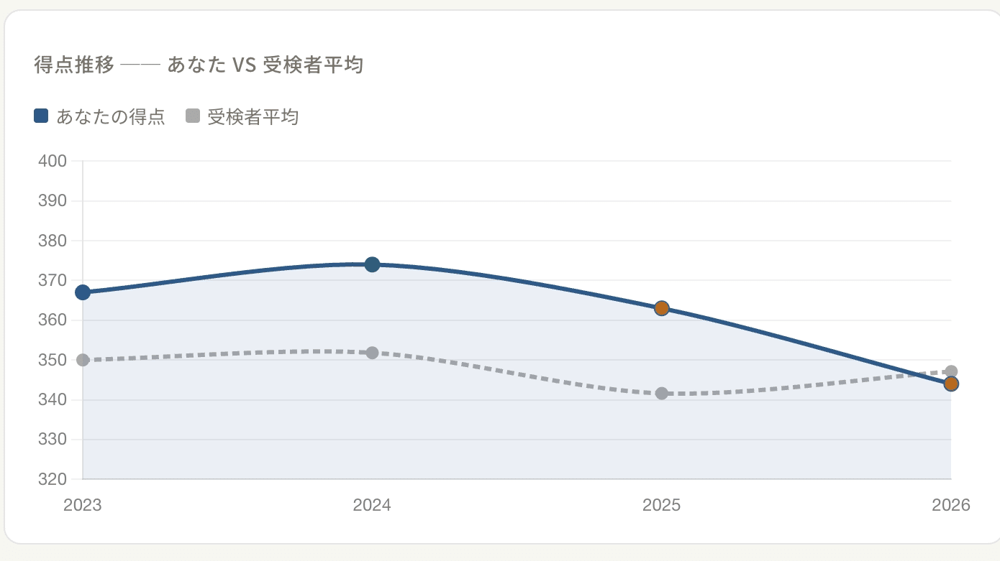
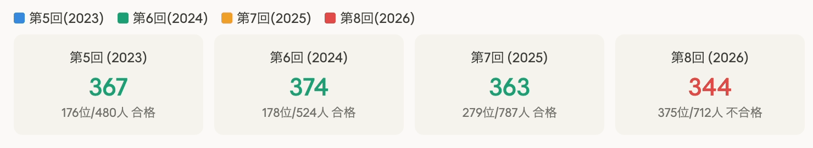
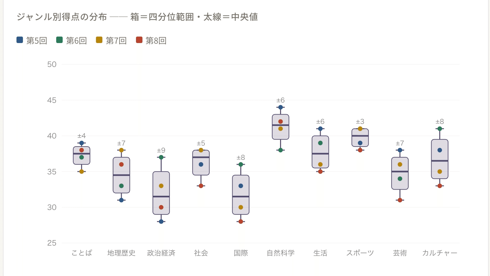
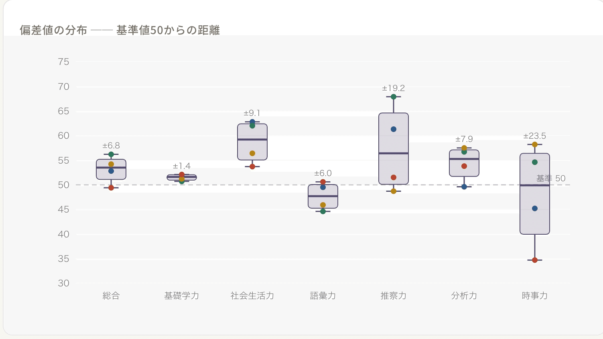
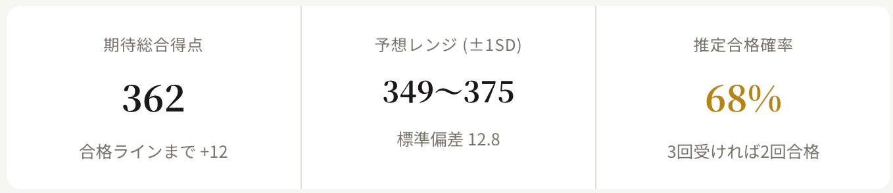
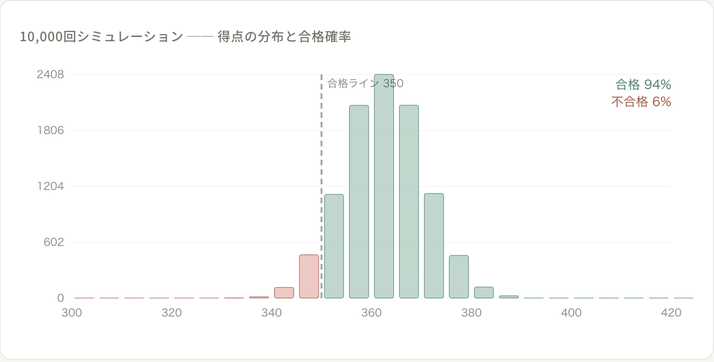
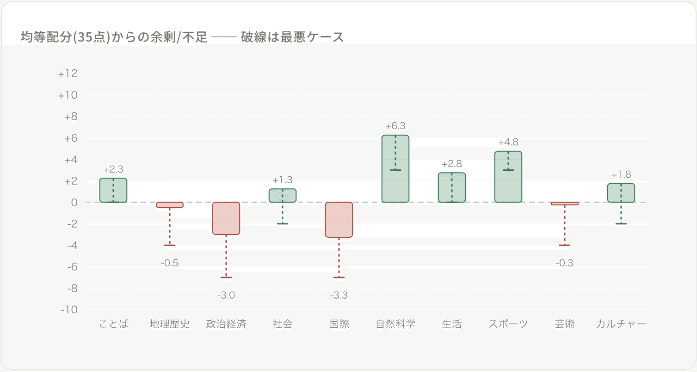

今年で4年目、毎年受験している知識検定ですが、今年初めての不合格となった。

:::embed{service="twitter" url="https://x.com/kyamamoto9120/status/2034267135170810128"}
> 6点足りず、4度目の挑戦で初めての不合格…😢
>
> 時事力が極めて弱く、この１年の生き方に課題を感じました。
> 知識検定は健康診断だと思っているので、不調が見つかるのは前向きなことです😌
>
> 今年は世の中の出来事に関心を持って生きていこう！！💪#知識検定 pic.twitter.com/je37iVW78Y
> — 山本一将｜焚き火を愛するエンジニア (@kyamamoto9120) March 18, 2026
:::

時事力が足を引っ張っていることは明白だが、せっかく4年分のデータが集まったので私の知力をプロファイリングしてみる。

## 4年間の総合成績

まずは全体像。得点は2024年の374点をピークに2年連続で下がり、2026年は344点で初の不合格となった。

注目すべきは順位のパーセンタイル。受検者数が480人→787人と増える中で、上位36%前後をキープしていたのが、2026年に53%まで落ちた。平均を下回ったのもこの年だけだ。

## ジャンル別の得点パターン

知識検定の面白さは10ジャンルの多様性にある。ことば、地理・歴史、政治・経済、社会、国際、自然科学、生活、スポーツ、芸術、カルチャー。どこが自分の武器で、どこが穴なのか。

自然科学（レンジ±6）とスポーツ（±3）は箱が小さく、毎回高得点を取れる「計算できる」科目。一方、政治・経済（±9）と国際（±8）はブレが大きく、良い回と悪い回の差が激しい「ギャンブル科目」であることがわかる。

## 偏差値の分布

得点だけでなく、検定が算出する7つの偏差値指標（総合、基礎学力、社会生活力、語彙力、推察力、分析力、時事力）も同じように箱ひげ図にしてみた。

推察力の振れ幅が圧倒的に大きい（48.7〜67.9）。絶好調なら偏差値68に届くポテンシャルがある一方、安定しない。基礎学力は箱がほぼ潰れていて（50.7〜52.1）、良くも悪くも毎回ほぼ同じ。そして時事力は第7回の58.2から第8回の34.7へ急落しており、不合格の最大要因がここにあることが見てとれる。

## 期待得点 ── 「次に受けたら何点取れるか」

4回分のデータから、ジャンルごとの期待得点（平均）と変動リスクを算出できる。

合格ラインの350点に対して、期待値は362点。一見余裕があるように見えるが、標準偏差が12.8もあるため、-1SD(349点)に振れるだけで不合格ゾーンに入る。

分布のピークは360点前後で、合格ラインの350点をまたぐ形になっている。推定合格率は約68%。

## 合格への貢献度マップ

合格ライン350点を10ジャンルで均等に割ると「1ジャンル35点」が基準になる。これに対して各ジャンルがどれだけ余剰/不足を出しているかを可視化した。

構造がはっきり見える。自然科学(+6.3)、スポーツ(+4.8)、ことば(+2.3)が貯金を稼ぎ、政治経済(-3.0)、国際(-3.3)が食い潰している。しかも不安定ジャンルの最悪ケース（破線）を見ると、政治経済は-7点、国際は-7点まで落ち込みうる。稼ぎ頭が同時に好調でないと吸収しきれない。

## おわりに

4回分のデータを並べてみると構造的な強みと弱みがくっきり見えてくる。自然科学とスポーツの安定感は頼もしいし、政治・経済と国際の振れ幅は明確なリスクファクターだ。

ただ、第8回の最大の敗因は時事力の偏差値が34.7まで急落したこと。時事問題は対策の効きやすい分野でもあるので、改めて日常的なニュースチェックを意識してこれからの１年を過ごしたい。
