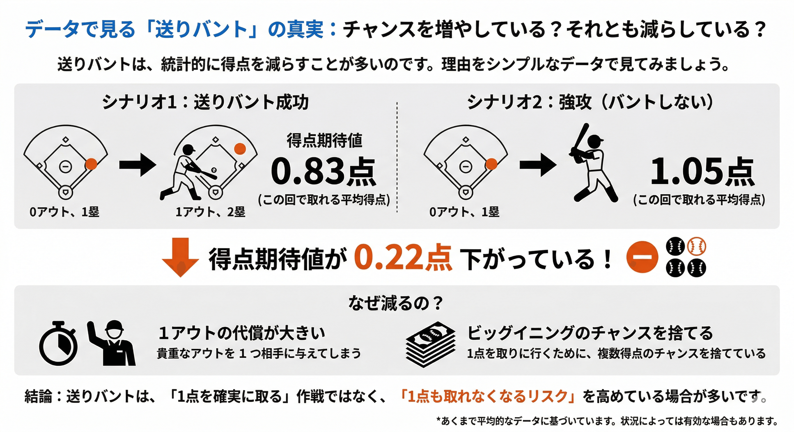

犠打は、データ的にはマイナスだ。それでも監督はサインを出す。

打者1人を消費して走者を1つ進める。堅実に見えるが、期待得点を下げる選択であることは、セイバーメトリクスの文脈でくり返し示されている。

*nano banana に画像作ってもらったが、数字はちょっと嘘かも。雰囲気で見てほしい。*

なぜ、わかっていてもやめられないのか。

答えは「併殺が怖いから」だと思う。1点を取れるかもしれない可能性より、ゲッツーで流れが止まる恐怖の方が大きい。プロスペクト理論でいう損失回避バイアス。得る喜びより、失う痛みの方が強く感じられる、そういう話だ。

## 池山監督が、それに挑んでいる

今シーズンのヤクルトが面白い。

就任1週間。送りバントのサインを出していない。積極的に振っていく野球を選んでいる。結果も出ている。ベンチが明るい。テレビ越しに見ていても、空気感が違うのが伝わってくる。

インタビューからも、アウトを一つ献上する意味を理解してこの選択を続けていることがわかる。

:::embed{service="external-article" url="https://www.nikkansports.com/baseball/news/202604020001774.html"}
**開幕５連勝で見えたヤクルト“池山野球”の形とは 先発早め交代、犠打なし、好循環生む選手起用 - プロ野球 : 日刊スポーツ**
ヤクルト池山隆寛新監督（60）が球団新人監督最長の開幕5連勝を果たした。5試合は“池山野球”の形が見えるようなシーンが節々
www.nikkansports.com
:::

「データ的に正しい選択」をプレッシャーのかかる試合の中で貫くのは、思っているより難しい。それを1週間続けているというだけで、十分すごい。

## 仕事でも、同じことが起きる

エンジニアリングは不確実性との戦いだ。たとえば技術的負債の解消と機能開発の優先順位、仕組みから変えるのか小手先の効率化で乗り切るのか、みたいな話だ。「本当にやるべきこと」はたいてい、効果が見えるまでに時間がかかる。一方、目先に小さな利益が見えている施策は、やった感が出やすい。

後者に流れがちなのは、合理的な判断というより、損失を避けたい感情の結果だと思っている。

EMとしての仕事の一つは、そのバイアスに気づいてもらうことだ。メンバーが目先の利益に目がくらんでいるとき、「これは損失回避だよね」と言語化できるかどうか。プロスペクト理論を知っているかどうかで、そのコミュニケーションの解像度が変わる。

知っていても、克服するのは別の話だ。私自身、答えは出ていない。

## プロスペクト理論に打ち勝つのは、周りの声だと思う

損失回避バイアスは、個人の意志だけで克服し続けるのは無理だと思っている。

球場のスタンドが「ゲッツーでもいい、振っていけ」という空気になっているとき、ベンチはきっと楽になる。逆に、スタンドがため息をつくとわかっていたら、監督は無意識にバントのサインに手が伸びる。

ファンの応援は、雰囲気じゃなくて、戦略の一部だ。

だから私は今年、積極的に振っていくヤクルトの野球を「これでいい」と言い続けたい。143試合、ゲッツーになっても拍手を送りたい。それがプロスペクト理論に打ち勝ち続けるための、ファンができる唯一のことだと思っている。

池山監督、このまま続けてください。応援しています！
