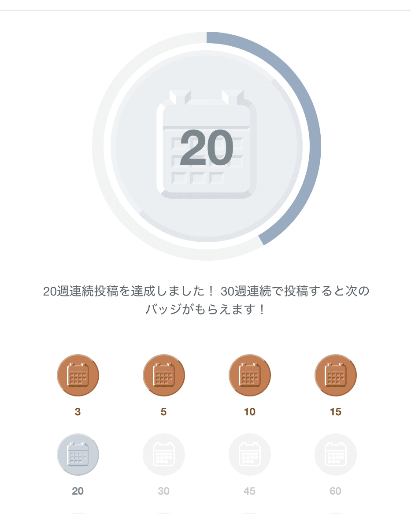

工夫は、ない。

気の利いたネタ帳もないし、予約投稿もしていない。毎週日曜、焦りながら書いている。それでもnoteの連続投稿が20週続いた。

きっかけは、昨年12月のアドベントカレンダー。

私はもともとブログが苦手で、何度始めても続かなかった。それがなぜか、そのままずるずる毎週続いてしまった。気づいたら20週経っていた。

20週書いてみて、わかったことがある。

書くハードルは、確かに下がった。「とにかく出す」ができるようになった。500文字でも、思いついたことをそのまま出せる。

ただ、日曜の夜は毎週焦っている。ネタは毎週ひねり出している。平日から探しているが、ろくに貯まらない。「今週は何を書こう」を、結局毎週繰り返している。

それでも続いているのは、たぶんひとつだけ。

感想をもらえることがある。それが素直に嬉しい。小さなリターンが、次の1本を書く理由になっている。

というわけで、続けるコツがある方、もしよかったら教えてください。ノウハウが欲しいです。
