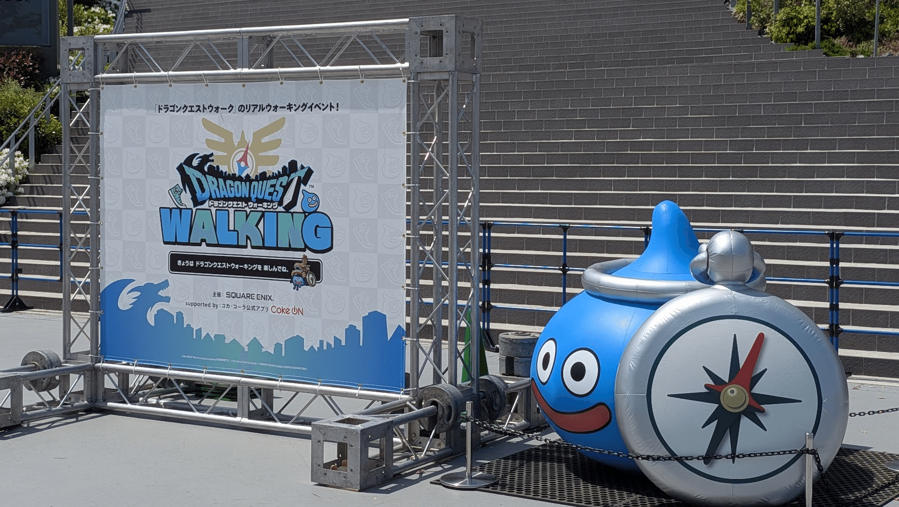

今年の4月は活動量が多かった気がしたので書き出してみました。

:::toc
:::

## 4/8 (水) Startup in Agile #7

:::embed{service="external-article" url="https://startup-in-agile.connpass.com/event/386112/"}
**【Startup in Agile #7 】ボトルネックは人の意思決定？「決め方」の変遷教えて (2026/04/08 19:00〜)**
\# イベント概要 ## テーマ：ボトルネックは人の意思決定？「決め方」の変遷教えて あなたのチームでは、どうやって意思
startup-in-agile.connpass.com
:::

MOSH が会場スポンサーだったのでサポート的に居ようかと思っていたのですが、Startup in Agile は参加したこともなくて気になっていたので急遽参加申し込みしました。  
ビールが飲みたかったのもあります🍺

感想を付箋に貼ってもらうスタイル良いなと思いました！  
オフラインイベントならアンケート取らずになるべくオープンなところで意見を拾いたい気持ちがあり、コンテンツにどのように組み込むのが良いか今後も考えていきたいです。

## 4/11 (土) 【劇場版】アニメから得た学びを発表会2026

:::embed{service="external-article" url="https://engineers-anime.connpass.com/event/375981/"}
**【劇場版】アニメから得た学びを発表会2026 (2026/04/11 10:30〜)**
\# 【劇場版】アニメから得た学びを発表会2026 アニメに支えられ、今日もコードを書く。アニメから力をもらい、日々のI
engineers-anime.connpass.com
:::

プロポーザルが採択されたので、レギュラー枠で登壇させて頂きました。  
アニメの話をこれだけすることもなかなかないので、それ自体が非常に楽しいイベントです。最近のアニメは全く分からないのですが、話題に上がったものは見てみたいなと思いました。  
（特に『ひゃくえむ。』は見てみたい…！）

## 4/13 (月) P2B CTO #19

:::embed{service="external-article" url="https://luma.com/fyh80f5y?tk=AHBmrQ"}
**🍻 #P2BCTO19 CTO IPAを飲む LT付きCTOミートアップ! · Luma**
先着30名限定！『🍻 #P2BCTO19』をP2B Haus吉祥寺にて開催します！🎉 TL;DR クラフトビールその他全種
luma.com
:::

CTO が忙しく、代打で参加させていただきました。  
お名前だけ一方的に知っていてあまり接点のなかった方々ともお話しすることができ、楽しかったです。ナイトロタップも初体験しました🍺

P2B はもっと行きたいのですが、吉祥寺は少し遠いです。。。

## 4/18 (土) - 19 (日) ドラクエウォーク in 名古屋

6回目となるドラクエウォークのリアルイベントは初の東海地区での開催でした。私は土曜日の参加でしたが、天候に恵まれており良かったです。

名古屋は何度も来ているのですが、実は名古屋城に入るのは初めてでした。  
（今までは周辺までは来て、外から名古屋城だけ見て帰っていました）

このような機会がないとなかなか今更行くこともなかったと思うので、その点でも良かったです。城周辺の藤も綺麗でした。

## 4/22 (水) EM Oasis #11

:::embed{service="external-article" url="https://emoasis.connpass.com/event/386140/"}
**それは『放置』か『期待』か ー メンバーが迷わない、EMの任せ方の流儀【EM Oasis #11】 (2026/04/22 19:00〜)**
\# 【それは『放置』か『期待』か ー メンバーが迷わない、EMの任せ方の流儀】 ## 概要 EMとしてチームを率いる中
emoasis.connpass.com
:::

EM Oasis の主催イベントです。  
初参加の方が多く、OST や懇親会中に実施する KPT が盛り上がったのが印象的でした。素敵な参加者の方々に支えられています🙏

## 4/25 (土) ぐちポジ.fm 収録

:::embed{service="note" url="https://note.com/kyamamoto9120/n/n029875faf89a"}
**ぐちポジ.fmに出演しました**
:::

詳細は上の記事にも書きましたが、ポッドキャスト収録はあまり経験がないので緊張しましたし、その分楽しかったです。また出たい！

## 4/28 (火) LINE APIで試したんだけど、聞いてほしい Night LT会 #01

:::embed{service="external-article" url="https://linedevelopercommunity.connpass.com/event/389706/"}
**LINE APIで試したんだけど、聞いてほしい Night LT会 #01 (2026/04/28 19:00〜)**
「LINE APIを使って何か作ってみた」「動いたけど誰にも話せてない」 そんなあなたのための LT 会です。 LINE
linedevelopercommunity.connpass.com
:::

LINE Developer Community の主催イベントで、私は MC を務めました。  
初めての人が気軽にLTできる場を作り続けていきたい気持ちがあるので、LINE DC として新しくLT会のシリーズが始まったのは良いことだと思っています。

:::embed{service="twitter" url="https://x.com/linedc_jp/status/2049074185440469099"}
> ますさん🐬 ディズニー好きエンジニア @mamamasu_3 
>
> 「結婚式のWeb招待状をLIFFで開発したら100日ログインされてる話」
>
> 始まりました！https://t.co/LjjsML2VbD#LINEDC pic.twitter.com/5gQd8BHhMq
> — LINE Developer Community(JP) (@linedc_jp) April 28, 2026
:::

今回は「結婚式のWeb招待状をLIFFで開発したら100日ログインされてる話」が個人的お気に入りです。10年早くこのLTを見ていたら私も作っていました。結婚式の招待状をWebにする発想はなかったし、これだけの仕組みが個人で作れるようになった AI 時代というは素晴らしいと改めて感じました！

## 【欠席】4/30 (木) MOSH Tech Meetup #4

:::embed{service="external-article" url="https://mosh.connpass.com/event/386793/"}
**MOSH Tech Meetup #4 AIエージェントでEMの仕事はどう変わるか (2026/04/30 19:30〜)**
\# MOSH Tech Meetup とは MOSH Tech Meetup は、MOSHが主催する技術コミュニティイベ
mosh.connpass.com
:::

自社主催のイベントですが、まさかの体調不良で欠席です。  
１ヶ月走り抜けられなかった残念さと、詰め込みすぎた反省があります。

5月もすでに結構予定が入っています。やり切るためには体力が必要なので、まずは健康に気をつけていきたいと思います💪
