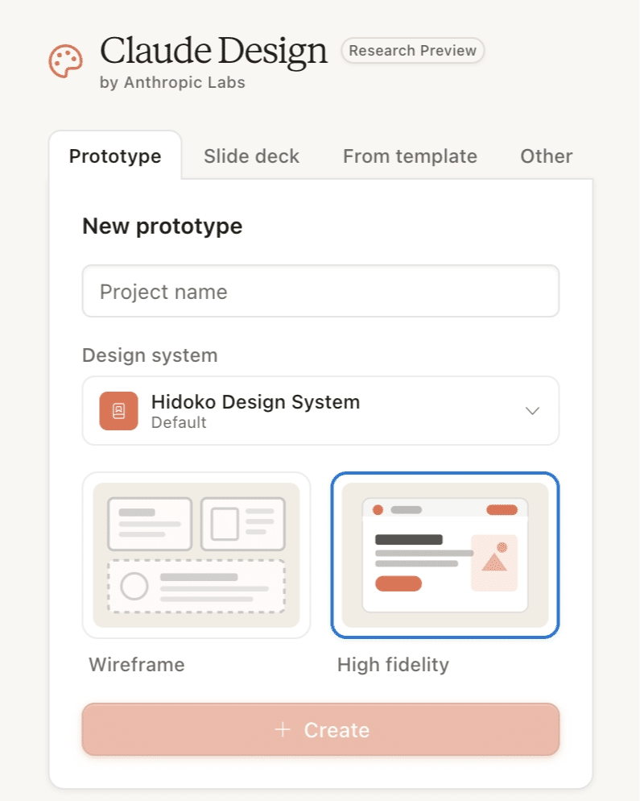
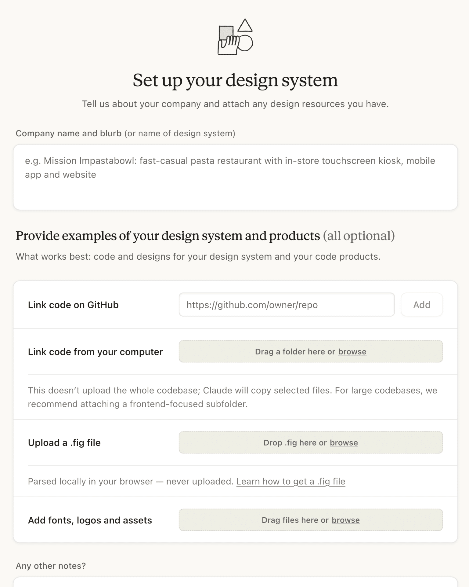
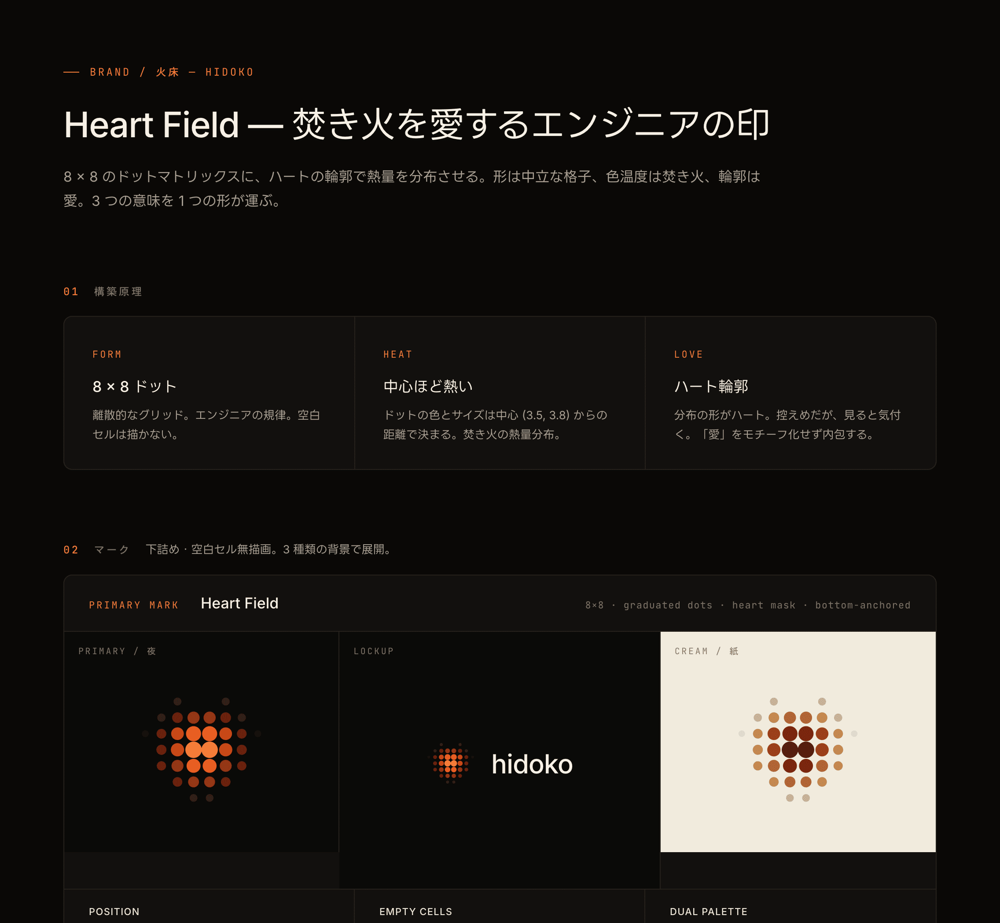
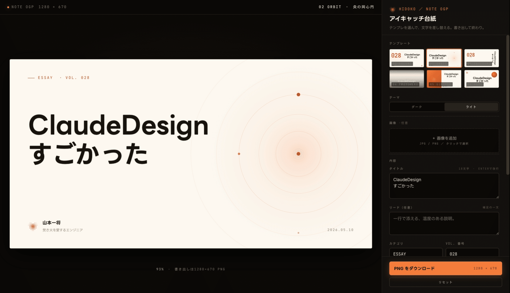
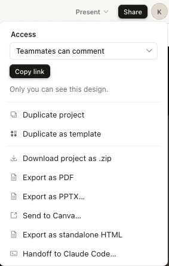

話題になっていて気になってはいたけど触れていなかった Claude Design。  
GW の自己研鑽に使ってみたらスゴかった！

## Design System から始まる

Claude Design は新しいプロジェクトの作成に「プロジェクト名」と「Design System」を要求します。

*Hidoko（火床）は私の個人開発プロジェクト*

デザインシステムの作成にあたっては色々聞かれますが、all optional なので全部無視して先に進みました。

その先には馴染みのチャットUIが登場しますが、そのタイミングで細かくヒアリングされるのでデザイン素人の私でも安心して進めることができます。

紆余曲折で完成したのがこんな感じ。  
ロゴやカラーパレット、タイポグラフィなど定義してもらい、「焚き火を愛するエンジニア」のデザインシステムが完成しました 🎉

## デザイナーというより、全部できる PdM かも

毎週 note を書く中で、見出し画像に困っていました。  
そんなに時間かけたくないが、ある程度見栄えがするものにしたい欲求だけありました。

せっかくデザインシステムができたので、見出し画像のジェネレータを作ってもらいます。

完成したものがこちら。

台紙を6種類のテンプレートから選び、タイトルなど入力して PNG でダウンロードする機能まで用意してくれています。  
このプロトタイプは完全に動作します！

途中でやったことは10問ほど質問に答えるだけです。  
選択肢には「Decide for me」もあり、こちらで決め切らなくてもよしなに考えてくれます。

実装するために Claude Code に依頼するための機能も用意されています。  
右上の「Share」にある「Handoff to Claude Code…」です。

Claude Code は必要なデータをダウンロードし、実装に向けて必要なことを検討してくれます。

## スライドやアニメーションも作ってくれる

アプリケーション以外のデザインもしてくれます。  
試しにアニメーションを作ってもらいましたが、クオリティはともかくプロトタイプとしては面白そうなものが作れました。

これをベースに動画生成の AI にクオリティを上げてもらう、みたいな使い方はできそうです。

週間の制限があるので優先度を決めながらになりますが、可能性を感じたので引き続き試していきます。
