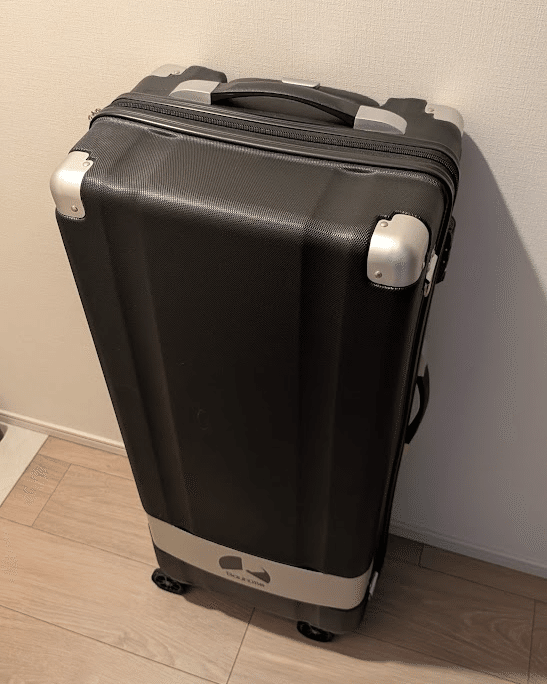
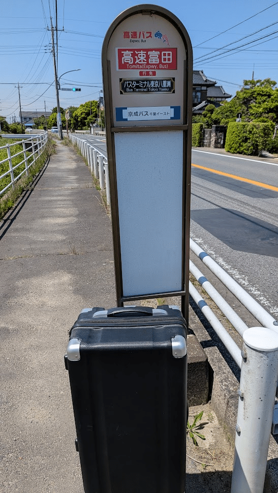
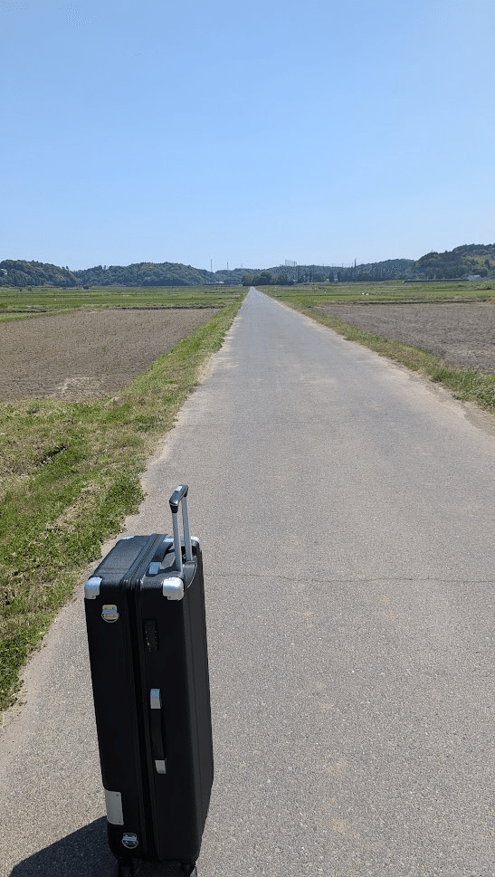
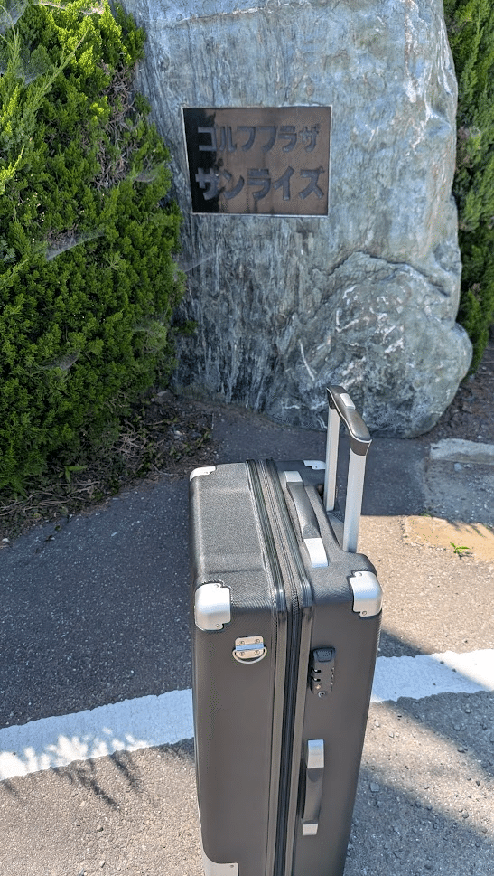
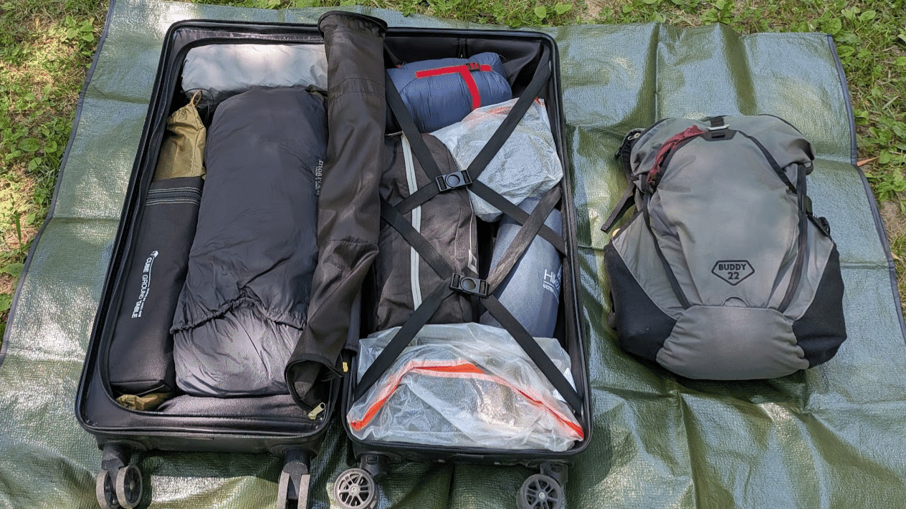
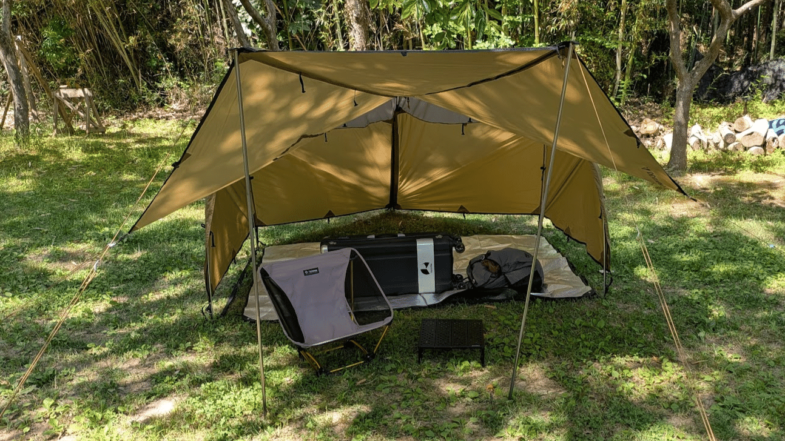
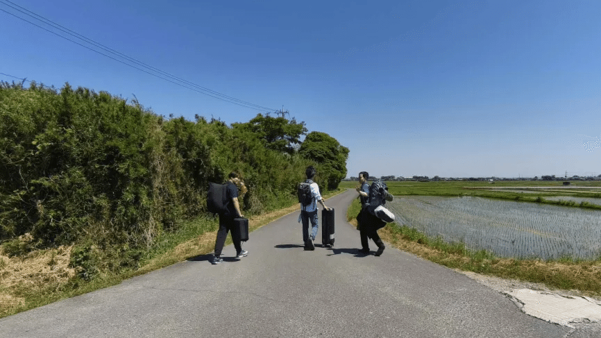

焚き火を囲んで星空の下 LT をする、「焚き火を愛するエンジニア」のために存在するような素敵なイベントの第２回が5月16, 17日に開催されました。

:::embed{service="external-article" url="https://kaitou.connpass.com/event/379977/"}
**キャンプ場で焚き火を囲んでLT会 #2 (2026/05/16 13:00〜)**
\# 焚き火LTとは？ キャンプ場を貸し切ってLT会をします。 LTの内容は \* おすすめのキャンプのスポット
kaitou.connpass.com
:::

以前にも紹介している通り、私は公共交通機関と徒歩でキャンプをします。

:::embed{service="oembed" url="https://www.docswell.com/s/kyamamoto9120/KPGVLQ-2026-02-19-193000"}
:::

焚き火LT会には興味があるが車を持っていない、と言う人にも可能性を示すために少し記録を残します。

## 会場までの道のり

今回は「19」という千葉県香取市のプライベートキャンプ場での開催です。

:::embed{service="external-article" url="https://19camp.com/"}
**19 -Juke- 公式サイト**
3,000㎡もある広大なサイトを1日1グループ限定で貸切できるちょっと贅沢なプライベートキャンプ場。 キャンプ場内には、給
19camp.com
:::

私は通常のキャンプと同様に、愛用のキャリーバッグにパッキングして出かけます。

*Bauhutte の「スリムスーツケース BCK-800」を使用*

キャンプ場の最寄りのバス停までは東京駅から高速バスで2時間ほど。  
事前の予約などは必要なく、バスターミナル東京八重洲から乗車します。

最寄りのバス停は「高速富田」

ここから2.0kmほど、約30分歩いてキャンプ場に向かいます。  
道中は一面の田園風景、日差しが強いですが心地よい風が吹く道でした！

キャンプ場はゴルフ場の中にあります。「19」と言う名前は18ホールの後の19番目の場所という意味が込められているのではないかと推察します。

## 持ち物

焚き火LT会は [@Kaitou1192](https://x.com/Kaitou1192) さんと [@kazu_kichi_67](https://x.com/kazu_kichi_67) さんが調理道具などを用意してくださり、こちらのキャンプ場では大きなファイヤーピットが備え付けられているので荷物は少しコンパクトにできます。

今回は適当に準備したので余計なものも入ってしまっているのですが、使ったものは以下のものくらいです。テーブルはなくても成立したと思います。

- テント
- シュラフ
- コット
- 椅子
- テーブル
- 焚き火道具

設営するとこのような感じ。夜は10℃くらいだったと思います。  
日中は暑かったですが、天気も良く全体的に過ごしやすい気候でした！

## イベントの様子

イベントは乾杯からスタート！

:::embed{service="twitter" url="https://x.com/kazu_kichi_67/status/2055555683131789454"}
> カンパーイ！ #焚き火LT pic.twitter.com/GzLvGAOq9C
> — kazu_kichi_67 (@kazu_kichi_67) May 16, 2026
:::

すごい肉が出てきたりと、まずは美味しいものを頂きながら語らいます。

:::embed{service="twitter" url="https://x.com/kyamamoto9120/status/2055565028607365435"}
> すごい肉出てきた！#焚き火LT pic.twitter.com/HW5yZp8zSb
> — 山本一将｜焚き火を愛するエンジニア (@kyamamoto9120) May 16, 2026
:::

LT会が始まるのは暗くなってから。焚き火をしながら進行します。

:::embed{service="twitter" url="https://x.com/kyamamoto9120/status/2055593393712202174"}
> 始まります！#焚き火LT pic.twitter.com/bRvXw9YT8U
> — 山本一将｜焚き火を愛するエンジニア (@kyamamoto9120) May 16, 2026
:::

:::embed{service="twitter" url="https://x.com/ryugen04/status/2055594000942538972"}
> リアル焚き火をしながらのLT#焚き火LT pic.twitter.com/yG1fhZbm1Y
> — ryugen (@ryugen04) May 16, 2026
:::

:::embed{service="twitter" url="https://x.com/natty_natty254/status/2055594382280245384"}
> いよいよ本編
>  #焚き火LT pic.twitter.com/DZQfUJVmFv
> — なってぃ (@natty_natty254) May 16, 2026
:::

私はスマートフォンから資料投影してLTです。  
今回はフォーキングの紹介をさせてもらいました！

:::embed{service="twitter" url="https://x.com/Kaitou1192/status/2055599949518410086"}
> 今回に相応しいお話。 #焚き火LT pic.twitter.com/ccKmSu5nRR
> — Kaitou (@Kaitou1192) May 16, 2026
:::

## キャンプ初心者でもOK

焚き火LT会の参加者が全員キャンプ経験者というわけではありません。  
今回も、初キャンプだった方が数名おられました。道具はある程度準備してもらうことができるので、気になる方はぜひ [@Kaitou1192](https://x.com/Kaitou1192) さんに相談して欲しいです！

また車がなくても私のように徒歩で向かうことも可能ですし、今回は自転車で参加された方もおられました。  
車がなくても大丈夫、というのも伝えたいポイントです。

*徒歩組の帰宅風景*

次回は「極」の開催かもしれません。楽しみです！！

:::embed{service="twitter" url="https://x.com/Kaitou1192/status/2055915331542217047"}
> 焚き火LT極 みたいなのを、やりたいというお話になっていたのを思い出した。来年2月開催かな？ #焚き火LT
> — Kaitou (@Kaitou1192) May 17, 2026
:::
