TSKaigi 2026 が 5月22, 23日に開催されました。

:::embed{service="external-article" url="https://2026.tskaigi.org/"}
**TSKaigi 2026**
TSKaigiは日本最大級のTypeScriptをテーマとした技術カンファレンスです。2026/5/22 (金) - 23
2026.tskaigi.org
:::

MOSHはゴールドスポンサーとしてブース出展しており、私も2日間ブースに立たせていただいたので、ささやかながらレポートを残します！

## 会場周辺の様子

会場は羽田空港国際線ターミナルにあるベルサール羽田空港でした。

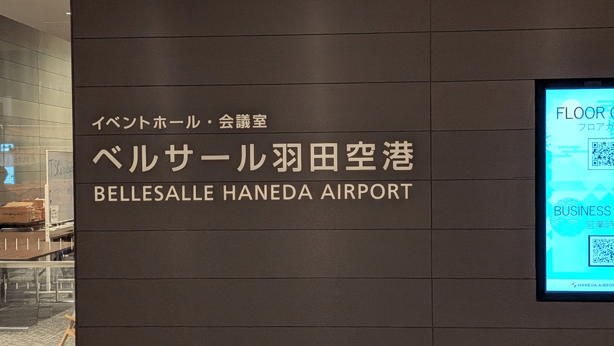

国際線ということもあり外国人の方が多く、周辺もインバウンド向けの装飾や店舗が多かった印象です。

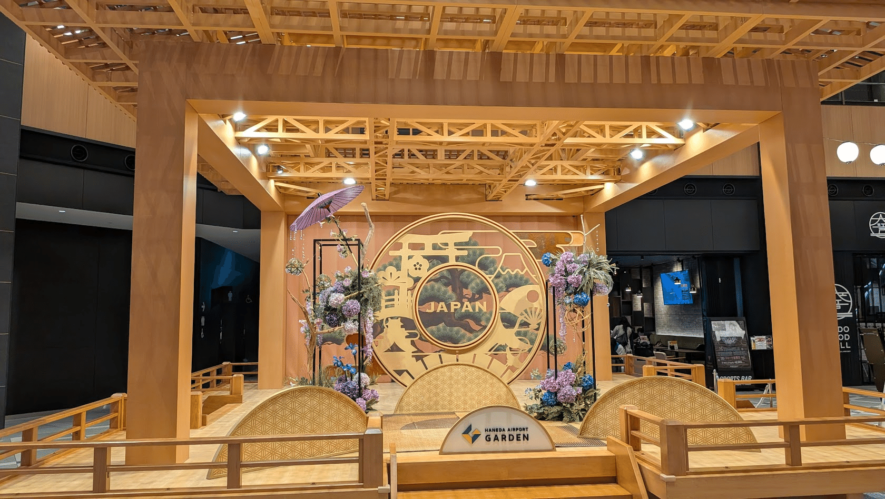

開場時間になると入り口には Welcome to TSKaigi 2026 のボードが飾られていました。このボードを前に写真を撮る方も多く見かけました！

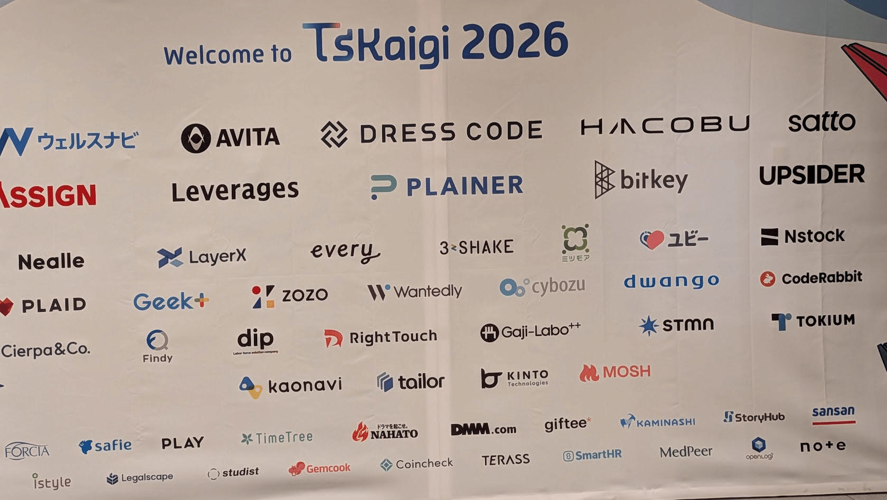

## MOSHの様子

MOSH のスポンサーブースは部屋に入ってすぐの柱側で最高の立地でした！

:::embed{service="twitter" url="https://x.com/tskaigi/status/2057995678874538001"}
> 【TSKaigi 2026スポンサーブース紹介】
> ゴールドスポンサー
> MOSH株式会社 @MOSHinc_jp #TSKaigi #TSKaigi2026 pic.twitter.com/8Nkz4o33ls
> — TSKaigi (@tskaigi) May 23, 2026
:::

今回は特に出し物など用意せず、ノベルティをお渡ししつつMOSHの話をさせていただくことに集中していました。

ステッカーなどのクリエイティブを評価いただく声もあり、MOSHの世界観も伝えることができたのかなと思います。

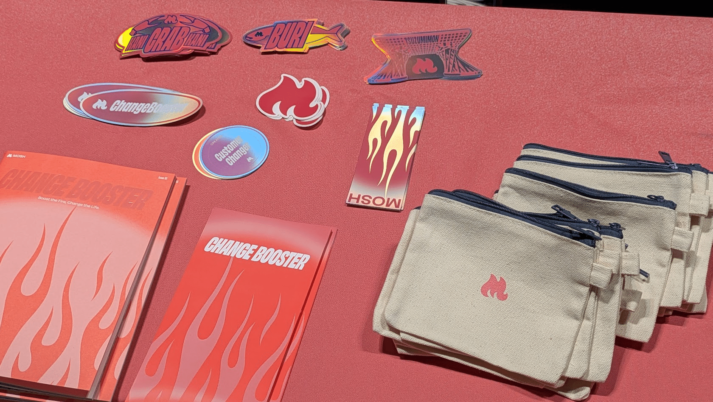

スポンサーセッションではVPoTからMCPサーバー構築の話をしました。

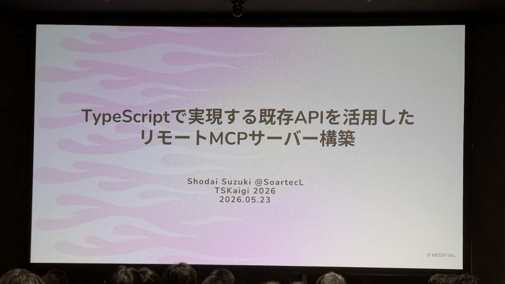

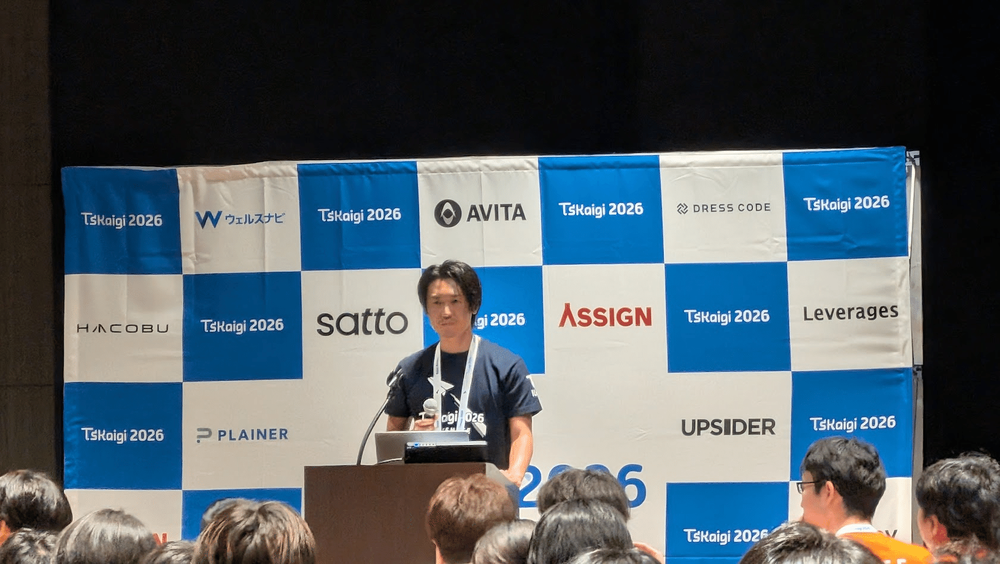

提供しているサービスをどのようにAIにフィットさせていくかは各社悩まれている部分だと思います。その課題に対して、一つの実現方法としてMOSHの取り組みを紹介させていただきました。

:::embed{service="twitter" url="https://x.com/SoartecL/status/2058056689912520843"}
> 本日の登壇資料です🙌
>
> "TypeScriptで実現する既存APIを活用したリモートMCPサーバー構築"https://t.co/XwnY1LqJKG#TSKaigi #TSKaigi2026 #tskaigi_upsider
> — SoarTec.lab (@SoartecL) May 23, 2026
:::

セッション後にはブースでMCPが動く様子を実際に実演し、こちらも多くの方に足を運んでいただけました。

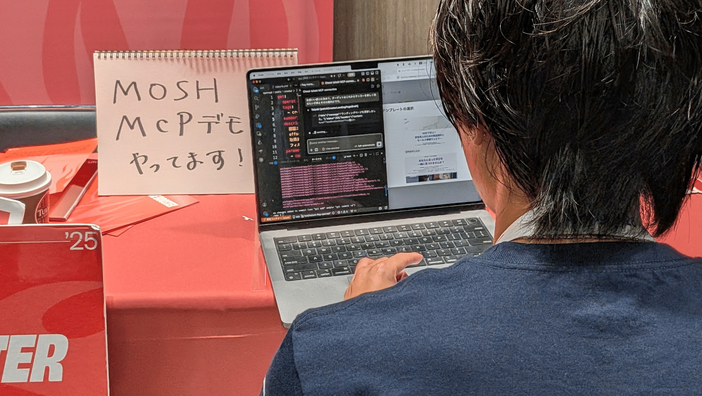

## 会場の様子

今回驚いたのはブースの多さです！懇親会での発表によるとスポンサーは77社、ブースは35社が出展していました。

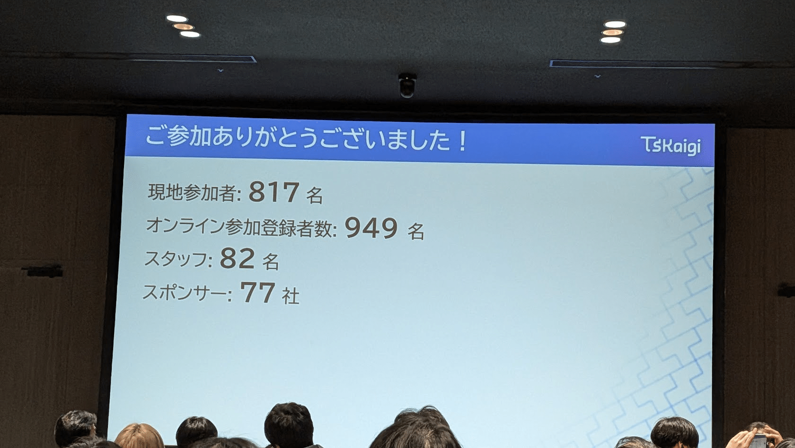

ブース周遊施策のスタンプラリーも大変なボリュームで、改めてブースに来ていただいた参加者の皆さまには感謝したい想いです🙏

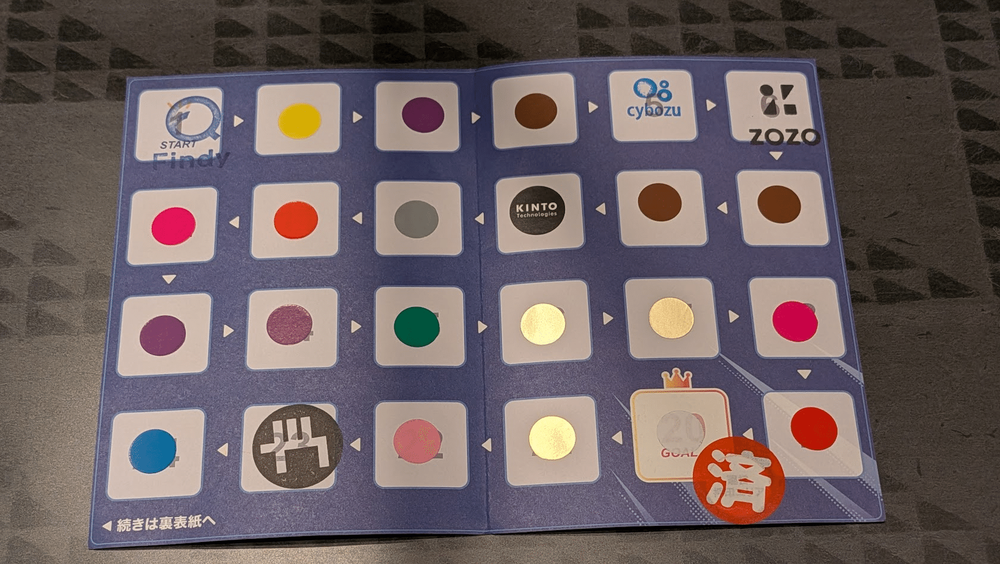

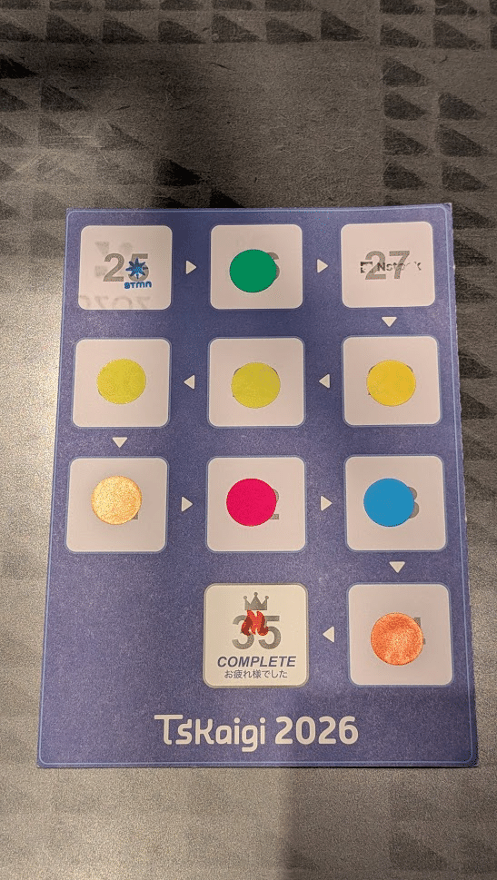
*ご挨拶に全ブースお話を聞きにいきましたが、本当に大変でした！*

会場ではブースの他にもマッサージやネイル・フェイスペイント、コミュニティマップ、コーヒーやお出汁が飲めるコーナーなど様々な仕掛けがあり、セッションやブース以外の場所でも盛り上がりがありました。

マッサージ受けたかったけどタイミング合わず…！

## まだまだTSKaigiはつづく

そんな大盛り上がりで2日間のイベントは終了しましたが、この後もアフターイベントがたくさん予定されています！  
MOSHも6/10に9社合同でのイベントを予定しているので、こちらもぜひご参加いただけると嬉しいです✨

:::embed{service="external-article" url="https://findy.connpass.com/event/392420/"}
**TSKaigi Night talks 〜after conference〜 (2026/06/10 19:00〜)**
\## 📝イベント概要 今年のTSKaigiはプロポーザルの倍率も非常に高く、惜しくも採択されなかった方々の中にも、熱量の
findy.connpass.com
:::

そして、次回はTSKaigiは仙台と発表されました！  
昨年の金沢に続く地方開催ですね。こちらも非常に楽しみです。

[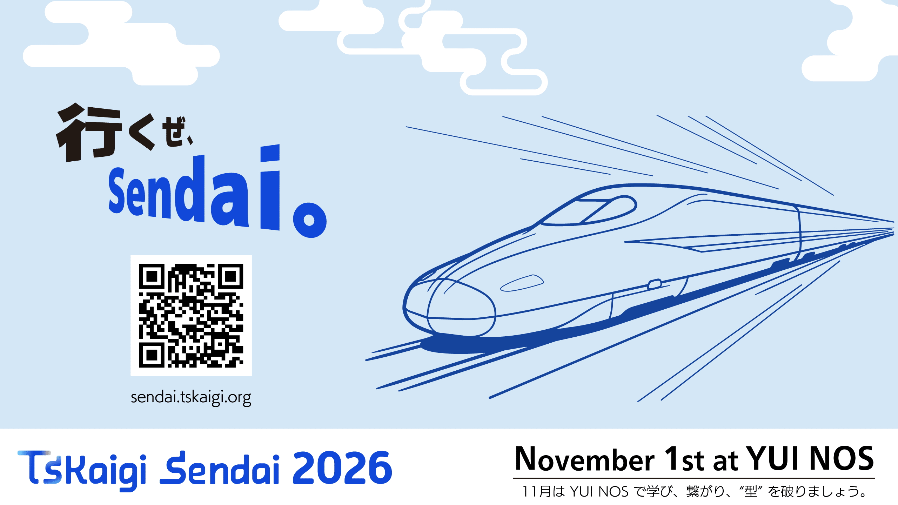](https://sendai.tskaigi.org/)

今回はずっとブースにいたのでほとんどセッションは聴くことができていないのですが、オンラインチケットの配信で後追いで見ることができました。私のTSKaigiはこれから始まります…！

素敵なイベントを準備してくださったスタッフの皆さま、セッションしてくださった登壇者の皆さま、そしてイベントを盛り上げてくださった参加者の皆さま、本当にありがとうございました〜！！

これからも引き続きよろしくお願いいたします！
