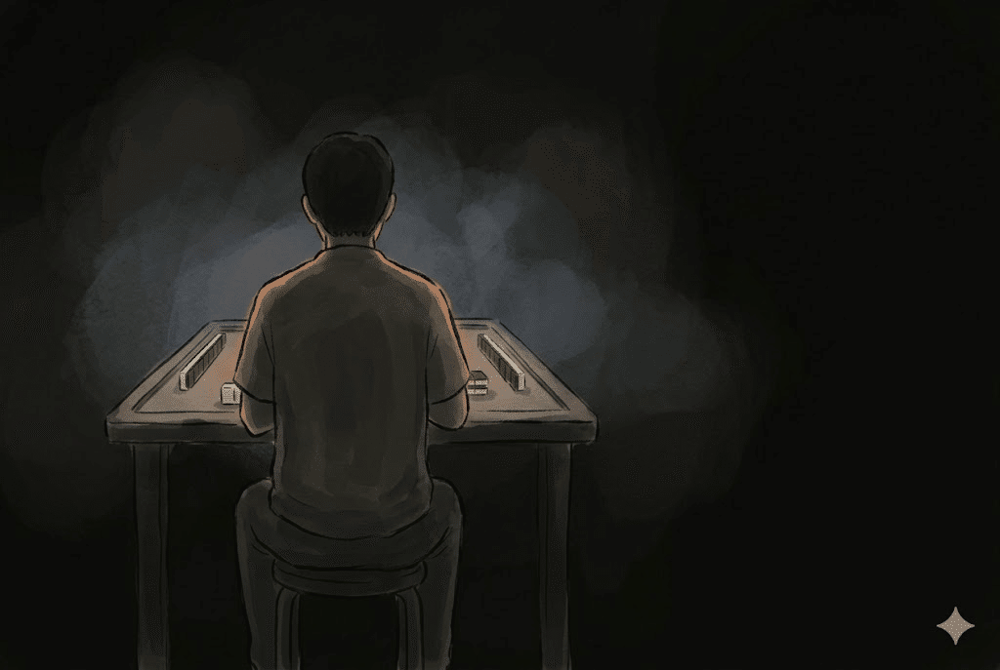
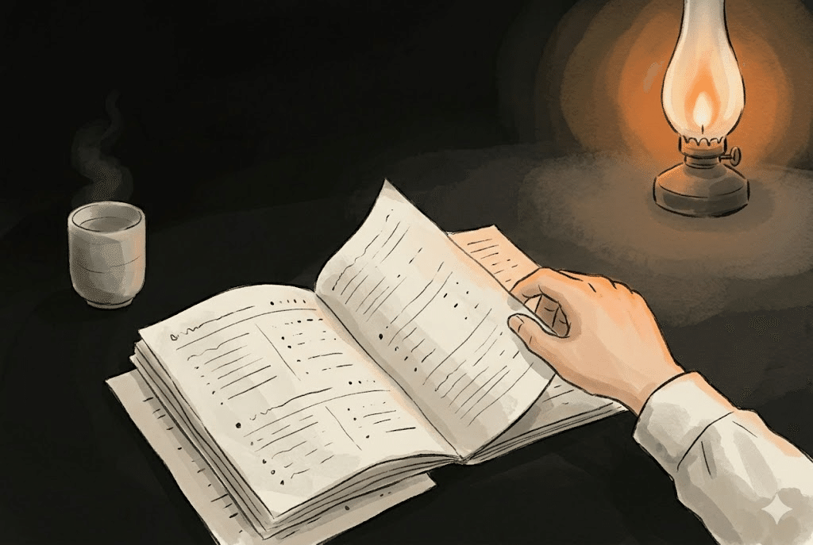
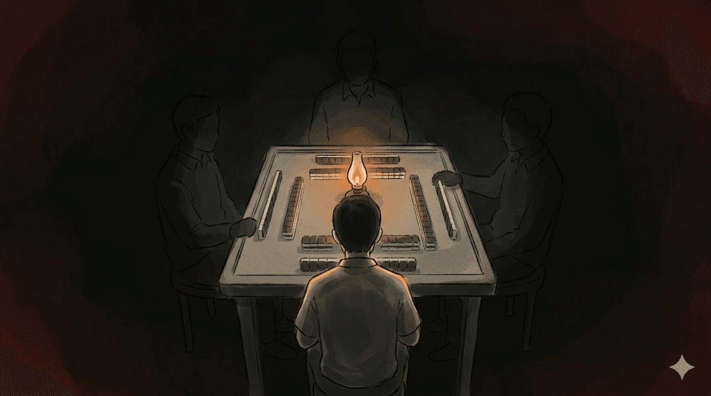

この記事は2026年4月11日に開催された「アニメから得た学びを発表会2026」というイベントで話した内容の文字起こしです。  
題は「末原恭子に学ぶ 凡人の生存戦略」。

原作のコマを使っていてスライドは公開できないので、代わりにテキストで残すことにした。

イベントレポートはこちら

:::embed{service="note" url="https://note.com/kyamamoto9120/n/n61400091e36c"}
**アニメから得た学びを発表会2026 参加レポート**
:::

---

## 周りに「怪物」はいませんか

周りに「怪物」みたいな人はいないだろうか。

SNSを開けば毎日のように大量のアウトプットを出し続けている人がいる。社内にも、一人で開発の進行を変えてしまうようなバケモノがいる。AI時代になって増え続ける情報を追いかけ続けて発信している人もいる。

そういう人たちを見ていると、「自分は何者でもない」と感じる瞬間がある。少なくとも私にはある。

## 自己認識は「凡人」

ありがたいことに私自身は周囲から一定の評価をもらっている。  
それは給料という形でも反映されている。

それでも、自己認識はずっと「凡人」のままだ。

特別な才能があるわけではない。凡人なりの戦い方を突き詰めてきたから、それっぽくいられているだけだと思っている。

今回はその「凡人の戦い方」を、ある作品を通して話したい。

## 『咲-Saki-』という麻雀漫画

『咲-Saki-』という麻雀漫画がある。麻雀が国民的競技になっている世界で、女子高生たちがインターハイの頂点を目指す物語。

ただ、これはただの麻雀漫画ではない。登場する選手の大半が超常能力を持っている。確率もセオリーも通じない、いわば「能力麻雀バトル」だ。

たとえば主人公の宮永咲は毎局のスコアを完全にプラマイゼロで終わらせることができる。それでいて「嶺上開花」という役を意図的に連発する。  
「怪物の見本市」という言葉が作中でも出てくる。そういう世界の話。

## 末原恭子という、誰も覚えていなかった凡人

今回紹介したいのは姫松高校の末原恭子。チームの大将で、団体戦の最後尾を任されている。

そして、異能は一切ない。

怪物だらけの世界で、武器は頭脳とデータ分析だけ。チームの軍師として分析と対策立案も担う。自らを「凡人」と称している。

懇親会で話を聞いたら、咲を知る人でもこのキャラクターのことは覚えていませんでした。それほど、マイナーなキャラクターです。

## 凡人の生存戦略は、4つある

凡人は怪物だらけの世界でどう生き残るのか。末原恭子の戦い方を4つの戦略にまとめてみる。

### 1. 自分が凡人であることを知っている

末原恭子の名言の一つにこういうのがある。

> 思考停止したらホンマの凡人。サイコロまわして頭もまわすで！

末原が言う「凡人」と本当の凡人。この二つには、はっきりとしたギャップがある。

末原は異能を持たない。その意味では確かに「凡人」だ。これは彼女が自分で引き受けている事実で、ないものねだりはしない。

ただ、それを言い訳にして思考停止する人は彼女の定義では「ホンマの凡人」になる。末原はそっちには堕ちない。考えることをやめない。

つまり末原にとって「凡人」は、誇りを持って維持する称号だ。怪物に挑む手段を、限界まで絞り出して持っている人のための名前。

「凡人」は、弱さの言い訳ではない。むしろ、自分の強みと弱みを正確に把握して、戦う土俵を自分で選ぶ姿勢のことだ。これがすべての土台になる。

### 2. データで、魔法を解体する

末原のもう一つの武器は、データだ。

彼女は膨大な牌譜、つまり過去の対局記録をプロファイリングして、相手の超常能力を「偏った物理現象」として捉え直す。魔法に見えるものを、データで「法則」に変換するのが基本方針。

対戦相手の姉帯豊音は、追っかけリーチで確実に和了を奪う能力を持っている。末原はこの能力の法則を確かめるために、あえて4回放銃する。自分の点数を削ってでも仮説を検証した。法則を看破した後は、リーチをかけないダマテンで完封している。

天才の直感に対抗できるのは、こういう地道なデータ収集と仮説検証の積み重ねだ。魔法に見えるものも、分解すれば対処できる。

### 3. 何度メゲても、卓から降りない

末原は鋼のメンタルの持ち主ではない。

怪物たちの理不尽なアガリを見せつけられて、何度も心が折れる。  
「もうめげたい 投げたい つらいつらい」と崩れる。  
「ホンマおもんないわ……」と愚痴もこぼす。

それでも、思考の糸だけは絶対に切らない。必死に掠め取った点数を、倍以上奪い返される理不尽もある。それでも「凡人やからって蚊帳の外に置かんといてって話やん」と反骨心を燃やして食らいつく。

強さとは折れないことではない。折れてから立ち直る回復力、いわゆるレジリエンスのことだと、私は思っている。

10回戦って1回の勝ちを掴むために、考え続ける。これを実際にやり切れる人は、現実世界ではかなり強い。末原が現実にいたら、それだけでエリートだと思う。

### 4. 一人で勝てないなら、組織で勝つ

末原は高2の秋、自分の団体戦レギュラー枠を辞退している。代わりに、爆発的なポテンシャルを持つ1年生の後輩を先鋒に推薦した。目先の試合を犠牲にしてでも、3年時の全国制覇を見据えた長期人事だ。

その指導は厳しい。過酷なノルマと罰ゲームで後輩を鍛える。

けれど、自分が推薦した事実は「ハズかしいから」と隠している。努力を重ねた後輩には「少し追いついたで」と声をかける。不器用だけど、深い愛情がある。

個の力で劣るなら、チームの総合力で勝つ。目先の勝利ではなく「最強の姫松」を作る長期戦略。これは凡人だからこそ到達できる視座だと思う。

## 地獄の大将戦ですべてをやりきった

ここまでの4つの戦略を、末原がすべて統合して見せる場面がある。

インターハイ準決勝の大将戦。対戦相手は全員が超常能力を持つ怪物だ。末原自身が「なんなんやこの卓……怪物の見本市」と漏らすほどの絶望的な状況。

それでも、彼女はやり遂げる。

自分を客観視し、データで能力の法則を解析し、何度折れても立ち直り、チームのために最後まで戦い抜いた。4つの戦略すべてを、この極限状態でやりきった。

## なぜ最強の怪物は、凡人を恐れたのか

そして、作中最強クラスの怪物・宮永咲が末原と打ち終えた後にこう漏らす。

> 今度打ったら……たぶん勝てません

なぜ最強の怪物は凡人を恐れたのか。

能力者は、自分の能力に依存している。だからパターンが読める。一方、型に依存しない凡人は、データと論理で変幻自在に対応してくる。能力者から見ると、それが底知れず恐ろしい。

凡人が、能力者にとっての脅威になる。これが末原の到達点だ。

## 当たり前のことを、完璧にやりきる

自分を知り、データを集め、折れても立ち直り、仲間と戦う。これだけ。

私もこれからは、凡人として考え続ける。

> 思考停止したらホンマの凡人。サイコロまわして頭もまわすで！
