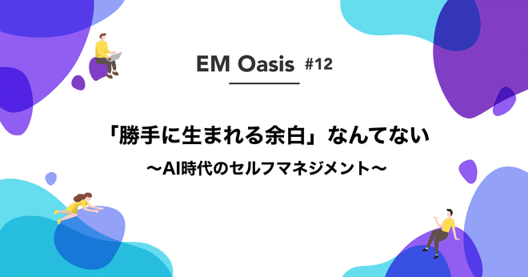
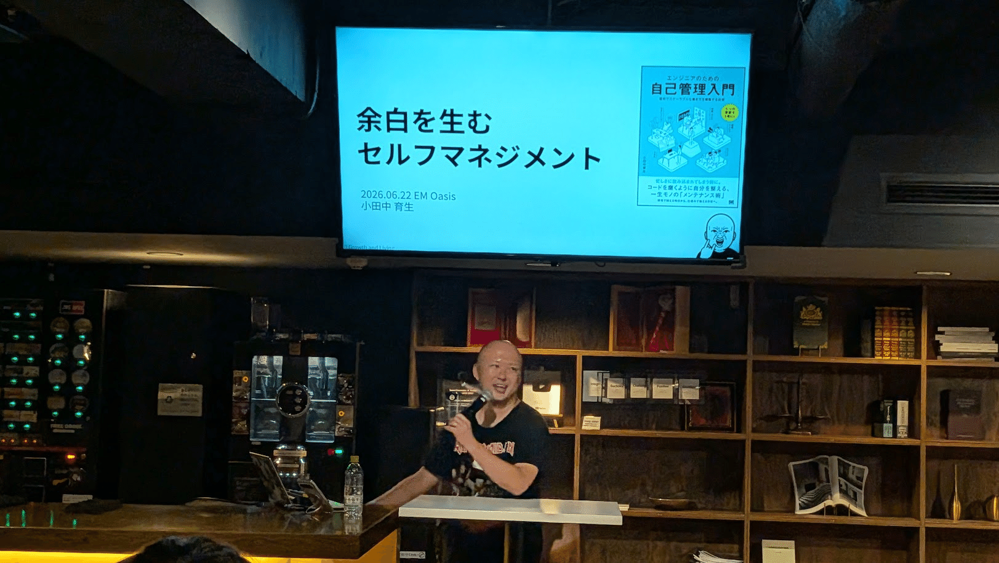
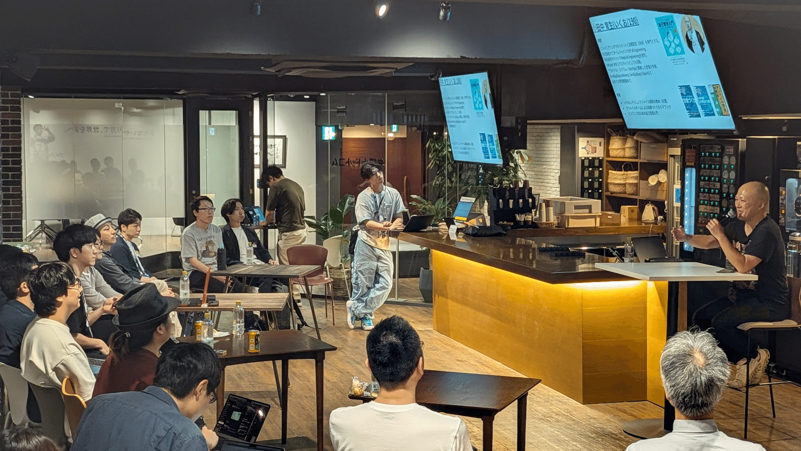
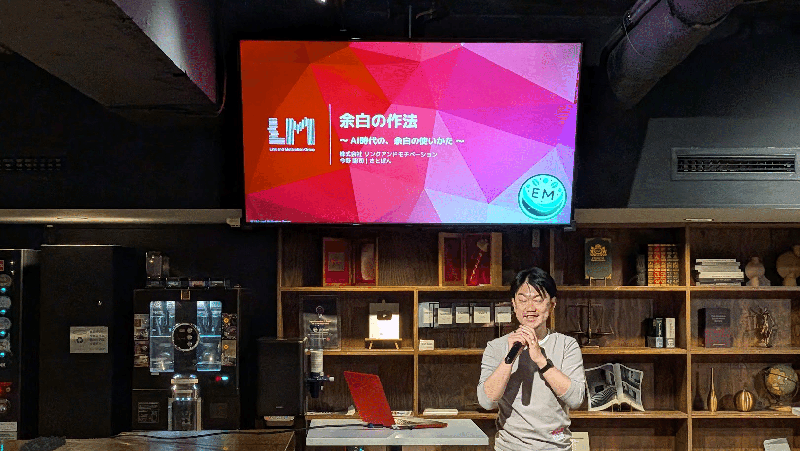
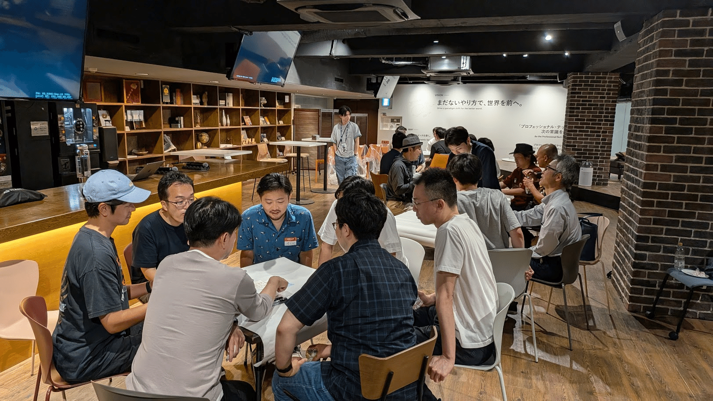
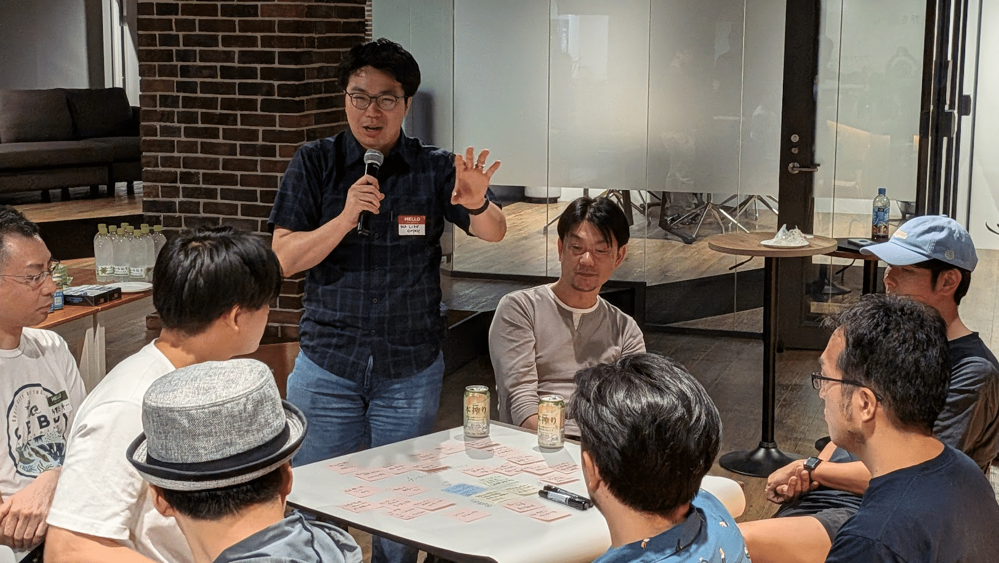
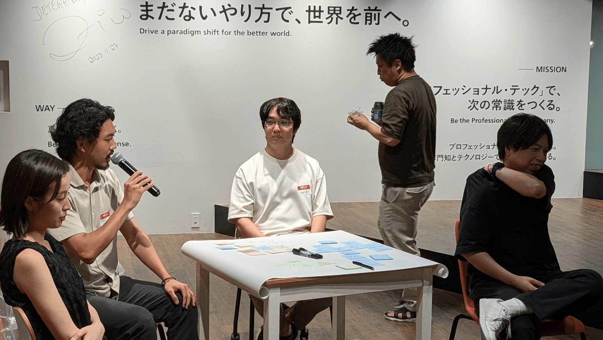
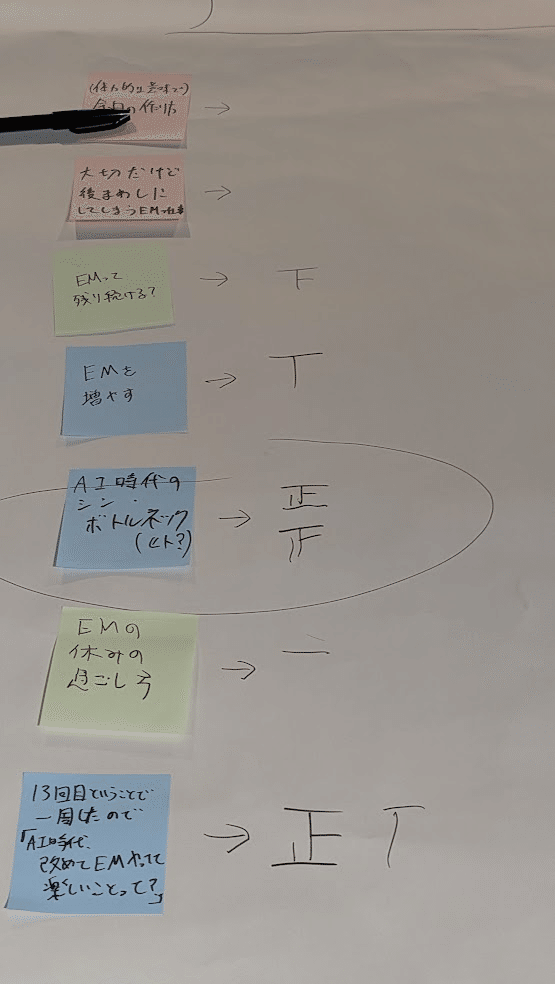
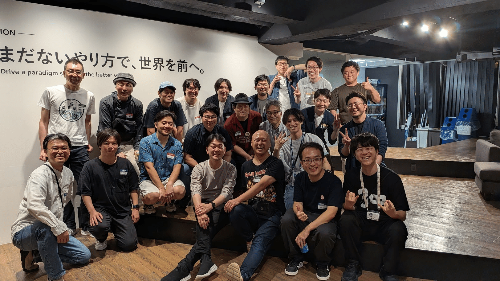

2026年6月22日、EM Oasis #12 を開催しました。  
テーマは「『勝手に生まれる余白』なんてない 〜AI時代のセルフマネジメント〜」。会場は弁護士ドットコムさんの六本木オフィスをお借りしました。

EM Oasisで「余白」をテーマに取り上げるのは、実は今回が2回目です。  
約1年前の第9回でも「余白こそが武器になる 〜意図的な余白のつくり方と活かし方〜」というテーマで開催しました。

なぜまた「余白」なのか。イベントを終えてみて、EMたちの「余白」への関心がこんなにも強いのかと、運営として実感した回でした。

## 招待講演：小田中育生さん「余白を生むセルフマネジメント」

招待講演は、株式会社カケハシの Head of Engineering、小田中育生さん。  
著書『エンジニアのための自己管理入門』の内容をベースに、今回のテーマに合わせた形でセルフマネジメントの話をしていただきました。

:::embed{service="speakerdeck" url="https://speakerdeck.com/ikuodanaka/self-management-that-creates-breathing-room"}
:::

講演の導入で小田中さんが引用したのが「ジェポンズのパラドックス」です。19世紀の産業革命のとき、資源の利用効率が上がるほどかえって資源の利用量が増えてしまった。  
AIの時代にも同じことが起きている。仕事は速くなったはずなのに、私たちは全然楽になっていない。「時間がない」が日常になっている。会場の参加者も深くうなずいていました。

そこから話は余白を意識的に生み出すためのセルフマネジメントへ。  
小田中さんが紹介した「ゆとりの法則」が響きました。余白は単なる空き時間ではなく、変化のための自由度だ。これがなければ組織は硬直化する。

講演の後半では、書籍で取り上げているセルフマネジメントの実践についても話が広がりました。『エンジニアのための自己管理入門』、まだ読んでいない方はぜひ。

:::embed{service="external-article" url="https://www.shoeisha.co.jp/book/detail/9784798194066"}
**エンジニアのための自己管理入門 堅牢でスケーラブルな働き方を構築する技術 | 翔泳社**
がんばりすぎるあなたのために 働きやすさを取り戻すセルフマネジメントのノウハウ 忙しい。やることは多い。学ぶべきことも増
www.shoeisha.co.jp
:::

## LT：さとぽんさん「余白の作法 〜AI時代の、余白の使いかた〜」

LTは、リンクアンドモチベーションVPoEのさとぽんさん。  
さとぽんさんも「余白」での登壇は2回目で、前回の第9回では「EMの仕事＝余白のデザイン！」というタイトルで話してくれました。

:::embed{service="speakerdeck" url="https://speakerdeck.com/lmi/emoasis-12-link-and-motivation"}
:::

今回のタイトルは「余白の作法」。前回が「余白をどう設計するか」だったのに対し、今回は「余白をどう使うか」に視点が移っていました。

中でも残ったのは、この一言です。

> 使い道が決まっていない余白は、必ず浪費される。

余白を作ること自体がゴールではない。何のために使うかが決まっていなければ、結局その時間は別の何かに吸い込まれていく。余白を「持つ」ことと「使いこなす」ことは別の話だ。前回の「デザイン」から今回の「作法」へ、問いが一段深くなっている。私自身、さとぽんさんの発表を聞くたびに余白の捉え方が更新されていて、今回もまた学ばせてもらいました。

## お悩み相談会——テーブルディスカッション

EM Oasisでは毎回、OST（オープンスペーステクノロジー）形式でお悩み相談会を行っています。参加者にその場でテーマを出してもらい、興味のあるテーブルに分かれて話す流れです。

今回は5つのテーブルが立ち上がり、最終的に4つのテーブルが活発に動いていました。

普段はイベントテーマとは関係のない悩みが出てくることも珍しくありません。ところが今回は、出てきたテーマの多くがセルフマネジメントや余白に沿っていました。それだけ「余白」は今の参加者にとって、自分ごとのテーマだったのだと思います。

私はセルフマネジメントをテーマにしたテーブルに参加しました。そこでは、参加者の方が自分の抱えている悩みをかなり深く打ち明けてくれる場面がありました。社内ではなかなか相談相手がいない。でも誰かに話して、自分なりに整理して前に進みたい。そういう思いで来てくれていることが伝わってきました。

どのテーブルも時間が足りなかったという声が上がっていました。  
セッションを聞くだけで終わらず、自分の悩みを持ち寄って話し合う。EM Oasisが参加型であることの良さが、今回は特に出ていた回だったと感じます。

## 次回のEM Oasis

次回のテーマは、当日の参加者のみなさんと一緒に決めました。詳細が決まり次第、connpassとXで告知します。

「こういう場があるのか」と思った方、ぜひ一度足を運んでみてください。

:::embed{service="external-article" url="https://emoasis.connpass.com/"}
**EM Oasis**
\# コミュニティ説明 本コミュニティーはEMの 1. 学び 2. 広がり 3. 繋がり 4. 癒し 5. 遊び の場とな
emoasis.connpass.com
:::

:::embed{service="twitterProfile" url="https://x.com/EMOasisCOMM"}
:::

## 謝辞

今回の会場を提供してくださった弁護士ドットコムさん、飲食をサポートしてくださったROSCAさん、招待講演の小田中育生さん、LT登壇のさとぽんさん、そして参加してくださった皆さん、ありがとうございました。

