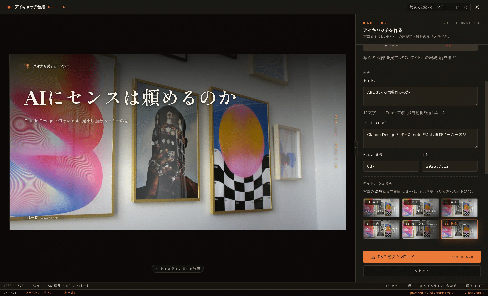
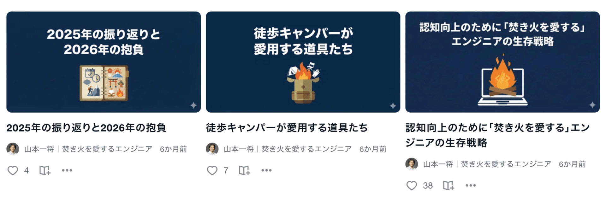
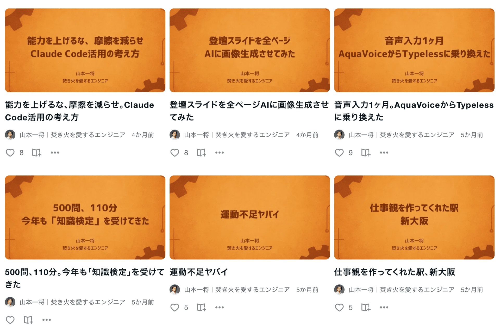
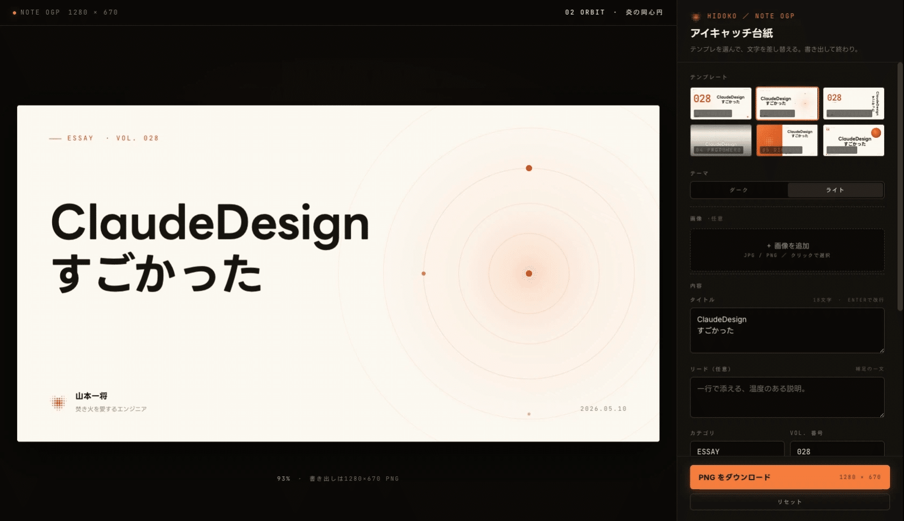
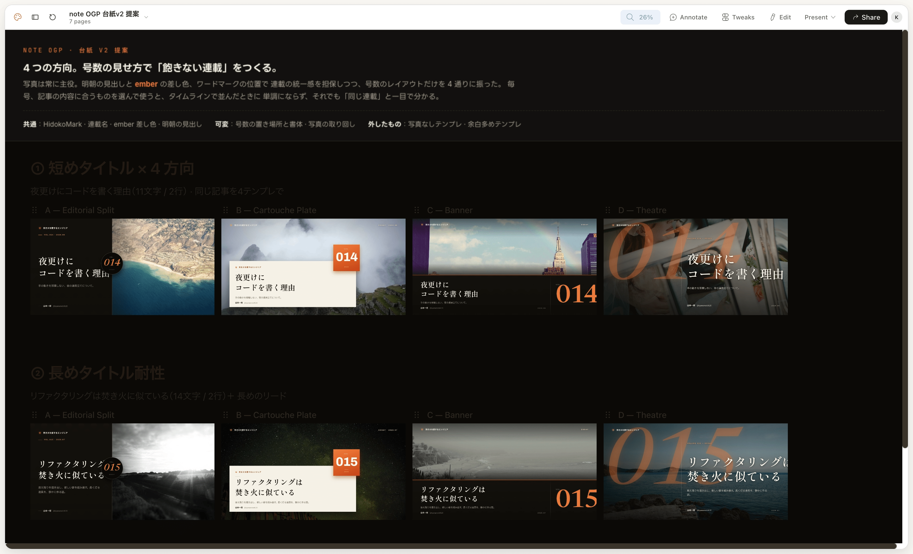
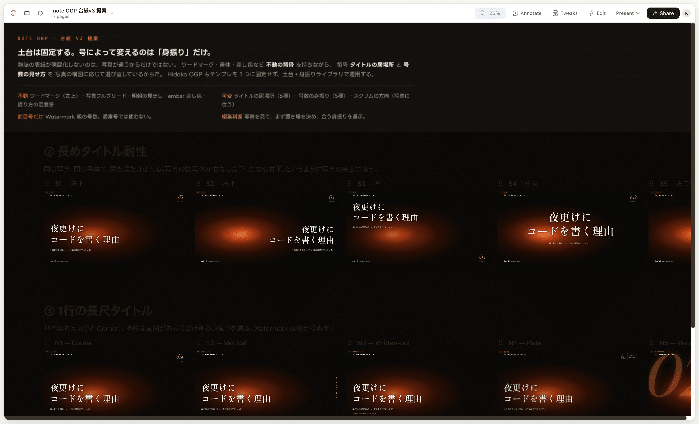

AIに、センスは頼めるのか。

私の答えは「頼める。ただし、頼み方があった」です。

先日、社内のデザイナーと Claude Design の使い方について話す機会がありました。題材にしたのは、私が個人開発している note の見出し画像メーカーです。この対話がとても嬉しい体験だったので、そこで言語化できた「AIとデザインを作るプロセス」を記事にします。

何が嬉しかったのかは、最後に書きます。

## 作ったもの

まずは成果物からお見せします。note-ogp という、note 記事の見出し画像を作ることに特化したアプリです。

https://note-ogp.y-kaz.com/

画像を1枚選び、タイトルと号数、日付を入力して、いくつかのパラメータを設定する。それだけで、ある程度オシャレな見出し画像ができあがります。

なぜこんなものを作ったのか。

毎週 note を書いていて、いちばん辛いのは記事を書くことではありませんでした。見出し画像を作ることです。

## 見出し画像づくりの変遷

この作業は、3つの道具を渡り歩いてきました。

最初は画像生成AIです。記事の内容を全部入力して、見出し画像を生成してもらうプロセスでした。ある程度の質は出ます。ただ、文字の制御などクオリティの担保が地味に大変で、毎週の作業としては無視できない時間がかかっていました。

次が Canva です。Canva AI にテンプレートを作ってもらい、タイトルの文字だけを差し替えていく運用に変えました。工数は大幅に下がりました。単品で見れば「ちょっと良いものできた！」という気持ちもあったんです。

問題は、並んだときでした。毎週書いていれば記事は溜まっていき、note のサムネイル一覧でまとめて見られます。そこで全く格好良くない。連載には「12枚並べて格好良い」という感覚が必要なのだと、このとき気付き始めました。それでも、あまりの楽さに長く使い続けてしまい、脱却の手段をずっと探していました。

そして Claude Design が登場します。真っ先にチャレンジしたかったのが、センスの良い見出し画像を作る努力でした。実際には忙しくてすぐには触れず、ゴールデンウィークに時間が作れてようやく着手しています。当時の速報記事がこちらです。

https://note.com/kyamamoto9120/n/nbe133d5a7dfc

ここから、Claude Design と見出し画像を追求する日々が始まりました。

## 転機 — テンプレを選ぶのを、やめた

最初に Claude Design と作ったのは、いくつかのテンプレートを選んで見出し画像を作るツールでした。ちょっと格好良いものは作れます。でも、これでは Canva の再演です。「これが並んだときに、満足のいく記事一覧になるのか」という問題がそのまま残りました。

ここからは、台紙の見せ方の追求になります。

この時点で記事は28本。これだけ書いていると、見出し画像に求めるものが言語化されてきます。私の要件は3つでした。

- 連載であることがわかる
- 世界観が統一されている
- それでいて、飽きない

これを重視してデザインを出してもらいます。方向性は良くなってきました。でも、まだ「良い」と思えないんです。

そこで、方向を変えました。

私は雑誌の表紙が好きです。格好良い雑誌って、12ヶ月分並べても格好良いんですよ。Canva 期に気付いた「並べて格好良い」の答えは、アナログの世界にすでにあった。雑誌の表紙をベンチマークに置いて、それを想像しながら作り込みを始めました。

急に良くなってきました！

これなら、写真さえちゃんと選べば、満足感のある見出し画像を並べられる。そう確信できた瞬間でした。

## プロセスを言語化する

「見出し画像を作るアプリ」から「自分が使いたいアプリ」までのギャップは、かなり大きいものでした。要求を言語化する能力が求められますし、Claude Design に何度もパターンを作ってもらい、細かいすり合わせを重ねて完成に近づけていきました。

振り返って重要だったのは、この3つの動きだと思っています。

まず、ベンチマークを決める。憧れのアナログを指差して「これ」と言えるようにする。アプリの作り込みではなく、台紙のブラッシュアップに集中できたのはこのおかげです。

次に、大量に出させる。とにかくたくさんパターンを作ってもらって、格好良いものをすり合わせていく。この物量は、人間のデザイナーには頼めません。AIは文句も言わず、何時からでも何時間でも付き合ってくれます。だからこそ、この作業を自分一人でやり切れたのだと思います。

最後に、削ぎ落とす。アプリをメンテするなかで、設定可能な項目が増えすぎたタイミングがありました。私は一度、全部消しました。

AI時代に気をつけなければいけないのは、作りすぎることです。頼めば何でも作ってくれるから、危うく Canva を作るところでした。Canva を作ったらおしまいです。汎用の道具が欲しいなら、本物の Canva を使えばいい。必要なものは何かを問い続けて価値を磨き、不要を削いで洗練させる。それができていることが、このアプリに自信を持っている理由です。

ちなみにこのプロセス、モデルが Opus でも Fable でもクオリティにそれほど差を感じていません。Fable は確かに賢いのですが、Opus でも困らない。効いているのはモデルの賢さより、プロセスの型のほうだと感じています。

## デザイナーに褒められた

冒頭の話に戻ります。

このプロセスと成果物を、社内のデザイナーに褒めてもらえました。

自分のAIの使い方に自信を持つのが難しい時代です。「これでいいのか」と思いながら使っている人は多いはずで、私もそうでした。このアプリを題材に Claude Design の使い方を話すなかで、自分のプロセスが言語化されていき、それを専門職の目で認めてもらえた。これは確実に自信になりました。

同時に、本当に細かいこだわりにめっちゃ気付いてもらえたんです。こちらが説明する前に、狙いを見抜いてくる。やっぱりデザイナーはすごい、専門職なのだと実感しました。Claude Design がどれだけ進化しても、デザイナーは不要にならない。これも実感を持ってそう思います。AIを使うことと、専門性を尊敬することは両立するんです。

## おわりに

ベンチマークを決め、大量に出させ、削ぎ落とす。

私が Claude Design と見つけたプロセスは、この3つの動きでした。デザインに限らず使える型だと思うので、よかったらあなたの題材で試してみてください。

Claude Design は頼もしい相棒です。私の能力を大きく拡張してくれました。これからも、無限にデザインを作ってもらうと思います。感謝！
