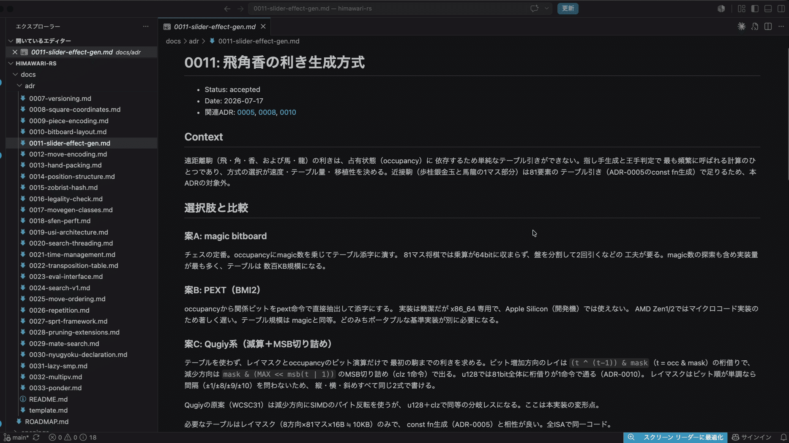
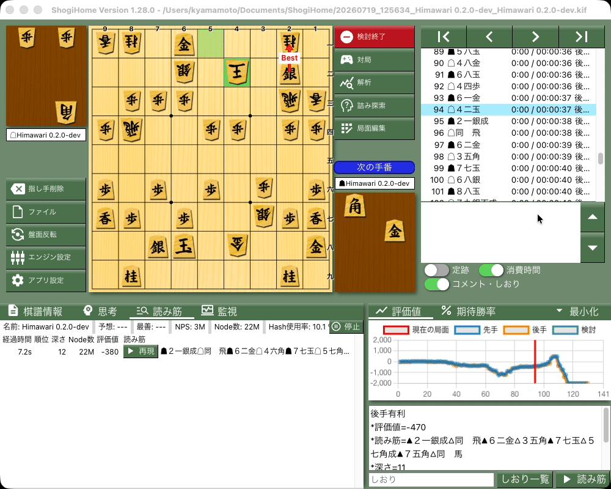

## 選手権から離れて 7 年

コンピュータ将棋の開発を久々に再開しました。  
今回は、コードを 1 行も書いていません。

世界コンピュータ将棋選手権には昔から参加していて、個人での最高順位は 2015 年の第 25 回大会で記録した 9 位です。最後に出たのは 2019 年 5 月の第 29 回大会。翌年の大会がコロナの影響で中止になったのをきっかけに、そのまま参加しなくなりました。

やりたいなーという気持ちはずっとありました。ただ、面倒のほうが勝っていました。実装し始めればそこそこ楽しいのですが、勝ちたいと思うと大変な競技です。そのための時間を捻出するのがつらくて、「やりたいなー」のまま 7 年経っていました。

## ちょっと気が向いたので、始めてみた

最近は Claude Code で開発しています。使っているうちに、やりたいことはなんでも実装できる気がしてきました。だとすると、コンピュータ将棋を再開できない理由も特にないのでは。

そう思っているだけの期間がしばらくありました。  
先日、開発のフローがなんとなくイメージできたので、始めてみました。大きな決意はなく、試してみたくらいの温度感です。

進め方は 2 つだけ決めました。実装は全部 Claude Code に任せる。方針は全部 ADR（設計判断の記録）を書きながら調整する。コードは書かず、判断だけ自分でやる。

*ADR の記述例*

## 3 日でどこまで来たか

始めて 3 日で、ルール通りに対局できるエンジンができました。評価は駒割（駒の損得だけ）の素朴なものですが、GUI に登録して普通に対局できます。いまは自己対局の検証を回しながら、探索の改善を積んでいるところです。

*駒割だけですがそこそこ動きます*

指し手生成や USI（将棋エンジンの通信プロトコル）対応は、過去に何度も実装してきました。ただこの区間は、面白い判断が少ないわりに手数だけかかる、しんどい工程です。今回そこがほぼ手放しで終わったのは、体験としてかなり良かったです。

それ以上に効いているのは、アイデアの実装がすぐ終わることです。過去の開発では、実装のしやすさを優先してアイデアを見送ることがよくありました。いまは実装コストが判断材料からほぼ消えるので、「やるべきか」だけで決められます。見送ってきたアイデアを片っ端から検討し直せるのは、素直に楽しいです。

## オリジナリティは不明。でも楽しい

この方法で作ったプログラムにオリジナリティがあるのかは、正直わかりません。コードは 1 行も書いていませんし。

ただ、それはそれとして楽しいんですよね。どの設計を選び、どの改善を採用するか。判断は全部自分がしていて、実装を手放しても面白さは減っていない、というのが 3 日やってみての実感です。競技としてどこで勝負するか、その置き場所が昔と変わっただけなのかもしれません。

しばらく続けてみようと思っています。また進んだら書きます。
