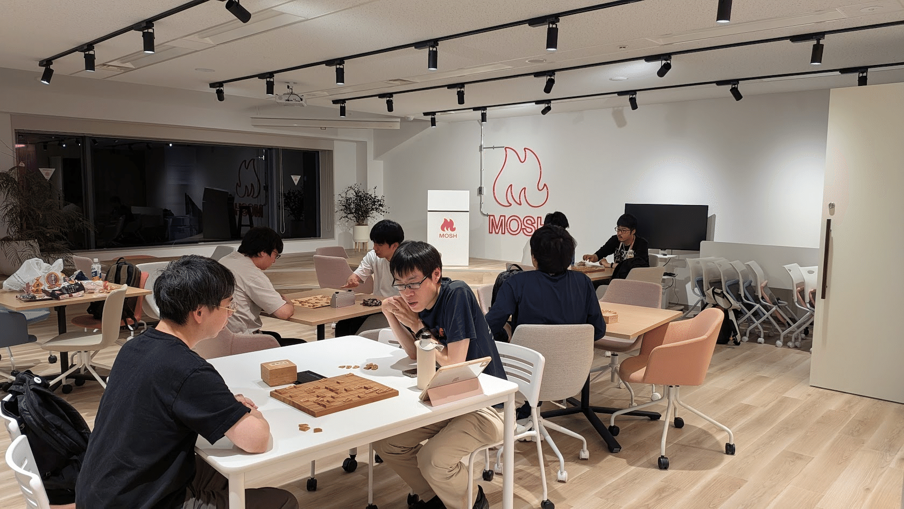

気付けば40本目の note 記事です。順調に継続されています。  
写真は横浜ランドマークで撮影したカビゴンです。

## 7/6 (月) AI時代のエンジニア生存戦略

ROSCA主催のイベントに登壇させていただきました。

https://rosca.connpass.com/event/395936/

熱量に溢れたイベントで、参加者の出席率もよく椅子が足りなくなってしまったので用意されたラグに座って話を聞く方もいるほどでした！

資料は公開していないのですが、個人的には手応えのある発表でもあったので機会があればまたブラッシュアップしてお話ししていきたいと思います。

懇親会もとても盛り上がり、皆さんの悩みを聞かせていただく学びある時間になりました。

## 7/8 (水) ハーネスエンジニアリング × AI Meetup

mento、DressCode と MOSH の3社共催イベントです。

https://mosh.connpass.com/event/393744/

ハーネスエンジニアリング、という言葉自体の良し悪しはさておき、このようなスタートアップ３社が実践している話を聞けるのは貴重な機会だったかなと思います。

ドリンクも料理も素敵なものをご用意いただいて、とても楽しかったです！

https://x.com/yug1224/status/2075379657474781661

## 7/10 (金) LINE DC Generative AI Meetup #8

私が運営する LINE Developer Community の勉強会です。この週３つ目のイベントです。

https://linedevelopercommunity.connpass.com/event/397834/

この Generative AI Meetup はかれこれ丸2年以上続いているシリーズになるのですが、毎回オフラインの場に集まる価値を強く感じるイベントです。

今回は LINE API Expert でもあるハリネズミさんが Mastra についての書籍を出版されたということで、その記念イベントという形で開催しました。

## 7/22 (水) - 23 (木) AI DevEx Conference 2026

Findy さんのカンファレンスにブースを出しました。

https://dev-productivity-con.findy-code.io/aidevex2026

昨年までは開発生産性カンファレンスと呼ばれていたイベントですが、今年からは AI DevEx ということで AI 色が極めて強いイベントだったと思います。

弊社からは VPoT の鈴木が登壇しました。

https://x.com/SoartecL/status/2080121634355392814

手前味噌ですが、本当に良い話でした！  
今の MOSH の強さを正しく伝えることができる発表で、この資料は折に触れて紹介していきたいと思いました。

## 7/31 (金) デザインシステム勉強会

dip × MOSH のデザインシステム勉強会を開催しました。  
TSKaigi のブール出展のご縁で実現したイベントです。

https://dip-dev.connpass.com/event/397535/

良い刺激がたくさん得られたイベントでした。  
私は当初登壇する予定はなかったのですが、前日夜にMOSH側の登壇予定者に欠員が出たこと、VPoT が登壇を後押ししてくれたことでお話しすることになりました。

https://x.com/kyamamoto9120/status/2083193477735596404

最近少し忙しくて体力的にも厳しく参加自体も考えようかと思っていたのですが、この後押しは救いでした。やっぱり忙しい時こそイベントに行くべきです。元気をもらいましたし、考えを整理する時間にもなりました。

## その他の活動：将棋

今月は将棋に関わることが急に増えました。

### 7/3 (金) Dev将

クローズドなイベントなのですが、将棋好きなITエンジニアが集まってただ将棋を指す、というイベントを MOSH 会場でやりました。

久々にリアルで将棋が指せて楽しかったです！  
次回は8月21日の予定です。興味がある方は私にご連絡ください。

### コンピュータ将棋開発の再開

Dev将が刺激になって、というわけではないのですが、長年休止中だったコンピュータ将棋の開発を Claude Code に完全に実装を任せるという形で再開しました。

https://note.com/kyamamoto9120/n/n8e50f15a69e0

こちらについては、また記事を書く予定です。

### 7/26 (日) 社団戦

穴埋め要因としてですが、初めて社団戦に参加しました。  
2フロア一杯に人が集まり将棋を指す光景は圧巻でした！

https://x.com/kyamamoto9120/status/2081198382333546771

棋力的に3部は厳しすぎましたが、ちょっと勉強を再開しようかなとも思いました。

---

幅広く活動した１ヶ月でした。  
一般の参加者として関わるイベントがなく、登壇や共催、主催、ブース出展と密度のあるイベントが多かったです。

技術だけでなく、将棋による繋がりも増えたのは素敵です！  
この調子で8月も活動していきます。
