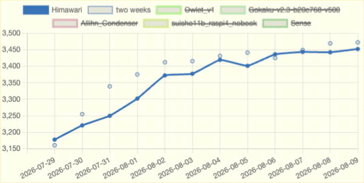
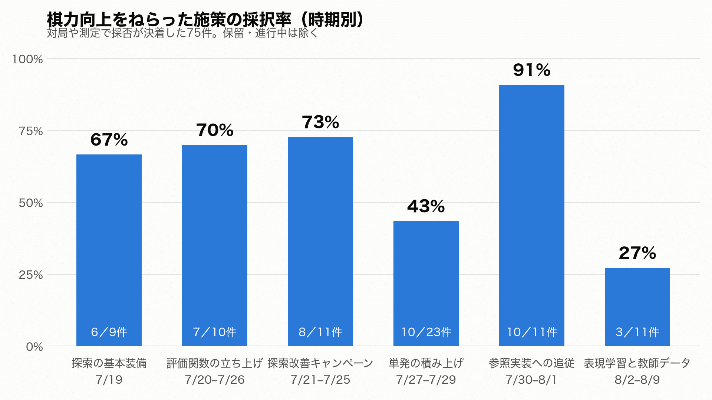

3週間前、コンピュータ将棋の開発を Claude Code と再開した話を書きました。3日でルール通りに指せるエンジンができた、というところまでです。

:::embed{service="note" url="https://note.com/kyamamoto9120/n/n8e50f15a69e0"}
**コンピュータ将棋の開発を、Claude Code と再開してみた**
:::

あれから3週間。コードは相変わらず1行も書いていません。  
というより、このリポジトリではドキュメントを含めて1ファイルも編集していないし、コマンドも実行していません。

それでもレーティングは3452まで来ました。

*floodgate のレーティングの推移*

今回書きたいのは将棋の話ではありません。  
「うまくいく施策の割合が、3週間でどう落ちていったか」の話です。

## 現在地

floodgate というコンピュータ将棋の自動対局場があります。  
24時間、勝手に対局が組まれてレーティングが付く場所です。

初参戦が7月24日、レーティングは3186でした。

7月29日からは常駐させるためにマシンスペックを下げて再参戦。  
392局で204勝188敗、レーティング3452。2週間で266上がりました。

この間に積まれたのは ADR 149本、PR 225本、コミット446件です。  
趣味の開発で一人でできる分量は大きく超えていると思います。

## 目的は将棋ではありません

私がやりたいのは、将棋AIを強くすることではありません。24時間、自律的に開発が回り続ける環境を作ることです。将棋はそのための題材です。

業務の開発でいちばん難しいのは、「作ったものが価値につながったか」の判断だと思っています。リリースしても、効果なのか季節要因なのか判別できない。

コンピュータ将棋には、ここに[SPRT](https://chessprogramming.org/Sequential_Probability_Ratio_Test)という道具があります。変更前後のプログラムを数百〜数千局戦わせ、「強くなった」と言えるかを統計的に判定する手法です。人の解釈が入らず、数時間で白黒がつきます。

つまり将棋は、価値の測定という難所が最初から解けている題材です。ここで自律開発の環境を作れないなら、測定のない実業務で作れる道理がない。そういう順序で選びました。

## 回し方

仕組みはシンプルです。

方針は Fable 5 と対話しながら決めます。決まったら ADR に落としますが、書くのも Fable 5 です。書けたら Opus 5 に渡し、実装、実験、PR まで進めてもらいます。CI と SPRT を通った PR は、エージェントが自分でマージします。私の承認は挟みません。

棋力に関わる変更は SPRT で「強くなった」と出るまで main に入れない規約です。

棄却された案の ADR も消しません。エージェントは会話の文脈を持ち越さないので、「なぜ前回失敗したか」をファイルで読める状態にしておく価値が、人間の開発より大きいと考えています。

## 打率は67%から27%に落ちた

ここからが本題です。

棋力向上をねらって着手し、採否が決着した施策は3週間で75件、うち採択が44件でした。この「採択された割合」を、野球にならって打率と呼ぶことにします。通算で58.7%です。

時期ごとに区切ると、様子が変わります。

最初の1週間は7割前後。そこから43%に落ち、直近の1週間は27%です。理由ははっきりしていて、教科書に載っている手が先に尽きるからです。枝刈りや評価関数の定番は「入れれば効く」と分かっているもの。それを入れ終えた後に残るのは、効くかどうか分からない案だけになります。

当たったときの取り分も減っています。最初の週は採択1件あたり平均+83 Eloだったのが、直近の週は+23です。打率が下がるうえに、当たっても小さい。

そしてグラフにひとつ、逆向きの山があります。7月30日からの3日間だけ、打率91%。ここには経緯があります。

## 6連敗の翌日にやったこと

7月29日、時間管理の改善案を6件試して、全部落ちました。棄却の ADR が6本並んだ日です。

診断はエージェントがしました。6本の棄却理由を並べて読むと、個別のパラメータではなく、探索を止める判定の構造そのものが参照実装（やねうら王）と違う。全件が同じ場所でつまずいていました。棄却の記録を消さずに残していたのが、ここで効いた形です。

方針を変えたのは私です。翌日、単発の改善を積むのをやめ、参照実装との差分をまとめて埋める方針に切り替えました（ライセンスは参照実装に合わせて GPLv3 へ揃えています）。そのとき付けた条件がこれです。

> 再現を目標に置く。値も条件も変えずに移す。良し悪しの判断を挟まない。

エージェントに、考えるのをやめさせました。打率91%はこの指示の産物です。検証済みの実装を写す作業に、判断を挟む理由がない。それに正直なところ、追従の期間は機械的にうまくいくと分かっている、つまらない区間なんですよね。そこに自分の時間もエージェントの試行錯誤も使いたくありませんでした。

参照実装への追従自体は、最初から構想にありました。何も見ずにどこまで行けるか見たくて、行き詰まるまで温存していただけです。6連敗が、その引き金になりました。

## 実業務に持ち帰れること

打率27%は4回に3回外すということです。  
人間主体の開発では許容できないかもしれません。

ただ、自律開発では話が変わります。1試行が「エージェントが数時間走る」だけなら、27%でも積み上がります。外れた案も棄却の記録が残るぶんだけ次に効きます。

ただしこの算段は測定が自動で回っていることが前提です。  
採否の判定が人間待ちになった瞬間、24時間走る意味は消えます。ADR 149本、PR 225本、コミット446件という数字はレビューしていないからこそ実現できます。

実業務に持ち込むならまずは価値の測定を自動化する。承認の条件を明確にしなければならないなと改めて感じました。

## 次にやりたいこと

先日、たまたま floodgate を観戦していたら一手詰めに気付いていない局面を見かけました。ご機嫌なまま、負けてました。

:::embed{service="twitter" url="https://x.com/kyamamoto9120/status/2084692145462792581"}
> 【コンピュータ将棋の話】
> たまたま floodgate 見ていたタイミングでの将棋、この局面で一手詰めに気付いていないのはバグっている気がする。
> Claude Code に floodgate の棋譜全部精査してもらったほうが良いな。https://t.co/Ugql4L6YEt pic.twitter.com/lfCeFcO8sO
> — 山本一将｜焚き火を愛するエンジニア (@kyamamoto9120) August 4, 2026
:::

気付けたのは偶然見ていたからです。  
392局ぶんの棋譜を人間が精査するのは大変ですが、Claude Code ならできます。実戦の棋譜には、SPRT の数字に出ない違和感が埋まっているはずです。

いまの仕組みは、測定の数字だけを見て回っています。  
次は本番の対局を観測して、そこから施策を立てるところまで任せたい。

進んだら、また書きます。
