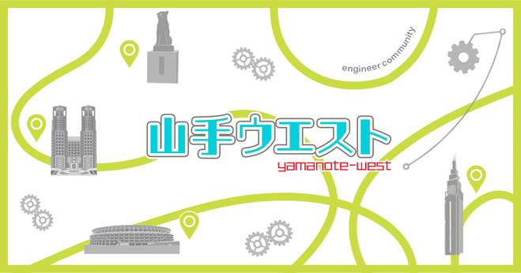
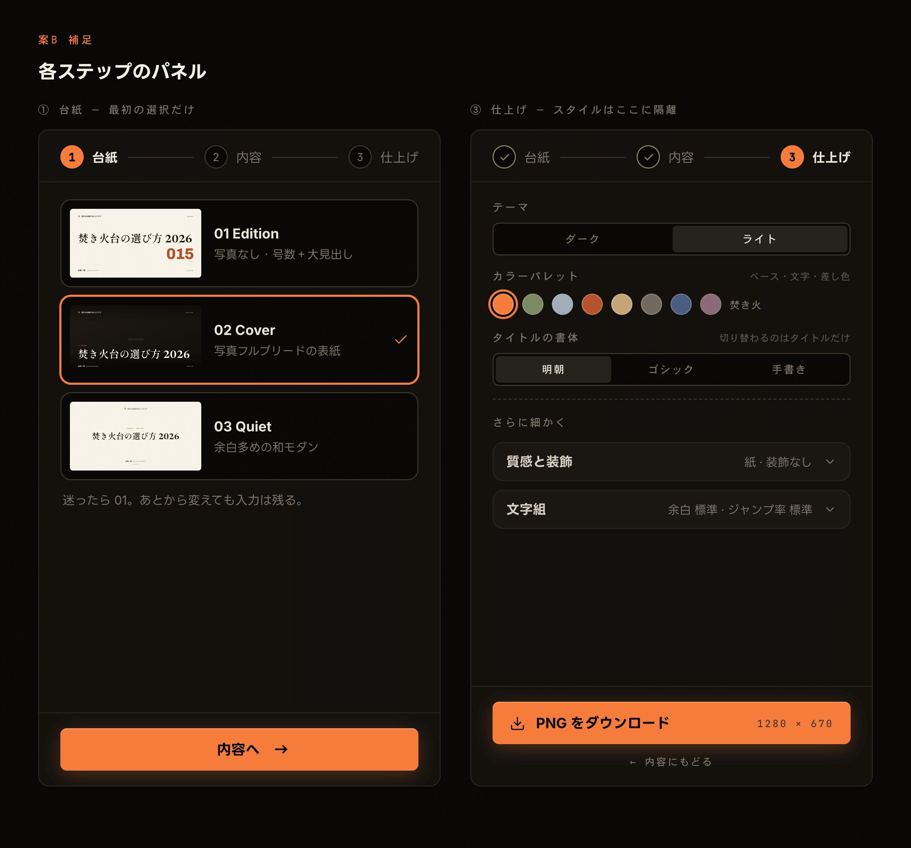
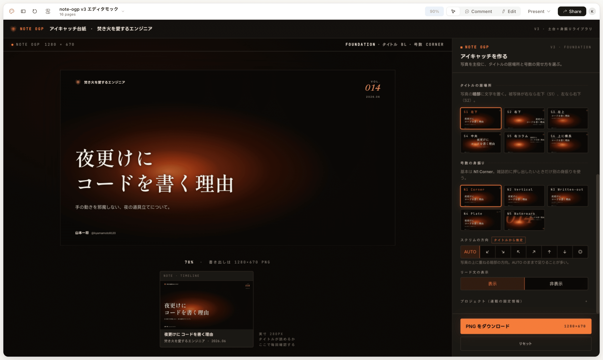
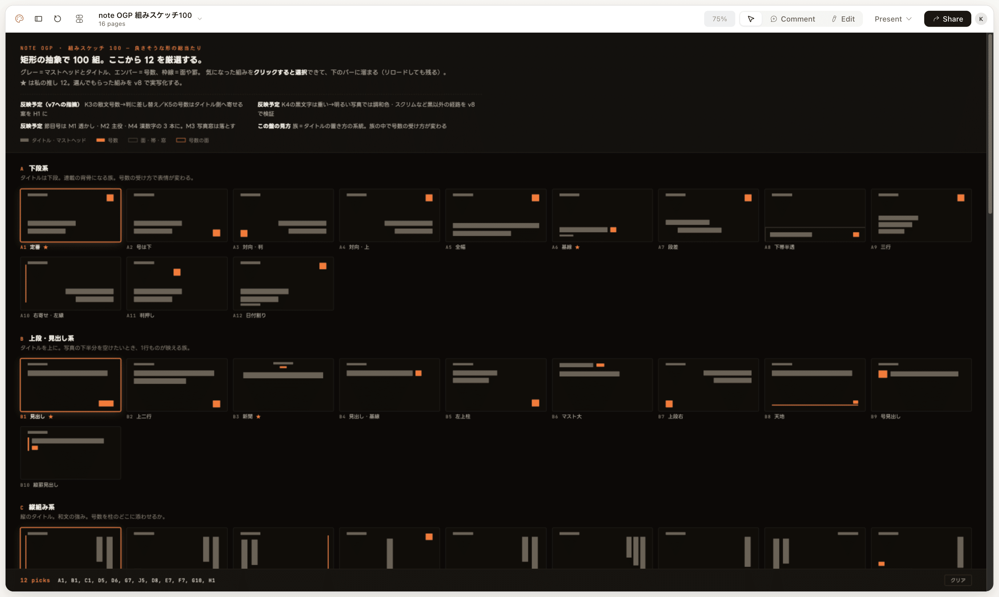
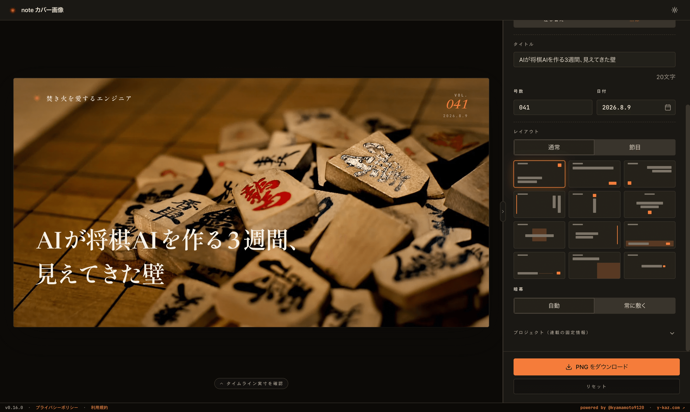

自分が欲しいツールがその日のうちに動く。 最初はそれだけで楽しかった。

でも、すぐに飽きた。

なんでも作れることに、そこまでの価値はなかった。動くものが増えるほど、使わないものも増える。作った時点で満足して、二度と開かないツールがいくつもあります。

面白くなってきたのは、そのあとでした。

---

8月25日(火)、新宿の「山手ウエスト #1」でこの話をします！  
この記事は勉強会でお話しすることの予告編です。

*山手線の西側で開催する勉強会、少ないよね！から始まったみたいです*

### 設定項目を増やしていた時期

いま「noteカバー画像」というツールを作っています。noteの見出し画像を作るためだけのツール。毎週noteを書くので、毎週必要になる。

開発当初から、機能は絞ったつもりでした。自分が使いやすいように、と。

ただ、途中で欲が出ます。出てくる画像のバリエーションが足りない。質も足りない。そう感じて、設定項目を増やす方向に舵を切りました。

*増え続ける設定項目の画面設計*

タイトルをどこに置くか。号数をどう見せるか。写真に重ねる暗部をどっち向きにするか。リード文を出すか、出さないか。

*サイドパネルの情報量が大変なことに…*

選べる幅は広がった。でも、使うのが面倒になった。

毎回この画面と向き合って、6つの中からタイトルの位置を選ぶ。それは私がやりたかったことではない。私が欲しかったのは、開いて数十秒で納得できる画像が出ることでした。

### 100個並べて、選ぶ

そこでやったのが、レイアウト案を100個作らせることです。

写真もタイトルも入れず、矩形だけの抽象で100通りの組み方を並べる。そこから自分の好みで12を選ぶ。

*AI は嫌な顔せずにひたすら案出ししてくれます*

選んでいると、自分が何を良いと思っているのかが分かってきます。タイトルは下段が落ち着く。号数は角に小さく置きたい。事前には言えなかった。並べられて、初めて分かった。

いま画面に残っている設定は、タイトル・号数・日付・レイアウトの4つです。

*最新の画面。レイアウトも直感的に選べます。*

設定は減って、出てくる画像の質は上がりました。

### 感情なら言語化できる

デザイナーではないので、理想のUXを自力で設計する力はありません。

でも、自分の感情なら言語化できる。

「この項目、毎回触るのが面倒だ」 「この画像、なんとなく安っぽい」

これをそのままAIに渡す。何が足りないのかを一緒に掘って、UXの形に落としてもらう。この往復が、いまいちばん楽しい。

なんでもできるツールを作るのではなく、少ない入力で質を上げる。この感覚は、実務で機能を設計するときにも効いています。

### 8月25日、新宿

「山手ウエスト #1『AI開発、最近どうですか?』」に登壇します。  
この話を、もう少し具体的にする予定です。

新宿が近い人はぜひ。

https://yamanote-west.connpass.com/event/399789/
