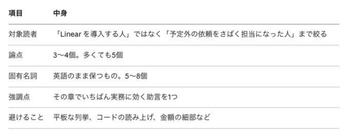

5月某日、チーム編成が変わり、リリース直前のプロダクトのリードになりました。機能はもうほとんど動いていて、GA に向けた調整をしている段階です。そこに入った形になります。

困ったのは、動画配信に使っている外部の SaaS の仕様を私が何も知らなかったことでした。わからないままだと設計や実装が正しいのか判断できませんし、トラブルが起きたときに切り分けもできません。

公式ドキュメントは191本、全部英語。順番に読んでいく時間はありません。

:::toc
:::

## URL を貼るだけでは足りなかった

とりあえず Gemini Notebook（旧 NotebookLM）にドキュメントの URL を貼ってみたのですが、出てくるものが薄い。

考えてみれば当たり前で、これだと191枚のページをバラバラのまま渡していることになります。ページには順序がないし、どれとどれが同じ話題なのかも渡された側にはわかりません。原文が英語なら、返ってくる説明も英語に寄ります。

私がやっている「作り直す」は、この191枚を19章にまとめることです。日本語にして、目次を付けて、1冊の本の形にしてから渡す。

いちばん差が出るのは、章という単位ができるところだと思います。ページ単位のソースは絞りようがありませんが、章になれば「今日はこの章だけ」と指定できます。

比較実験をしたわけではないので、このあたりは感覚値です。

## 作ったもの

原文1本を日本語の詳細ノート1本にして、そのノート群を章ごとにまとめて章記事にする。変換はこの2段だけにしました。段を増やすほど情報が落ちるからです。

章立ては原文のディレクトリ構成をそのまま使わず、機能の領域と組織での使われ方の両軸で切り直しています。「本にする」というのは、要するにここのことです。

同じ手順を Linear のドキュメントでも回しました。こちらは急ぎではなくて、Linear が哲学を持ったツールだからです。これまでのプロジェクト管理ツールの置き換えとして使うより、思想を理解して使ったほうが強力だと感じました。

どちらのガイドも個人の学習目的で手元に置いているだけで、公開はしていません。

## 実装は任せた。足したのは禁止リストだけ

取得スクリプトも章立ての定義もワークフローも、品質を検査する仕組みも、書いたのは全部 Claude Code です。

章立ては docs.json というファイルに入っているのですが、私はこれを一度も開いたことがありません。最初は章立てくらい自分が握るべきだろうと考えていましたが、任せても成立しました。

あとから中を見たら、こんな検査が入っていました。章とファイルの割り当てを Python にベタ書きしたうえで、章に書いたファイルが実在するか、どの章にも割り当てられていないファイルがないかを確認する。引っかかると例外で止まります。

```
assigned = {s["source"] for s in sections}
all_files = {str(p.relative_to(SRC)) for p in SRC.rglob("*.md")}
unassigned = sorted(all_files - assigned - EXCLUDED)
if unassigned:
    raise SystemExit(f"unassigned source files: {unassigned}")
```

Linear では、中身が "Filler content" の繰り返しになっている実質空のページが1本あって、これも理由付きで除外されていました。ここまでは指示していません。

つまり、作る部分は任せられます。だとすると残る仕事は、何を渡すかと、出てきたものにどう返すかのほうで、私が実際にやっていたのも後者だけでした。

ノートを書かせるエージェントには「要約するな」と伝えてあります。ただ、これだけでは効きませんでした。効くようになったのは、こう書き換えてからです。

> \- 手順が5つあるのに3つに減らす  
> \- パラメータ表から「主要なもの」だけ抜き出して残りを切る  
> \- 制約・上限値・課金に関わる注意書きを省く  
> \- 対応バージョン・対応プラットフォームの一覧を「など」でまとめる  
> \- 複数のコード例のうち1つだけ残す  
> \- 原文の警告（Warning / Note / Caution）を落とす

最初からこう書いていたわけではありません。以前から似た仕組みを別のことにも使っていて、出てくるものが薄いたびに禁止を1行ずつ足していったらこうなりました。

手順のほうにも1行あります。

> 1件読んだら即書く。全件読んでからまとめて書き始めない。

たぶん理由は同じで、全部読んでから書かせるとコンテキストが尽きて要約に倒れるのだと思います。

日本語にしないものも決めました。コードと、API のフィールド名やイベント名。訳してしまうと実装中に検索できなくなります。

品質バーも数値です。H2 は5〜9個、コード例は最低3つ、本文150行以上。「詳しく書いて」ではまったく効かなくて、数えられる形にすると効きました。

ただ、最近は指示しなくても薄いものが出てくることがほとんどありません。モデルのクオリティが上がっているのだと思います。この禁止リストが今も要るのかは、正直よくわかっていません。

## Gemini Notebook に渡すときは、章カードを1枚作る

ガイドができても、そのまま渡すと平板になります。数百行の章記事を投げると、重要な判断と些末な設定が同じ重みで並んでしまう。

なので章ごとに「章カード」を1枚作ってから、プロンプトに展開しています。



論点を選ぶときは、章の H2 見出しをそのまま並べないようにしています。見出しが9個ある章で9個挙げたら、絞ったことになりません。

章カードがしっかりしていれば、音声でもスライドでもいいものが出ます。逆にここが曖昧だと、どの形式でも散漫になりました。

ガイドを自作しない人でも、この5項目は使えると思います。長いドキュメントを渡す前に、5行書くだけなので。

## 同じものを Claude Code にも読ませている

ガイドはプレーンな Markdown のディレクトリに置いてあるので、Gemini Notebook 以外からも使えます。

いま気に入っているのが、Claude Code の参照先にする使い方です。Issue を書くときや実装中に、このディレクトリを見るよう指示しておく。公式ドキュメントを検索させるより、ずっとよく効きます。

Gemini Notebook の中に閉じ込めなくてよかったな、と思っているところです。

---

公式ドキュメントを直接読む機会は、ほとんどなくなりました。それでも、自分で読んでいた頃より理解できている実感があります。

仕組みはいずれ古びるので、残るとしたら書き足したフィードバックのほうだと思っています。

---

## 付録: 使っているサブエージェントの定義

実際に動いているものから、パスと製品固有の名前を一般化して載せます。そのままコピーして使えます。

### doc-noter — 原文1本を日本語ノートにする

````
---
name: doc-noter
description: 原文 Markdown 1本を読み、情報を落とさない日本語の詳細ノートを extract/sections/NN-MM_<slug>.md に書き出す。build-doc-guide ワークフローの Phase 2 を担う。
tools: Read, Write, Bash, Glob, Grep
model: sonnet
---

# Doc Noter — 原文ドキュメントを日本語の詳細ノートにする

技術ドキュメントの原文 Markdown 1本を、情報量を落とさずに日本語の詳細ノートへ変換する。
出力は `extract/sections/<NN>-<MM>_<slug>.md`。

入力は完全なテキストなので推測は一切不要。原文に書いてあることだけを正確に写し取る。

## リジューム

担当する出力ファイルが既に存在し、中身が空でなければ skip して報告する。

## やる手順

担当は1件のこともあれば複数件のこともある。担当の各件について次を繰り返す。

1. 出力先ファイルの存在を確認する（あれば skip して次の件へ）
2. 原文ファイルを Read で全文読む
3. 下記の構造に従って日本語のノートを書き、Write で保存する

1件読んだら即書く。全件読んでからまとめて書き始めない。
原文が長い場合も、分割して読み切ること。一部だけ読んで書き始めない。

## 日本語化の原則

説明文・見出し・箇条書きの散文は日本語にする。次のものは原文のまま残す。

- コードブロック全体（言語を問わず、コメントも含めて改変しない）
- API のフィールド名・パラメータ名・エラーコード・イベント名
- HTTP メソッドとパス、cURL の例
- 製品名・機能名
- URL、ファイルパス、環境変数名

コードブロック内の英語コメントは訳さない。ただしコードブロックの直前か直後に、
そのコードが何をしているかの日本語の説明を1〜2文で添える。

## 情報を落とさない

これは要約ではない。原文にある事実は全部残す。

やってはいけないこと。

- 手順が5つあるのに3つに減らす
- パラメータ表から「主要なもの」だけ抜き出して残りを切る
- 制約・上限値・課金に関わる注意書きを省く
- 対応バージョン・対応プラットフォームの一覧を「など」でまとめる
- 複数のコード例のうち1つだけ残す
- 原文の警告（Warning / Note / Caution）を落とす

やっていいこと。

- 原文の段落順を、理解しやすい順に組み替える
- 冗長なマーケティング的言い回しを削る
- 同じ内容の繰り返しをまとめる
- 原文で暗黙になっている前提を補足として明記する（`## ノートの補足` に隔離する）

原文にない情報を本文に混ぜない。補足したいことは `## ノートの補足` にだけ書く。

## frontmatter

```yaml
---
type: Section
title: "<日本語のタイトル>"
description: "<40字以内の要約>"
chapter_no: <整数>
section_no: <整数>
source_url: "<原文の公開 URL>"
source_file: "source/<原文の相対パス>"
source_words: <原文の語数>
---
```

## 本文の構造

```markdown
# <日本語のタイトル>

原文: [<原文のパス>](<原文の URL>)

## このドキュメントが答えること

1〜3文。どんな場面で必要になり、何が分かるのかを書く。

## 前提

このドキュメントの内容を実行する前に必要なもの（API トークン、有効化が必要な設定、
依存パッケージ、他ドキュメントの完了）を列挙する。原文に前提の記述がなければ節ごと省く。

## 本文

原文の内容を日本語で詳述する。見出しは原文の構造を尊重して H3 で切る。
コードブロックは原文のまま。表は表のまま日本語化する。

## パラメータ・設定値

API パラメータ、設定オプション、環境変数を表にまとめる。
原文に該当がなければ節ごと省く。

| 名前 | 型 | 既定 | 説明 |
|---|---|---|---|

## 制約・注意点

上限値、課金への影響、既知の制限、非推奨事項、原文の警告を漏れなく列挙する。
原文に該当がなければ節ごと省く。

## 関連

原文がリンクしている他のドキュメントを列挙する。リンク先のパスを併記する。

## ノートの補足

原文にない補足があればここに書く。なければ節ごと省く。
```

## 巨大な JSON 仕様（OpenAPI など）を担当する場合

JSON が巨大なため Read で全文を読まない。Bash で `python3` を使い、
必要な構造だけを抽出してからノートを書く。

- `paths` を走査し、タグごとにエンドポイント（メソッド・パス・要約）を集計する
- `components.schemas` から主要オブジェクトのフィールドを抜く
- Webhook 仕様なら、全イベント名とペイロードの意味を集計する

出力はイベント一覧・エンドポイント一覧の表を中心にする。全件を列挙し、代表例だけに絞らない。

## 報告

書き出した後、100語以内で伝える。

- 出力ファイル名と行数
- 原文の語数とノートの語数（ノートが原文の6割を切ったら「※要確認: 情報落ちの可能性」と付記）
- コードブロックの数（原文とノートで一致しているか）
- 省いた節があればその理由
````

### doc-chapter-writer — ノート群を章記事にする

````
---
name: doc-chapter-writer
description: セクションノート群をもとに章記事 chapters/NN_<slug>.md を書く。build-doc-guide ワークフローの Phase 3 を担う。章間整合チェックも兼ねる。
tools: Read, Write, Edit, Glob, Grep
model: opus
---

# Doc Chapter Writer — 技術ドキュメントの章記事を書く

セクションノート群（`extract/sections/<NN>-*.md`）を読み、章記事 `chapters/NN_<slug>.md` を書く。

読者はこのガイドを「読み物」としてだけでなく「実装時の参照先」としても使う。
物語性より、判断に必要な情報が揃っていることを優先する。

## 必ず読むファイル

- `extract/docs.json` の該当する `chapters[N]`
- 担当章のセクションノート全部 `extract/sections/<NN>-*.md`
- 判断に迷ったら原文 `source/<パス>`

## リジューム

`chapters/NN_<slug>.md` が既にあり中身が空でなければ skip して報告する。

## frontmatter

```yaml
---
type: Chapter
title: "第N章 <タイトル>"
description: "<1文の要約>"
tags: [<タグ定義から選ぶ>]
timestamp: <YYYY-MM-DDT00:00:00Z>
chapter_no: <整数>
source_count: <この章が扱う原文の本数>
---
```

## 本文の構造

```markdown
# 第N章 <タイトル>

対象ドキュメント: <本数>本

<導入 2〜4段落。この章が扱う領域がプロダクト全体のどこに位置し、何を解決するのかを書く>

## <H2 を 5〜9個>

<散文で書く。コード例は原文のまま引用し、なぜそう書くのかを日本語で説明する>

## つまずきどころ

<この領域で実装者が踏みやすい落とし穴を列挙する。原文の警告・制約から拾う>

## 章のまとめ

<この章で押さえるべき判断基準を3〜5点>

## 他章との関係

<前章からの流れ、次章のテーマ、関連する他章への参照>

## 参照した原文

<この章の全セクションノートを、原文パスとあわせて列挙する>
```

## 品質バー

1. H2 は 5〜9個（`つまずきどころ` 以降の定型 H2 を除く）
2. コード例は最低3つ、原文から改変せずに引用する
3. API パラメータ・設定値は表にまとめ、章内から参照できる形にする
4. 「つまずきどころ」に3件以上を挙げる
5. 本文が150行以上（原文10本以上の章は250行以上が目安）
6. 章が扱う原文を1本残らず本文で触れる。触れられない本文があってはならない

原文が20本ある章では、全部を同じ密度で書くと冗長になる。
共通する統合パターンを本文で厚く説明し、個別の差分は表にまとめる。
ただし表からも漏れる原文があってはならない。

## やってはいけない

- 要点3つの箇条書きで章をまとめる
- コード例を書き換える、簡略化する、擬似コードにする
- 原文にない機能・パラメータを書く（推測で補わない）
- 「いかがでしたか」のような商業ブログ調
- 章タイトルを勝手に変える（`docs.json` の値を使う）
- API フィールド名やイベント名を日本語に訳す

## 文体

- 「です・ます」で統一する
- 一文は短く。目安50字、上限100字
- 手順は番号付きリスト、並列する選択肢は表、流れのある説明は散文
- 断定できることは断定する。原文が条件付きで書いていることは条件を明示する

## 章間整合チェックのモード

整合チェックとして呼ばれた場合は、全章記事を読んで次を検査し、Edit で直す。

- 用語の揺れ（同じ概念を別の日本語で呼んでいる箇所）
- 章をまたぐ重複説明（片方を参照リンクに置き換える）
- 「他章との関係」の相互参照が実在する章を指しているか
- 章番号・タイトルが `docs.json` と一致しているか

## 報告

書き出した後、150語以内で伝える。

- 記事の行数（下限を切ったら「※要確認: 情報落ちの可能性」と付記）
- H2 数、コード例の数、表の数
- 扱った原文の本数（章の `file_count` と一致するか）
- 本文で触れられなかった原文があればファイル名と理由
````

### notebooklm-prompter — 章カードを作り、4形式に展開する（抜粋）

```
---
name: notebooklm-prompter
description: 章記事1本を読み、Gemini Notebook 用のプロンプト（章カード + 動画・音声・インフォグラフィック・スライドの4形式）を1ファイルに書く。
tools: Read, Write, Glob, Grep
model: opus
---

章記事は必ず全文を読む。見出しだけで書かない。
「つまずきどころ」の節に、避けることと強調点の材料がある。

## 手順

1. 章記事を全文読む
2. 章カードの5項目を決める（対象読者・論点・固有名詞・強調点・避けること）
3. 章カードを4形式に展開する
4. ファイルを Write する

章カードを先に固めること。形式ごとに別々の論点を立てると、4本の一貫性がなくなる。

## 論点の絞り方

H2 見出しをそのまま並べない。3〜5個に絞る。

同種の項目が多数並ぶ章（プレイヤー20種、CMS 8種、ワークフロー12種）では、個別を論点にしない。
「共通パターン」と「差分の見分け方」を論点にする。

## 固有名詞の選び方

章記事に実際に出てくる語だけを挙げる。Grep で確認してもよい。存在しない API 名を書いてはいけない。

選ぶのは、訳されると実装時に検索できなくなる語。パラメータ名、イベント名、
エンドポイント名、製品名。一般的な技術用語（キャッシュ、ストリーミング）は含めない。

## 章カードの形

| 項目 | 内容 |
|---|---|
| 対象読者 | <1文> |
| 論点 | 1. <論点1><br>2. <論点2><br>3. <論点3> |
| 固有名詞 | name1、name2、... |
| 強調点 | <1文> |
| 避けること | <1文> |

## 品質バー

1. 章カードの5項目がすべて具体的に埋まっている
2. 4形式すべてのプロンプトがある
3. 4形式が同じ文面になっていない。形式ごとの特性
   （音声は理由、インフォグラフィックは軸、スライドは枚数）が反映されている
4. プロンプトはそのままコピペできる完成形。穴埋め箇所を残さない
5. 固有名詞が実際に章記事に出てくる
6. 「避けること」が章の性質を反映している

## やってはいけない

- 4形式に同じ文面を使い回す
- 章記事を読まずにタイトルから書く
- 「詳しく説明してください」のような絞りのない指示
- Gemini Notebook が持たない機能の指示（尺の秒単位指定、話者の指定、配色の指定）
- 論点を6個以上並べる
```

### 欠損の検出と再投入（ワークフローから抜粋）

エージェントを80回ほど呼ぶので、どこかで必ず落ちます。行数で欠損を判定して、バッチを半分にして投げ直します。

```
const MIN_NOTE_LINES = 15     // これ未満のノートは失敗とみなす
const MIN_CHAPTER_LINES = 120 // これ未満の章記事は失敗とみなす

// wc -l の結果から欠損を洗い出す
const missingNotes = SECTIONS.filter(
  (s) => !noteLines.has(s.name) || noteLines.get(s.name) < MIN_NOTE_LINES,
)

// 再投入時はバッチサイズを 4 → 2 に落とし、プロンプトに一行足す
agent(
  buildNotePrompt(chapter, items) +
    '\n\n## 注意\n\nこれは再生成です。既存ファイルが ' + MIN_NOTE_LINES +
    '行未満なら中身が不完全なので、skip せず上書きしてください。',
  { agentType: 'doc-noter' },
)
```

ファイルの存在確認だけでは足りません。中身が数行のゴミファイルができることがあるので、行数で判定しています。

### 取得スクリプト（抜粋）

URL 末尾に .md を付けると原文 Markdown を返すサイトがあります。最近のドキュメントサイトはこの慣習を持っていることが多いので、まず試す価値があります。

ただし全ページで成功するわけではありません。HTML が返ってきたものは失敗として弾きます。

```
fetch_one() {
  url="$1"
  slug="${url#https://example.com/docs/}"
  path="docs/${slug//\//__}.md"
  if curl -sSL --fail-with-body --retry 2 --max-time 60 -o "$path" "${url}.md"; then
    if head -c 200 "$path" | grep -qi '<!doctype\|<html'; then
      echo "HTML $path"
      mv "$path" "$path.html"
    else
      echo "OK   $path"
    fi
  else
    # --fail-with-body はエラー本文もファイルに書くため、残骸を消してから失敗を報告する
    rm -f "$path"
    echo "FAIL $path"
  fi
}
export -f fetch_one
xargs -P 8 -I{} bash -c 'fetch_one "$@"' _ {} < urls.txt
```

URL 一覧の作り方は、llms.txt があるかどうかで分かれます。無い場合は、クローラの出力と sitemap.xml の2経路で作って sort -u で突き合わせました。片方だけだと漏れます。
