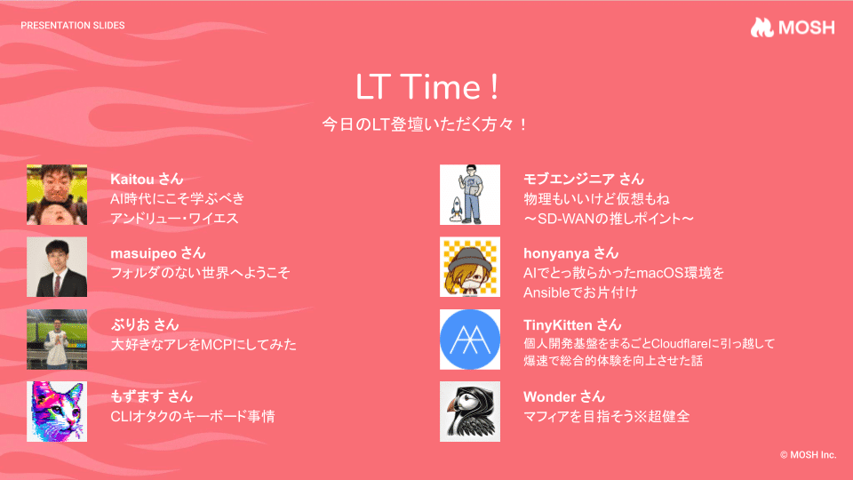

4ヶ月ぶりの開催となった MOSH Tech Meetup は、過去一番の盛り上がりだったかもしれません。発表枠は増枠しても8枠すべて埋まり、参加もほぼ満席でした。

https://mosh.connpass.com/event/400858/

企画から当日の司会まで頑張ってくれたのはスーさん（[@suguru_ohki](https://x.com/suguru_ohki)）で、私は本当に当日の受付くらいしかしていません。

ただ、一緒に技術広報をする仲間として本当に素敵なイベントだったなと思い、あくまで個人の感想として記事を書きます。

## 会社紹介に違和感を感じていた

MOSH がどんな会社だか説明する時に、プロダクトや技術スタックを紹介するのが基本かなと思います。

ただ、MOSH においてはそんなつまらない説明は嫌だなとずっと思っていました。

MOSH は「情熱がめぐる経済をつくる」をミッションに、個人が自身の「好き」や専門性、情熱を活かしたサービスをファンや受講者に直接届けて収益を得られる経済圏の実現を目指す会社です。

実現方法の話より先に、この面白さを伝えたいと思っていました。

## 「好きなこと」× エンジニアリングを話す会

そんな中企画された今回の MOSH Tech Meetup は、まさに MOSH の魅力を届けるのにぴったりなテーマだと感じました。

今回は以下の8名の方にご登壇いただきました。資料が出ているものはリンクしています。

- Kaitou さん「AI時代にこそ学ぶべきアンドリュー・ワイエス」
- masuipeo さん「フォルダのない世界へようこそ」

https://www.docswell.com/s/masuipeo/KVJ2GE-2026-09-09

- ぶりお さん「大好きなアレをMCPにしてみた」

https://slide.burio16.com/my-favorite-thing

- もずます さん「CLIオタクのキーボード事情」

https://talks.mozumasu.com/terminal-keyboard/

- モブエンジニア さん「物理もいいけど仮想もね 〜SD-WANの推しポイント〜」

https://speakerdeck.com/masakiokuda/physical-is-great-but-so-is-virtual-key-selling-points-of-sd-wan

- honyanya さん「AIでとっ散らかったmacOS環境をAnsibleでお片付け」

https://speakerdeck.com/honyanya/automating-macos-cleanup-with-ansible-and-ai

- TinyKitten さん「個人開発基盤をまるごとCloudflareに引っ越して爆速で総合的体験を向上させた話」

https://speakerdeck.com/tinykitten/kojin-kaihatsu-kiban-o-marugoto-cloudflare-ni-hikkoshi-te-de-sougouteki-taiken-o-koujou-saseta-hanashi

- Wonder さん「マフィアを目指そう※超健全」

https://speakerdeck.com/iwonder118/mafia-o-mezasou-choukenzen

画家、フォルダ、タコス、キーボード、SD-WAN、Ansible、個人開発、マフィア。並びだけ見ると無秩序ですが、「好きを本気で語っている」点では全部同じでした。皆さま本当に情熱を持ってお話しされていて、きっちり時間は守りながらも濃密で面白いお話でした。

こういった「好き」や情熱を支えるのが MOSH のミッションです。このような場を提供できてよかったと感じました。

当日の様子は [#MOSHTech](https://x.com/search?q=%23MOSHTech) にも残っています。

懇親会もずっと盛り上がっていました。発表の続きがそのまま会話になっていて、トークテーマが多すぎて全然話し足りなかったくらいです。受付側から見ていちばんうれしかったのは、「次は自分も話したい」という声が場の中から出ていたことでした。🙏

## 次回の予定

次回も、似たようなテーマでの開催を予定しております。確定ではないですが、11/25 (水) で計画しています。

今度はもっと登壇枠を増やして、よりたくさんの「好き」に触れられる時間にしたいです。そして私も、焚き火を愛するエンジニアとして発表したい！！

また、イベントページを公開したら宣伝するのでお待ちください〜🙌
